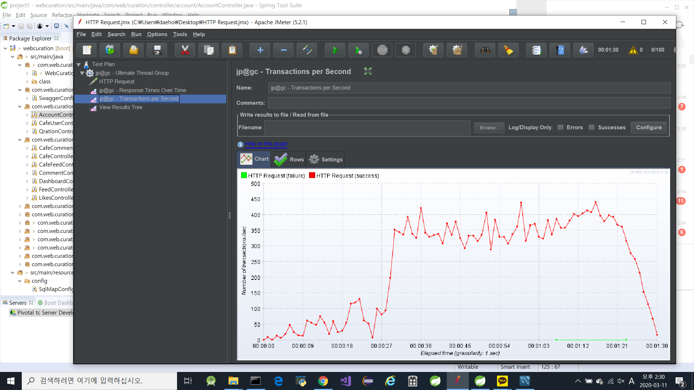
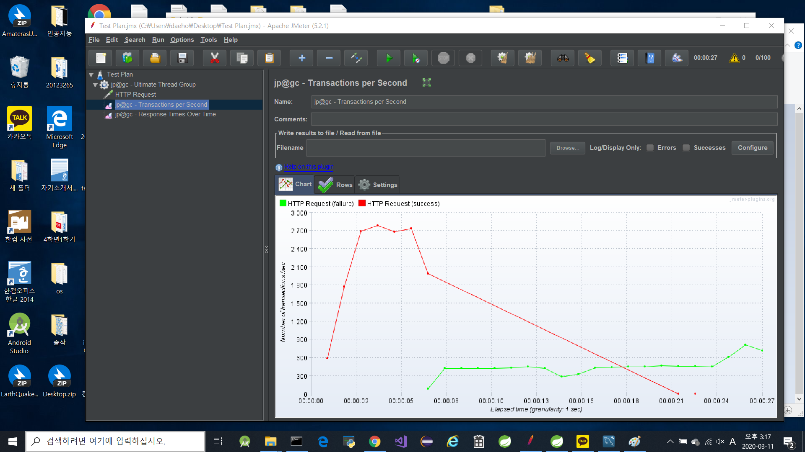
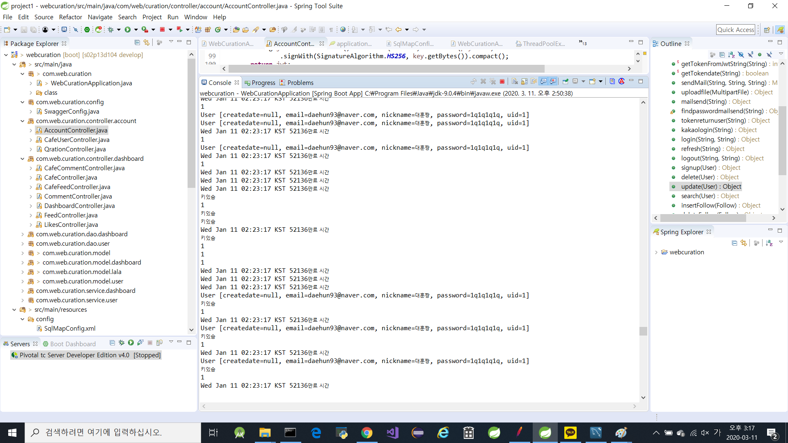

## 🎤 프로젝트 소개

부하테스트

## 🎤 결과사진

프로젝트 성공



프로젝트 실패



> 테스트 성공/실패 판단 이유

이유는 다음과 같다. 과부하를 일으키는과정에서 우리 프로젝트 같은경우 로그인 토큰을 유지한다음 30분뒤에 자동 로그아웃을 하거나
사용자가 로그아웃을 해야 토큰이 사라지는데 계속해서 똑같은 아이디와 비밀번호로 로그인하여 과부하를 일으키다보니 오류가난다.



#### 🎤 프로젝트 SETTING

> JMeter 설치 : [JMeter](https://jmeter.apache.org/)

> JMeter plugin

[jmeter-pluguns.org](jmeter-pluguns.org) 설치

JMeter Plugins Manager의 `3 Basic Graphs` `jpgc` 추가

> Test Plan Setting

- jp@gc - Ultimate Thread Group 추가
  `Test Plan` > `add` > `Threads(Users)` > `jp@gc - Ultimate Thread Group`
- HTTP Request 추가
  `jp@gc - Ultimate Thread Group` > `Sampler` > `HTTP Request`
- HTTP Header Manager 추가
  `jp@gc - Ultimate Thread Group` > `Config Element` > `HTTP Header Manager`
- jp@gc - Active Threads Over Time, jp@gc - Transactions per Second, jp@gc - Transactions per Second, View Results Tree 추가
  `jp@gc - Ultimate Thread Group` > `Listener`x

> jp@gc - Ultimate Thread Group

- Start Threads Count : `100`
- StartUp Time : `20`
- Hold Load For : `60`
- Shutdown Time : `10`

## 🎤 설정

> HTTP Request

- Server IP : `localhost`

- Port Number : `8080`

- Method : `Post`

- Path : `/account/login`

- body Data

  ```json
  {
    "id": "daehun93@naver.com",
    "password": "1q1q1q1q!"
  }
  ```
