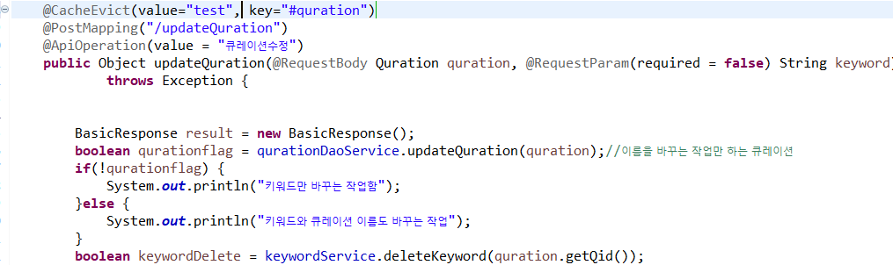

## 🎤 프로젝트 소개

최적화 프로젝트

## 🎤 캐쉬에 관환 학습내용

> 캐시는 언제 써야할까?

- 반복적으로 동일한 결과를 리턴해야하는 작업

- 서버 자원을 많이 사용하는 작업 또는 시간이 오래 걸리는 작업

> 캐시는 성능과 관련해서 가장 큰 영향력을 갖는다

- 서버간 불필요한 트래픽을 줄이고 웹 애플리케이션 서버의 부하를 감소시키고

- 빠른 처리성능을 확보해서 USER에게 쾌적한 서비스 경험을 제공 하는 것이다.

> 어떤 정보들을 사용하나?

-포탈의 검색어

-쇼핑몰의 핫딜상품, 베스트셀러,추천상품 등

-방문자수 , 조회수, 추천수

-공지사항 , Q&A

## 캐쉬 사용법

> 의존성 라이브러리 추가 pom.xml에

<dependency> <groupId>org.springframework.boot</groupId> <artifactId>spring-boot-starter-data-redis</artifactId> </dependency>

> Redis 서버설정 - application.yml or application.properties 파일에 추가

spring.cache.type=redis spring.redis.host=localhost spring.redis.port=6379

> SpringBoot에 캐시사용하겠다고 알려주기 - Springboot Main Application Class에 @EnableCaching 어노테이션 추가

@Cacheble은 캐시가 있으면 캐시의 정보를 가져오고, 없으면 등록한다.

@CacehPut은 무조건 캐시에 저장한다.

@CacheEvict 캐시삭제

## 프로젝트 시스템 아키텍처 구성도

@Yarn 서버 생략 가능

## 캐시 솔루션 Redis 적용 하기

[1] 사용할 프로젝트에 캐쉬를 선언한다.

[2] properties에 추가한다.

[3] pom.xml에 추가한다

## 병목이 예상되는 서비스를 캐싱으로 변경

> 우리 프로젝트에서 병목 현상이 일어난다고 판단할수 있는 restapi

- 매번 User를 가지고 오는것, 이메일 인증 서비스, 큐레이션 서비스 , 해쉬태그 서비스가 있다.

ex)큐레이션 같은경우 미리 디비에서 한번 가지고 온 값을 모든 페이지에서 캐쉬값을 이용한 큐레이션을 출력한다.

수정이 있거나 삭제가 있는 경우를 제외하고는 모두 캐쉬값을 사용하고 수정과 삭제시 캐쉬값을 삭제한다.

[1] 캐쉬값 등록

[2] 캐쉬값 삭제

> 결과는 실패했지만 적용된다는 사실을 알 수 있었다. 캐쉬 등록은 insert에서 해주고 출력구문은 캐쉬값만 출력해주어야한다.
