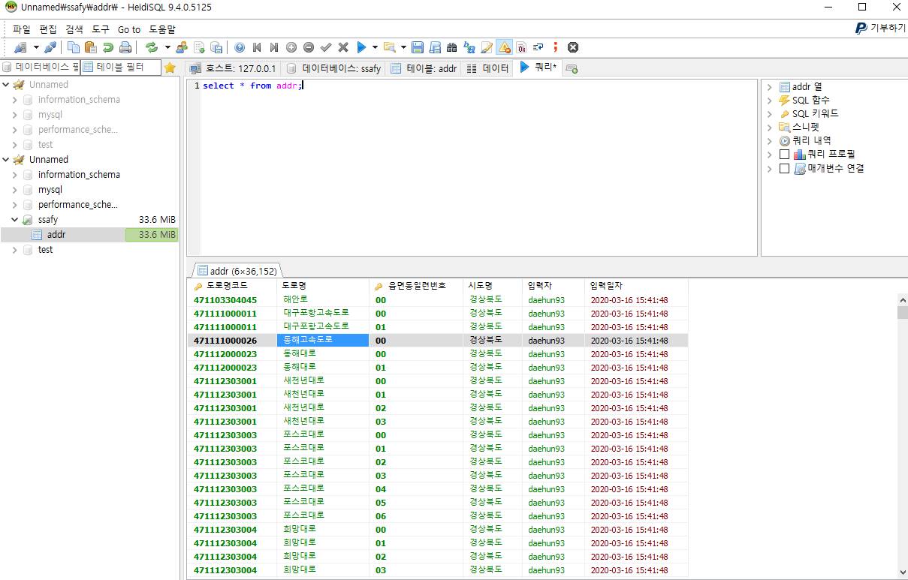
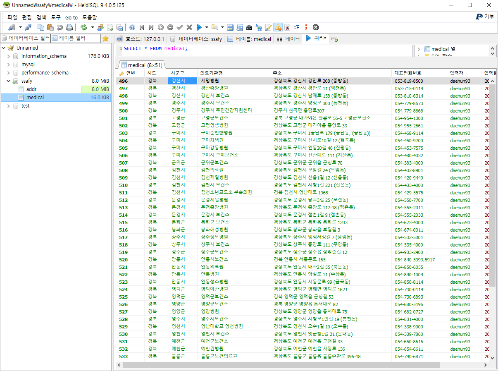

## 🎤 프로젝트 소개

DB데이터 적재및 가공

## 🎤 DB 준비

> MariaDB 설치

> HeidiSQL 설치

> 계정설정 및 ROOT 설정

> DataBase Saffy

> Table addr , medical

## 결과 사진

[1] 첫번째 Addr 테이블 결과사진

[2] 두번째 Medical 테이블 결과사진

## 후기 및 산출물

> 지금까지 나는 MySQL를 주 DB프로그램으로 사용해왔다. MySql 워크밴치 같은경우 너무나도 편리하게 잘 사용하고 있었고
> 이번 프로젝트는 MYsql이 아닌 MariaDB를 사용하고 데이터를 가공하는것에 목적을 두었다.

> csv 파일 2개, md 파일, 샘플 캡쳐본 2개
