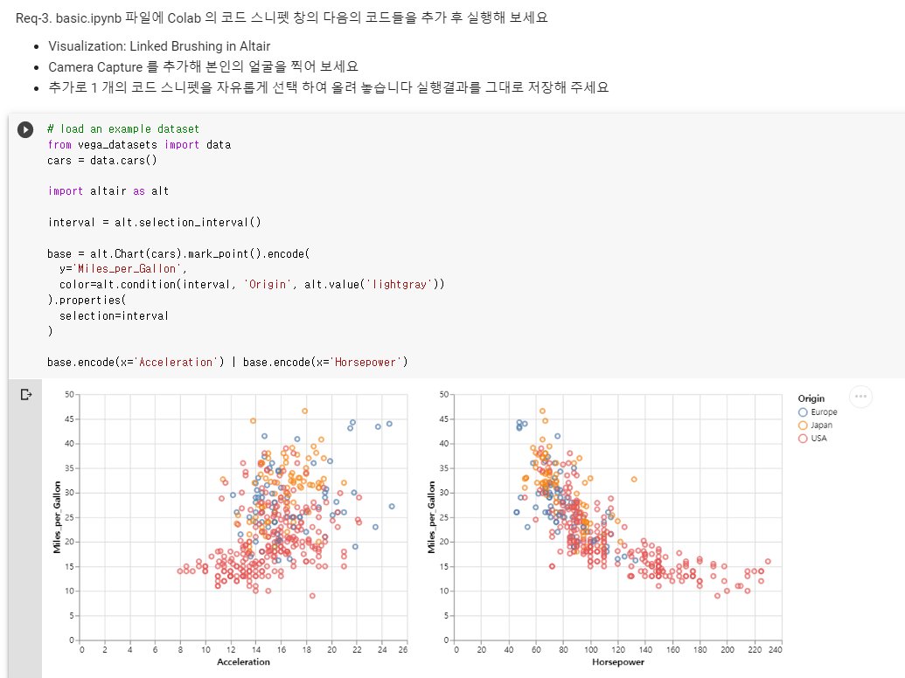
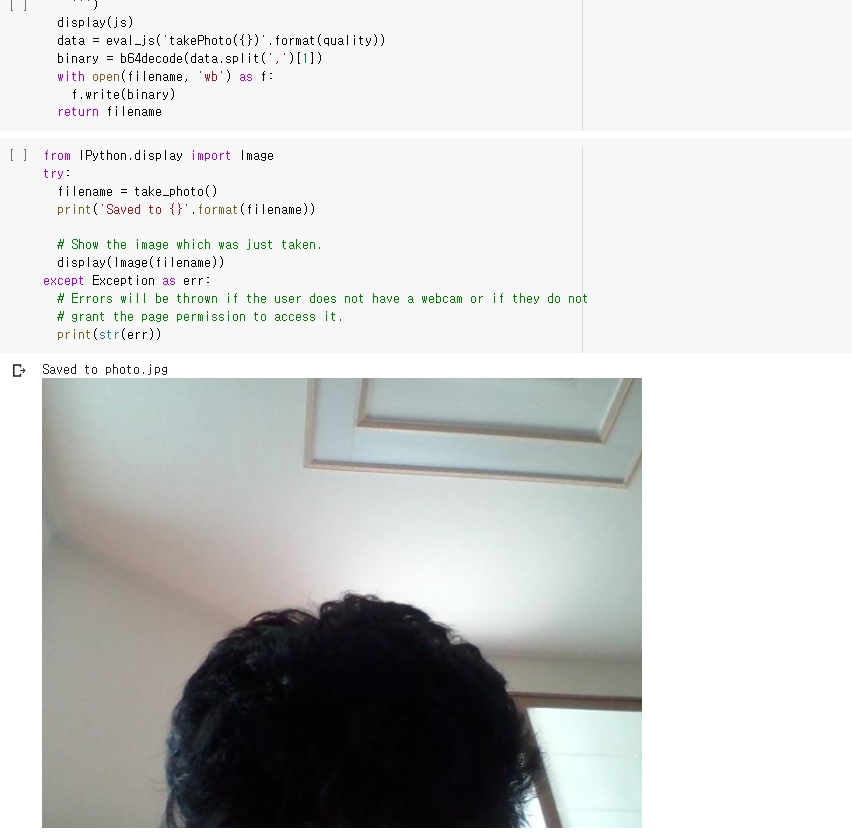
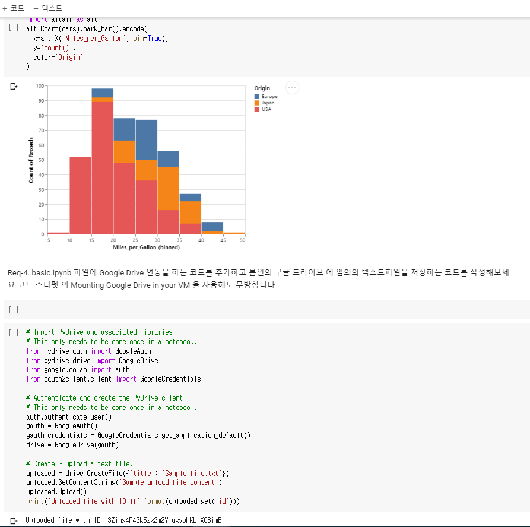
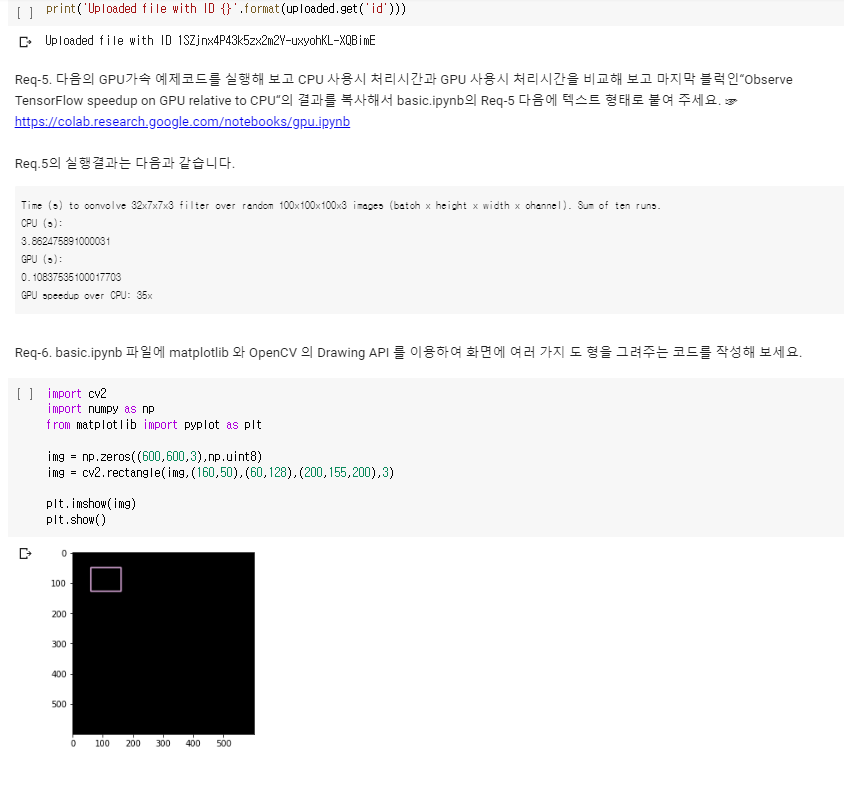
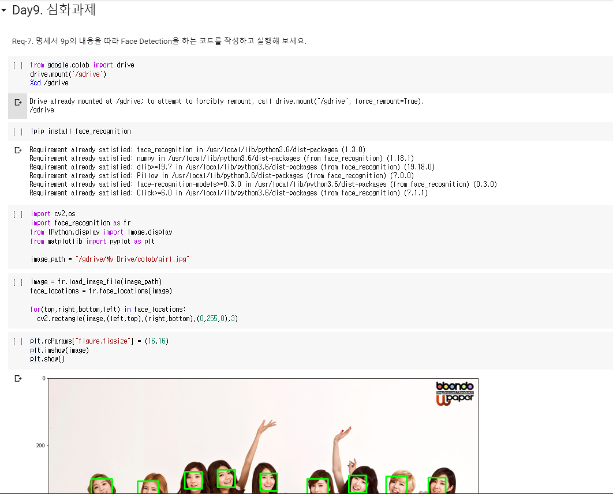
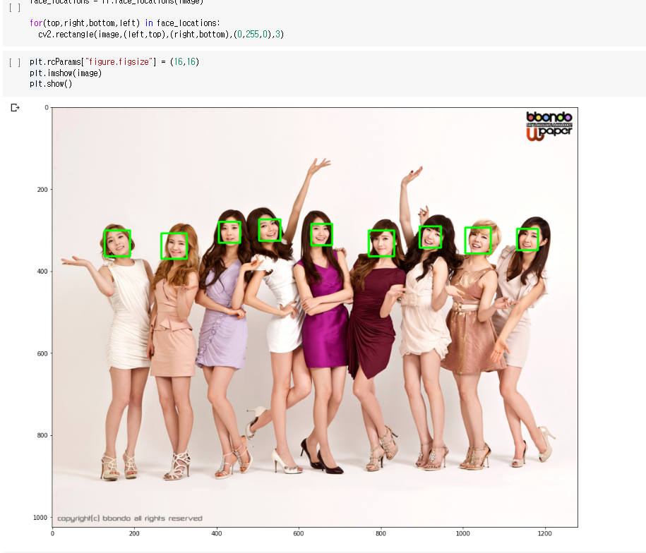
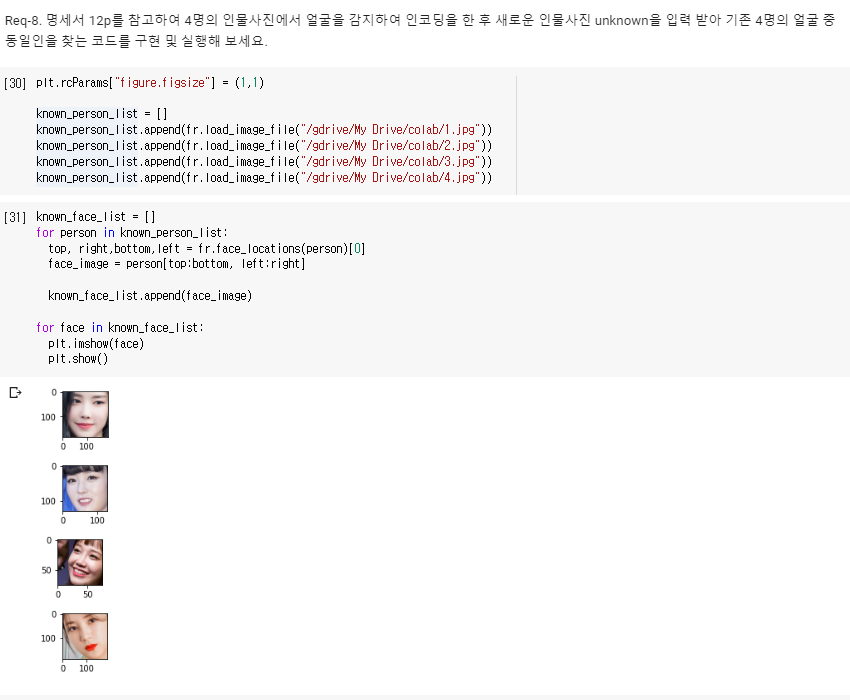
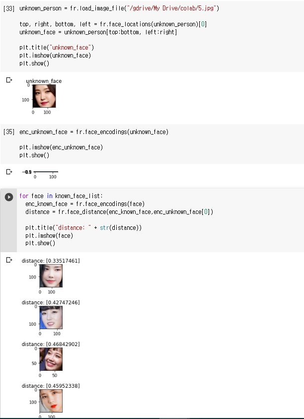

## 🎤 프로젝트 소개

Colab 기반 얼굴 인식 입문 프로젝트

## 🎤 Google Colab 이란

> 간단하게는 클라우드 웹 에디터라고 생각해 볼 수 있는 서비스다.

일반적으로 python을 이용해서 데이터 시각화, 머신러닝과 같은 프로젝트를 진행하는 사람들은 jupyter notebook 이라는 로컬 환경을 많이 사용하는데,

이와 같은 notebook 형식의 python 코딩을 Google Colaboratory는 특별한 설치 없이 웹에서 바로 할 수 있게 해주는 것.

> 본 프로젝트 목표

1. Google Colab 의 기본적인 사용법을 익혀봅니다.

2. Google Colab 을 통해 Python 코드를 GPU 가속을 적용해 실행해보고 Google
   Drive 와 연동해 수행결과를 읽고 쓸 줄 알게 됩니다.

3. OpenCV 라이브러리가 무엇인지 가볍게 살펴보고 Colab 상에서 간단한 OpenCV
   API 를 사용하여 이미치 처리를 하는 기본적인 방법을 경험 합니다.

4. 얼굴인식과 관련된 (가장 쉬운) 최상위 레벨의 패키지인 face_recognition
   패키지를 사용하여 간단하게 얼굴인식 기능 개발을 경험해 봅니다.

5. 기존에 사용해 보지 못한 새로운 라이브러리 / 패키지를 레퍼런스 문서를 보고
   적용하는 방법을 경험해 봅니다.

## 결과 사진

[1] 기본

[2] 심화

## 산출물

> 결과물 사진 8장 , 코드 colab파일 2개
