## 블록체인 실습 준비를 위한 사전 작업

> 가상머신을 준비하자

https://www.virtualbox.org/ 를 접속한다음
VirtualBox를 설치한다.

> Vagrant 설치

https://www.vagrantup.com/ 에서 설치한다.
그 이후 cmd에서 vagrant version을 입력하여 버전을 확인한다.

그리고 가상 머신으로 파일 전송을 지원하는 플러그인을 설치해본다.

cmd에서 vagrant plugin install vagrant-scp 입력

> 이더리움 가상 머신 생성 및 구동

cmd를 열고 가상머신을 구동할 경로로 이동한다.

그리고 명령어를 입력한다.

vagrant init

그리고 생성된 Vagrantfile의 내용을 수정한다.

> 가상머신 구동 명령어 실행

cmd 에서 vagrant up 입력

상태확인도 마찬가지로 cmd에서 vagrant status 를 입력

가상 머신 접속은 cmd 에서 vagrant ssh eth0 입력한다.

eth0 이것은 내가 만든 가상 머신 하나의 이름이다.

> 이제는 이더리움 네트워크를 구축해보자

Geth 를 설치해야한다. 가상 컴퓨터 두대다 각자 들어가서 다 설치해주자

가상 머신에 접속한다음 (접속시 cmd화면이 @가 들어가고 뒤에 가상컴퓨터이름 있는것)

sudo apt-get update

sudo apt-get install software-properties-common

suod add-apt-repository -y ppa:ethereum/ethereum

sudo apt-get install ethereum

위 순서대로 입력한다.

Geth가 설치되어있는지 확인해본다

geth version

이더리움을 저장할 폴더를 생성해본다 mkdir사용

그리고 CustomGenesis.json 파일을 생성한다 (가상컴퓨터 두대다 메모장이용)

이 생성한 파일을 가상머신으로 전송한다.

그리고 가상머신에서 ls -lh 라는 명령어를 통해서 json파일이 있는지 확인하고

geth --datadir . init ./CustomGenesis.json 명령어를 통해 Geth 초기화해준다

Geth를 구동하고 실행상태를 확인하자.

구동법 가상머신에 접속한뒤

nohup geth --networkid 921 --maxpeers 2 --datadir ~/dev/eth_localdata --port 30303 --allow-insecure-unlock --rpc --rpcaddr 0.0.0.0 --rpcport 8545 --rpcapi "admin,net,miner,eth,personal,rpc,web3,txpool,debug,db" --rpccorsdomain "\*" 2>> ~/dev/eth_localdata/geth.log &

를 입력한다.

두번째 가상머신

nohup geth --networkid 921 --maxpeers 2 --datadir ~/dev/eth_localdata --port 30304 --allow-insecure-unlock --rpc --rpcaddr localhost --rpcport 8545 --rpcapi "admin,eth,miner,personal,web3" 2>> ~/dev/eth_localdata/geth.log &

Geth 프로세스와 로그를 확인해보자.

> 노드들을 연결해보자

Geth 콘솔에 진입한뒤 명령어(geth attach http://localhost:8545)

admin.nodeInfo.enode 명령어를 통해서 노드정보확인

Peer 추가는

admin.addPeer("enode://...@192.168...~)

IP부분이 가상머신간 통신이 가능한 IP를 입력

## 🎤 블록체인 프로젝트 1주차

Day02

## 🎤 오늘 완료한 작업

Jira 확인 및 산출물 사진 2장

> eth 0 생성과정 및 완료

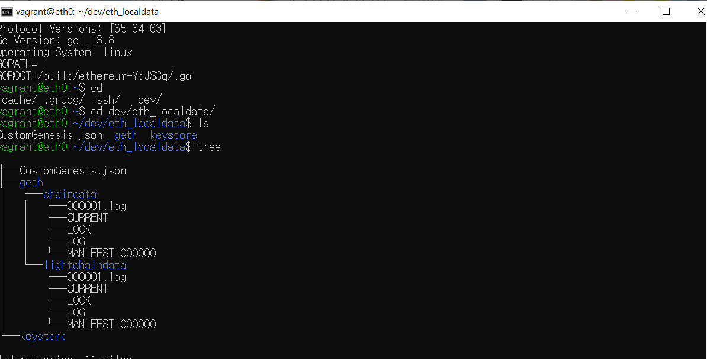

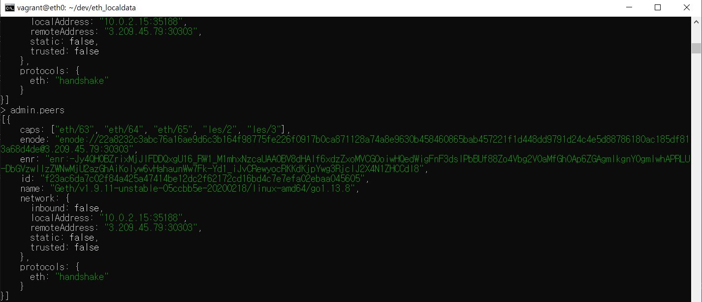

> eth 1 생성과정 및 완료

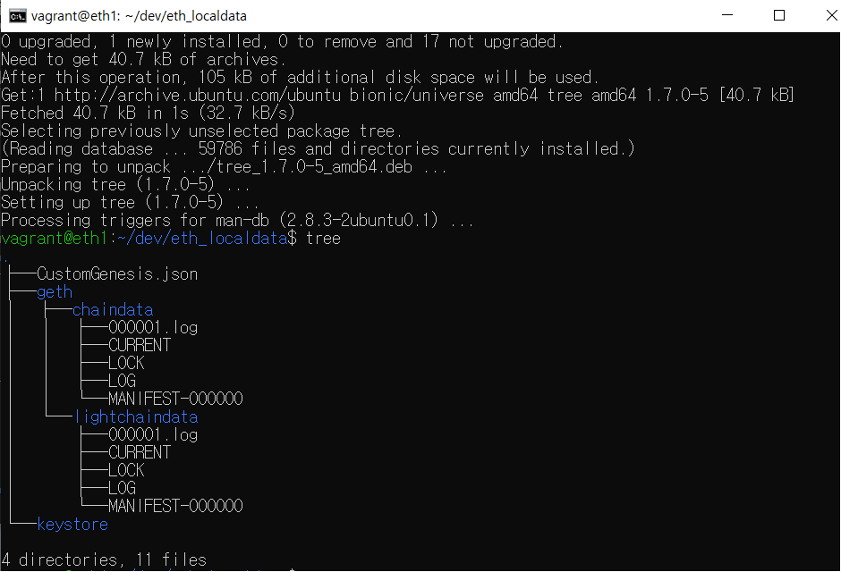

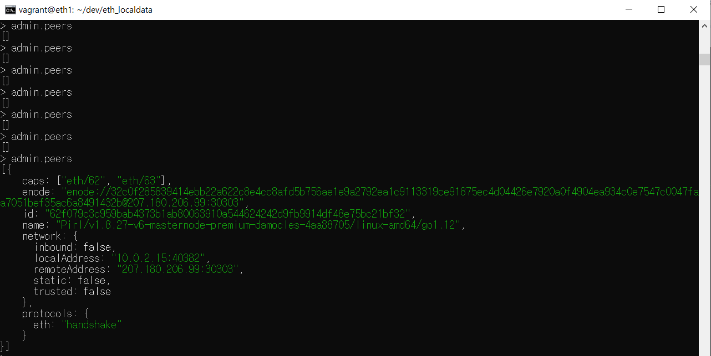

## 🎤 블록체인 프로젝트 1주차

Day03

## 🎤 오늘 완료한 작업

Jira 확인 및 산출물 사진 8장

> 계정 생성

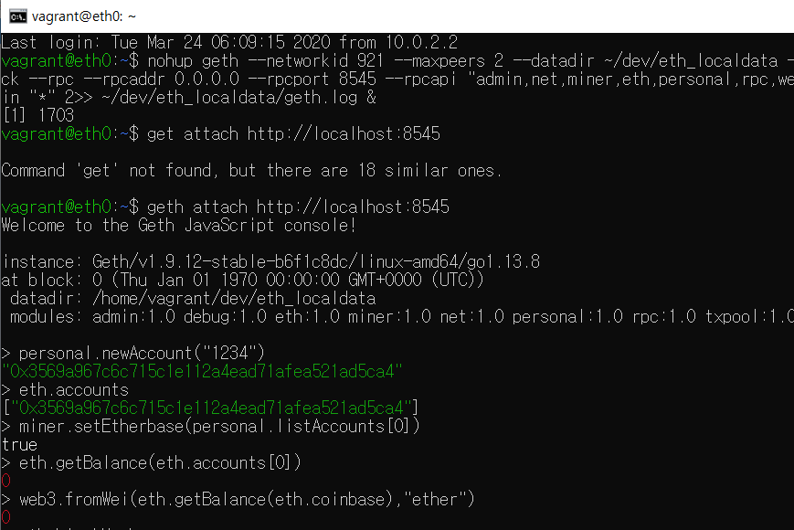

> 마이닝 시작 및 결과 확인하기

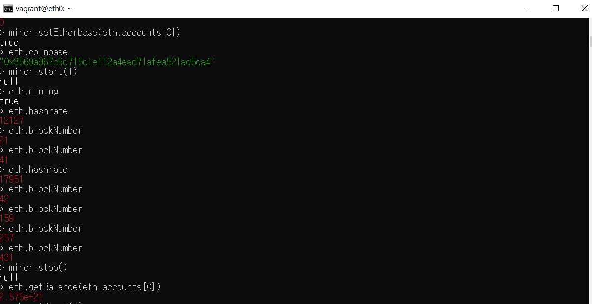

> 블락들 각각 정보 확인

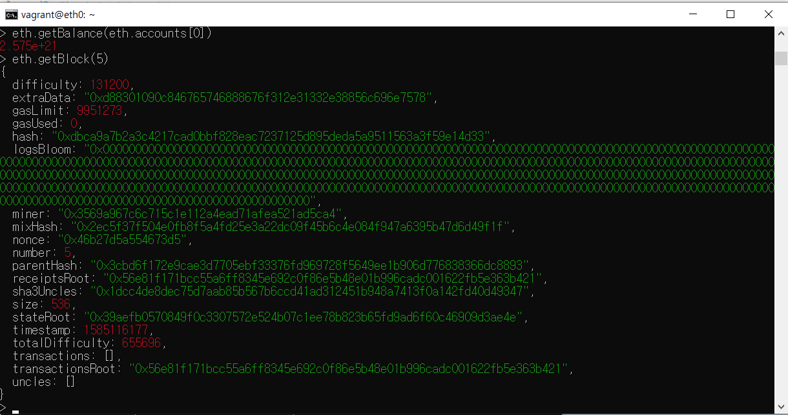

> 트랜잭션 처리 부분

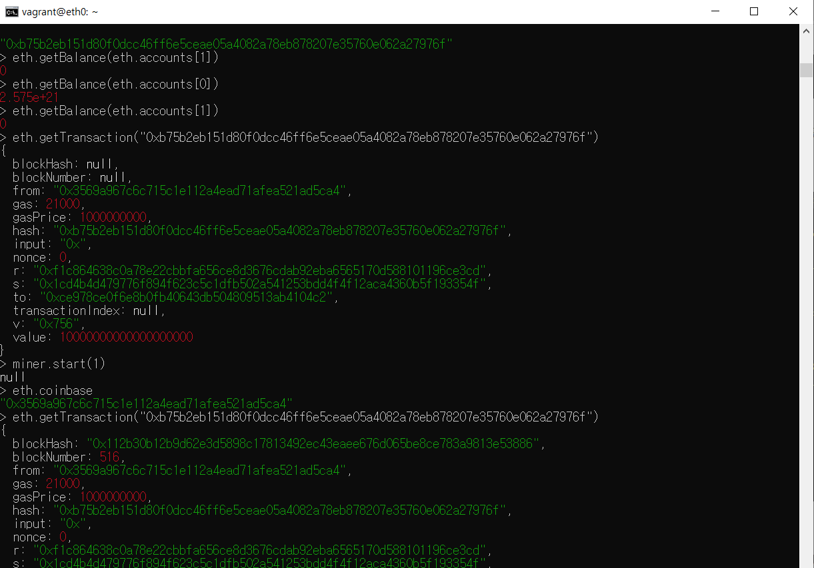

> keystore 폴더에있는 UFC로 시작하는 키값을 JSON 형태로 만들어서 저장한다.

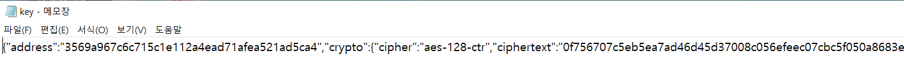

> 포트 포워딩을 설정하게 되면 내 개인 컴퓨터의 코인 정보를 알수있다.

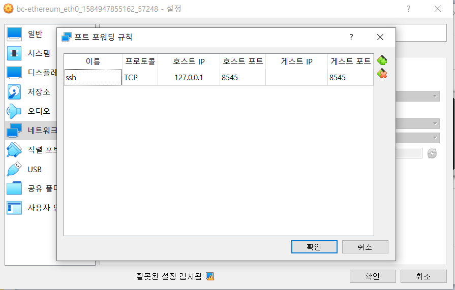

> Remix 연결 하기

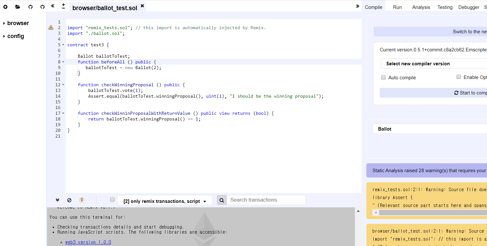

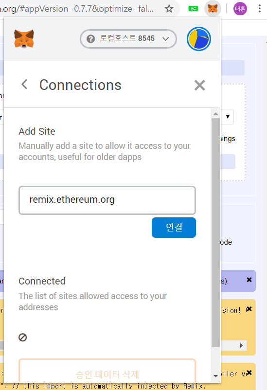

## 🎤 블록체인 프로젝트 1주차

Day04 05

## 🎤 오늘 완료한 작업

Jira 확인 및 산출물 사진 4장

> 메타 마스크 연동

> 예제파일 Ballot확인

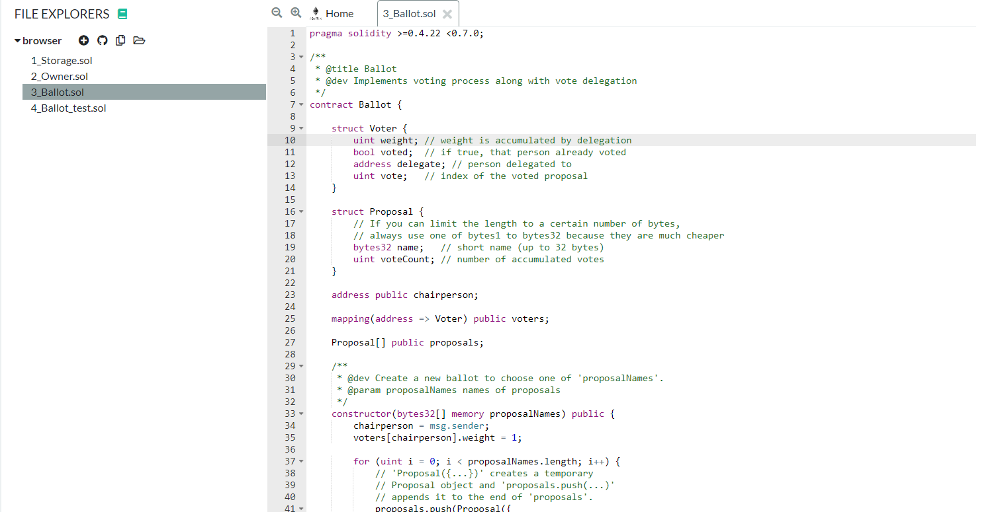

> 솔리디티 컴파일

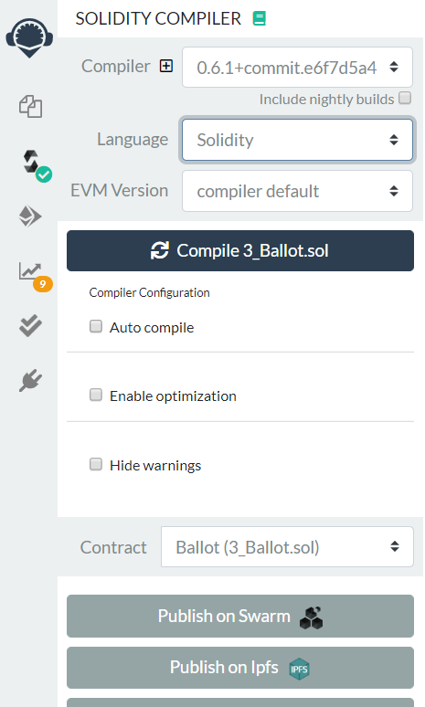

> Deploy 오류 확인

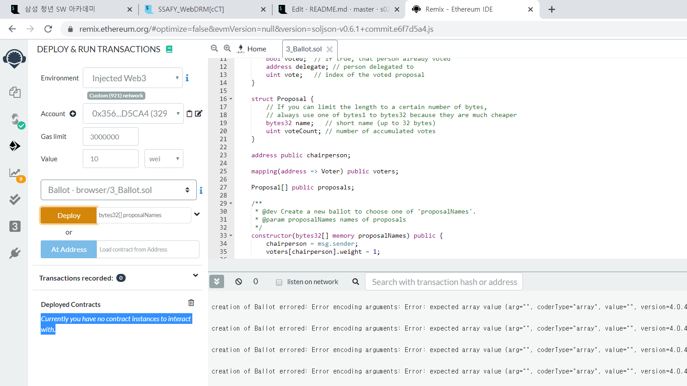
