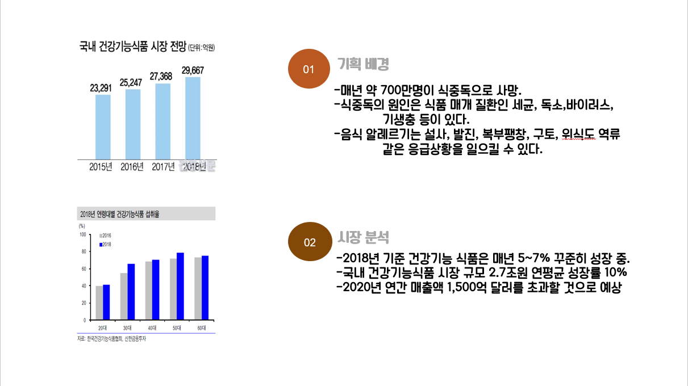
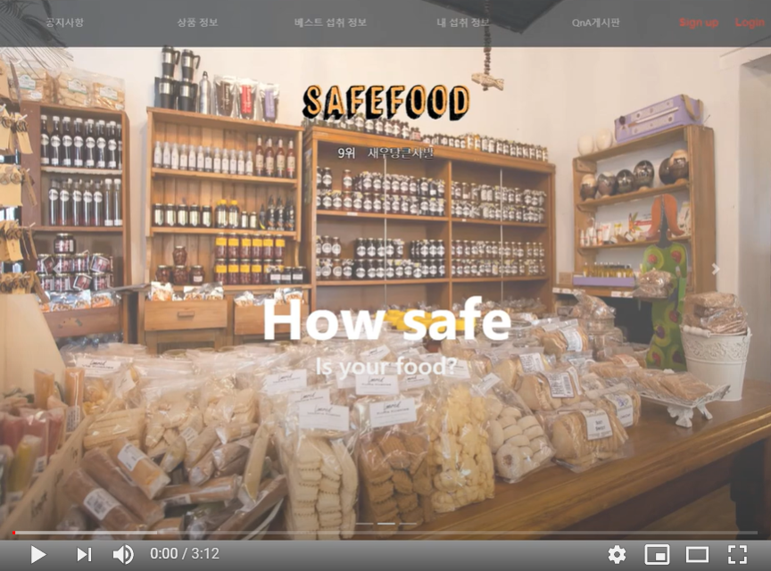
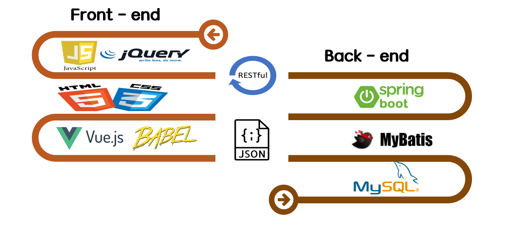
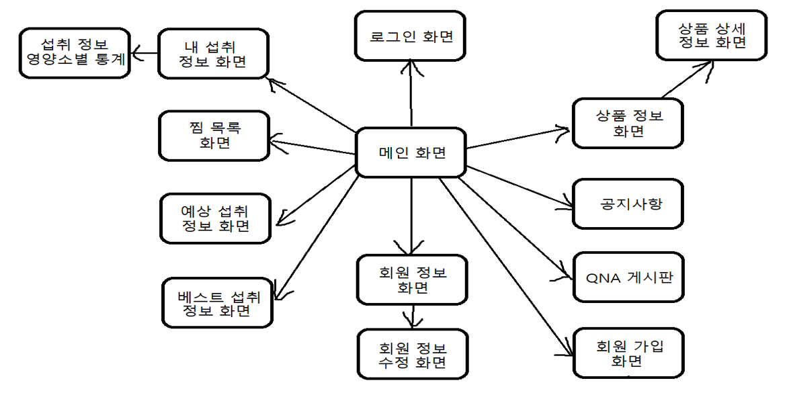
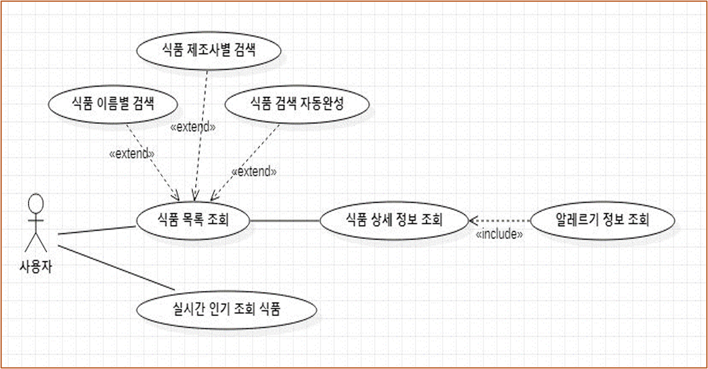
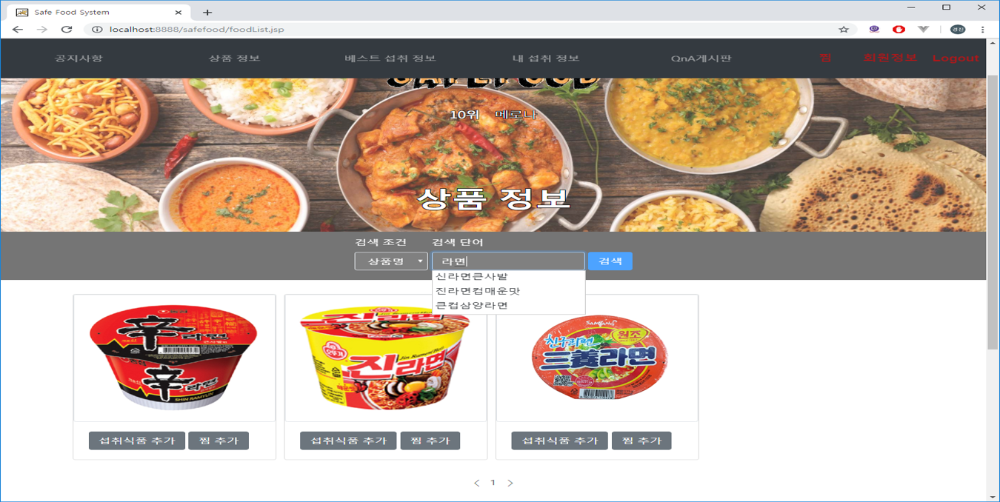
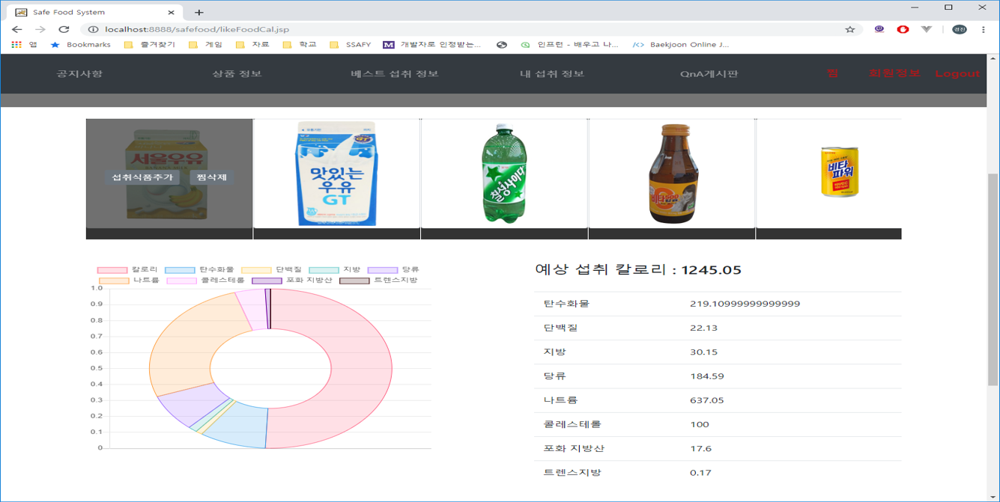
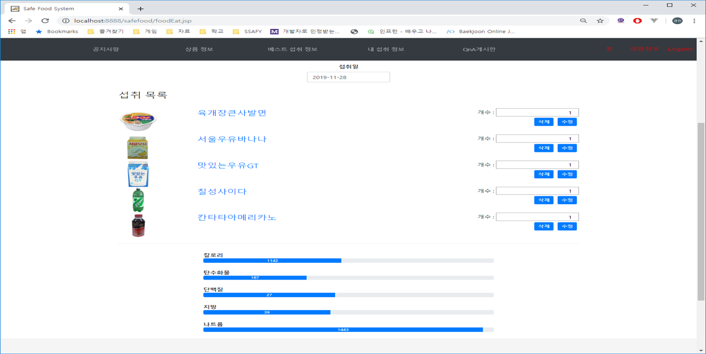
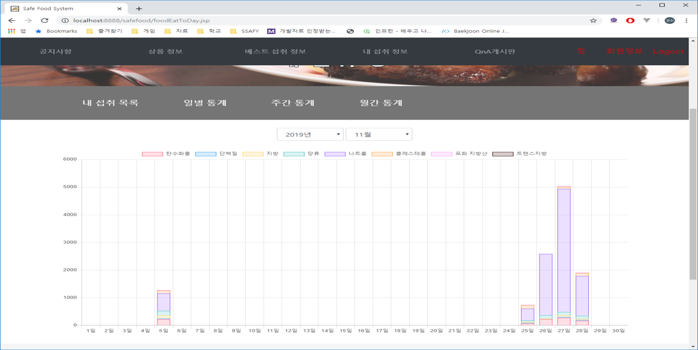

## 프로젝트 기획 배경 및 시장분석

## 백문이불여일견 시연영상

## 개발환경

## 화면흐름도

## 유스케이스 다이어그램

### 회원정보

### 식품관리

### 섭취식품관리

### 선호식품관리

### 공지사항관리

### QNA관리

## 기능 화면

검색 자동 완성

예상섭취 목록 화면

내 섭취 정보 화면

통계목록 화면

