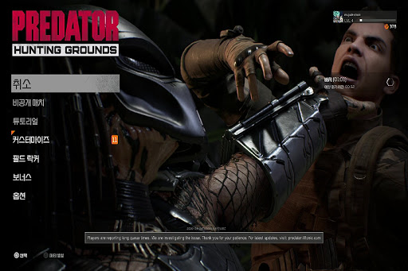
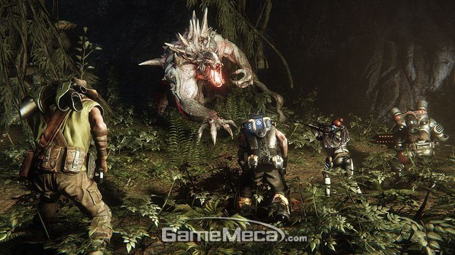
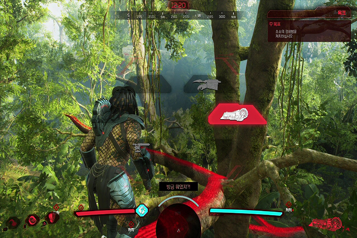

## 평점 ★★☆☆☆ 

평점 2점 초등학교 카르마 시절부터 시작한 FPS 인생에서 경험한 비운의 게임

## 게임 짧게 평가

게임 출시전 - 인간 VS 프레데터 라니 오랜만에 진짜 재밌게 하고싶다

게임 출시후 - 후기남기기 힘들 정도로 게임이 안잡힘.(유저부족)

### 게임 후기 부제 - 눈물의 대기시간

(이미지출저- 구글 프레데터 이미지)

게임 대기화면이다. 게임을 하고싶은데 게임을 할 수가없다.

맛있는 피자를 41000원 주고 샀는데 5명이 모여야 피자를 먹을 수 있다.
(인간 4명 프레데터 1명)

새로 생긴 피자집이 홍보가 부족하고 전부다 피자헛 미스터피자 먹으러 가닌깐 피자집에 5명이 모일수가 없다.

결국 기다리고 또 기다리면 외국에서 같이 먹자고 접속해준다.

외국인들이랑 같이 피자를 먹게되니 한국인들과 또 다른 느낌이라 좋은줄 알았다.

아직 최적화가 부족하다보니 핑이 생명인 FPS게임이 핑이 노랑색 빨강색이 되고

우리나라와 달리 피자를 한 두조각 맛을보고 본국으로 떠나는 외국인들이 대부분이니

결국에는 혼자 피자 먹다가 외계인이랑 일대일 맞짱을 뜨게된다.

충분히 국내에서 성공할만한 게임 기획이였다고 생각했는데

본국으로 중간에 도망칠 외국인이랑 또 피자먹을려고 기다릴 생각을 하니

피자 41000원을 다시 피자집에 환불 요청하게 되었다.
(피자를 먹는데 돈을 아끼는 편이 아닌데 못먹을 피자 계속 쳐다보느니 피자헛을 결제하기로 결심함.)

서버 최적화와 꾸준한 패치로인해 계속 나아지고 있다는 후기들도 많지만
이미 식어버린 피자를 먹어보고 먹는중 도망친 외국인을 많이 만나본 FPS게임 매니아로써
피자집을 떠나게 된 충분한 이유가 되었다.

### 그래도 잘 짜여진 게임 작품성

이볼브와 비슷한 느낌이면서 조금더 전략적인 게임이다.

인간 4명과 프레데터 1명이 서로 싸우면서 각자의 임무를 완수하면서

인간의 탈출을 막는 게임.

뭉치면 그 누구보다 강한 인간 VS 투명으로 변하고 각종 무기들로 특수한 능력을 지닌 프레데터

맵 중간중간에 있는 퀘스트를 완료하면서 서로 견제하고 전투를 하는 부분은 충분히 재미있는 요소가 많다.

### 피자 고객이 늘어난다면 다시 먹을 생각이 있는 맛있는데 안타까운 피자.

