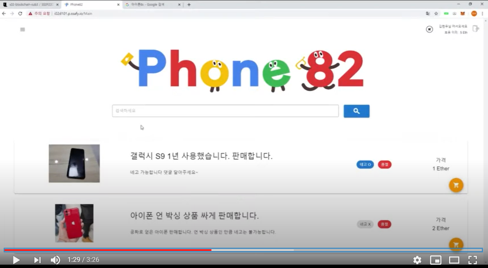
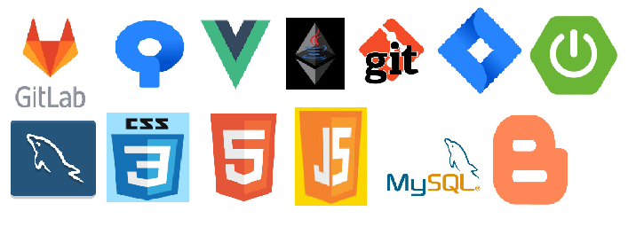
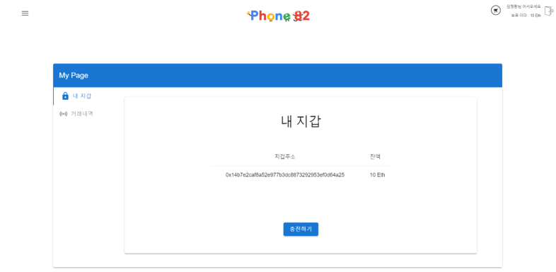
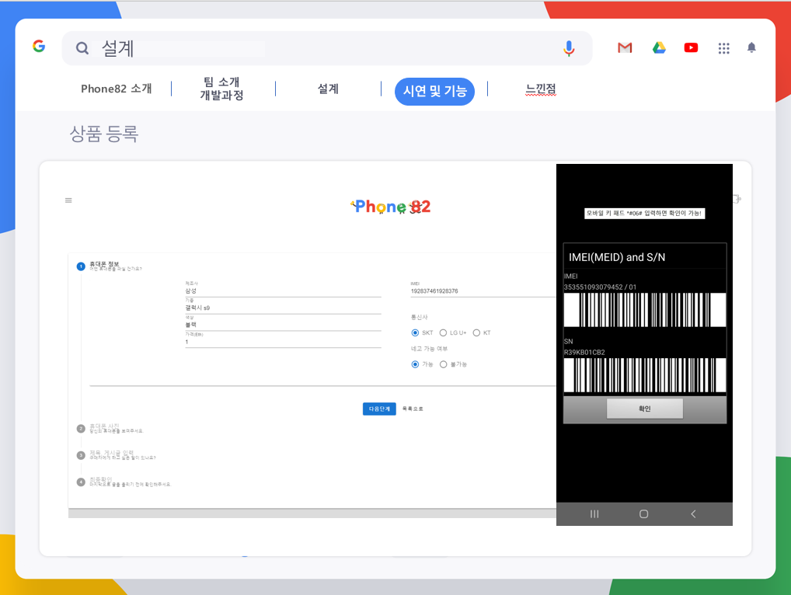
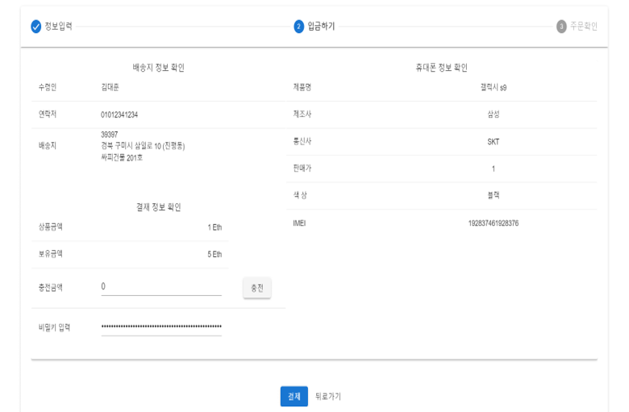

### 프로젝트 소개

가상화폐(이더리움)을 이용하여 중고폰 거래 웹사이트 개발

이더리움 화폐로 거래가능

## 백문 불여일견 시연영상 (클릭)

클릭

## 개발환경

Gitlab,git,source-tree,Web3,SpringBoot,Vue.js,CSS,HTML5

JavaScript,MySQL,Jira

## 회원 인증 및 지갑 비밀키 생성 과정

이메일 인증을 완료하면

자신의 이메일 계정에 따른 지갑 비밀키를 생성

경고창과 함께 꼭 저장할것 을 권고

## 개인 가상화폐 지갑 화면

자신의 지갑주소 및 잔액 확인

## 개인 중고폰 상품등록 화면

휴대폰 고유번호 IMEI확인 및 등록

제조사, 기종, 색상, 가격 등록

휴대폰 사진 및 제목 게시글 입력

## 구매시 화면

## 결제 화면

비밀키 입력란에 자기 계정에 맞는 비밀키 입력해야함.

## 가상 블록체인 실습 공부

이전 게시글 확인 
<https://daehun93.github.io/%EC%9E%90%EC%A0%84%EA%B1%B0SNS%ED%94%84%EB%A1%9C%EC%A0%9D%ED%8A%B8-%EC%8B%A4%EC%8A%B5/>

> eth 0 생성과정 및 완료

> eth 1 생성과정 및 완료

> 계정 생성

> 마이닝 시작 및 결과 확인하기

> 블락들 각각 정보 확인

> 트랜잭션 처리 부분

> keystore 폴더에있는 UFC로 시작하는 키값을 JSON 형태로 만들어서 저장한다.

> 포트 포워딩을 설정하게 되면 내 개인 컴퓨터의 코인 정보를 알수있다.

> Remix 연결 하기

> 메타 마스크 연동

> 예제파일 Ballot확인

> 솔리디티 컴파일

> Deploy 오류 확인

