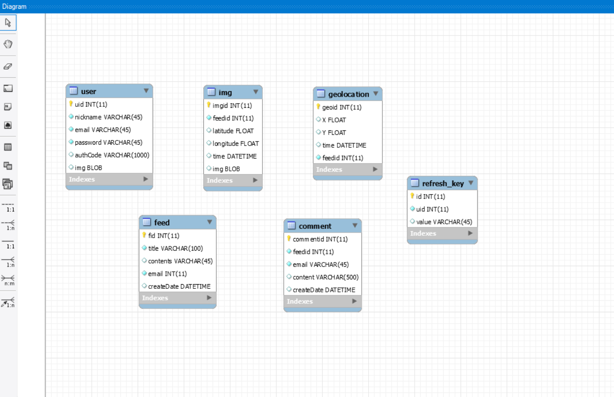
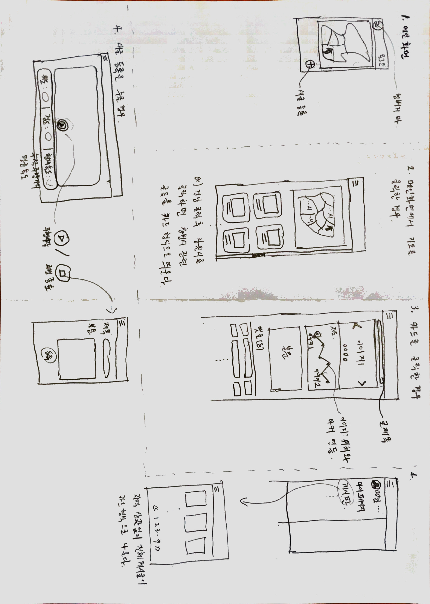

## 자전거 프로젝트란

> 소개가 늦었다 자전거 프로젝트란?

현재 프론트 개발자 친구 4명과 백 개발자 1명(나) 가 진행중인 프로젝트

SNS 형식으로 사용자가 자전거 주행을 시작했을때 와 정지했을때

그 기준으로 내가 주행한 거리를 지도에 나타내고 

일정 시간 기준으로 자동으로 사진을 찍어서 함께 게시글에 작성하고

유저들끼리 자전거 도로에 대해 서로 자유롭게 추천하고 공유하는 커뮤니티를 만들어 보자.

## 백에서 사용하는 기술

> MySql

나는 아직 MySql 말고는 DB에 대해 경험이 부족하다. MariaDB를 한번 사용해본 적이있지만

나에게 익숙한 MySql DB를 두고 백 개발을 하려고 한다. (MySql WorkBench에 이미 빠져버림)

> SpringBoot

스프링부트 4버전을 이번에 처음 써보려고 한다.

지금까지 3버전을 사용했었는데 별로 다른점은 딱히 없는거 같다.

### 그래서 오늘 한 일

오늘은 DB 설계와 사용자 관리 컨트롤러를 만들어 봤다.

오늘 설계해본 DB 테이블 

기본적으로 사용자, 게시글, 이미지, 댓글, 위치 

5개 테이블이 있는데 앞으로 추가되거나 정규화가 될것이다.

이미지는 지금까지 서버 컴퓨터에 넣어보는 방식으로 했었는데 이번에는

MySQL DB에 직접 Blob 형식으로 저장하는 방법으로 해볼려고 한다.

이 설계도를 바탕으로 DB는 만들었고 

아직 외래키와 상세한 키설정은 부족하다.

현재 상태는 다음과 같다. 기본적인 PK만 등록하고 테이블간의 관계는 아직 만들어지지않았다.

> 위와 같이 테이블간의 관계도 보는 빠른방법

1. 워크밴치 DataBase 탭을 클릭한다.
2. ReverseEngineer 를 클릭한다.
3. 관리자 비밀번호를 로그인하고 관계도를 볼 스키마 선택
4. 그럼 최종적으로 저런 화면이 나온다.

### 자전거 커뮤니티 초안

약간 이런 방식으로 만들려고 한다.

### 오늘 하루 마무리

오늘 React Native 책이 왔다.

책 제목 : 리액트 네이티브 인 액션

저자 : 네이더 다빗

Vue도 아직 잘 못하는데 요즘 React Native에 관심이 생겨서

짜투리 시간을 할애하여 천천히 진행 해보려고 한다.

### React Native 란?

일단 페이스북에서 만든 오픈소스 프레임 워크다.

인스타그램, 넷플릭스, 에어비엔비가 리액트를 활용했고 그래서 관심을 가지게 되었다.

쉬운 사용법이 장점이다.(뭐 한번 해봐야 알겠지만)

앞으로 공부를 하면서 리액트 네이티브에 대해 더 상세하게 리뷰하겠다.