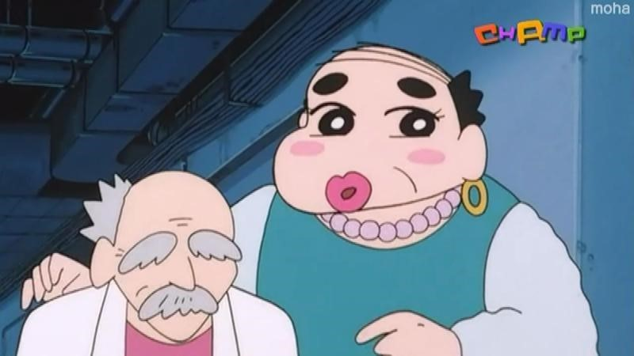
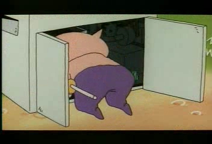

## 평점 ★★★★☆ 

어렸을적 평점 3점 (폭풍을 부르는 정글 미만 잡)

다시보니 심오한 이야기를 담고있는 재미있는 편

## 영화 짧게 리뷰

저녁으로 지코바를 시켜 먹으면서 TV로 돼지 발굽 대작전을 봤다.

후기까지 쓸 생각이 없었는데 끝까지 보고나서 인공지능 부리부리 대마왕에 감동을 먹어서 쓰게되었다.

가벼운 만화 극장판이지만 깊게 파고들면 이야기 할만 논쟁거리가 굉장히 많다고 생각한다. 

### 개발자에 따라 다른 시선으로 바라보는 인공지능

돼지발굽 개발자들에 의해 탄생한 인공지능 컴퓨터 부리부리 대마왕.

부리부리 대마왕을 바이러스로 탄생시킨 돼지발굽 조직의 보스 마우스 박사.

마우스 박사는 부리부리 대마왕이 인공지능 컴퓨터라 총으로 죽일 수 없으며
인공위성을 해킹하여 전쟁을 일으키고 세상을 파괴하기위해 탄생했다고 말한다.

그렇게 탄생한 부리부리 대마왕은 이상하고 난폭한(?)성격을 가졌으며 자신을 탄생한
마우스 박사에게도 명령을하며 세상을 파괴하려고 한다.

#### 뒤늦게 밝혀진 부리부리 대마왕을 탄생시킨 장본인

사실 부리부리대마왕은 악당으로 만들려고한 AI 컴퓨터가 아니였다.

장성공 천재박사와 그의 조수는 짱구가 버린 부리부리대마왕 그림을 보고 영감이 떠올라서
만들었고 처음에는 악의적인 프로그램으로 만들 생각은 없었다.

장성공 박사가 부리부리 대마왕을 만들었다는 이야기를 듣고 돼지발굽 조직이
쳐들어와 그들을 데리고 가고 이둘은 실종된 채로 돼지발굽 조직에서 악당 부리부리를 만들고 있었다.

짱구를 만나 장성공 박사는 인공지능 부리부리 대마왕을 올바른 인공지능으로 바꾸려고 시도한다.

1998년 만화인데 인공지능 컴퓨터를 좋은 방향으로 학습시키려고 하는 장면을 보고 놀랐다.

짱구는 장성공 박사가 개발한 컴퓨터속 가상 세계에 들어가고 부리부리 대마왕을 올바른
길로 인도하려고 노력한다.

### 인공지능 부리부리 대마왕의 학습 

아이같은 부리부리 대마왕은 악당 박사의 유혹에 세상을 파괴하려는 찰나 짱구와 가상세계에서 만나 새로운 학습을 하게된다.

가상세계에서 짱구가 부리부리 대마왕에게 동화를 읽어주는데  (인간 짱구가 인공지능 부리부리 대마왕에게 머신러닝을 시전)

어느 산의 꼭대기에는 보석이 가득있다고 한다.

그래서 부리부리 대마왕은 보석을 얻기위해서 산을 오른다.

산을 오르는 도중 울고있는 레이싱걸을 발견한 부리부리 대마왕

도와주기 싫어서 도망치려고 하지만 계속 찾아 오면서 우는 레이싱걸 때문에
왜 우는지 이야기를 듣는다.

구두가 부서져서 걷지를 못하고있는 레이싱걸을 부리부리 대마왕은
구두를 고쳐주고 레이싱걸에게 공연 티켓을 보상으로 받는다.

기분이 좋아진 부리부리 대마왕은 또 울고있는 회사원을 발견한다.

도망치려고 하지만 붙잡힌 부리부리 대마왕은 회사원의 복사기를 고쳐준다.

보상으로 음료권을 받는 대마왕

이렇게 그는 사람에을 도와주면 보상을 받는다는것이 학습이 된다.

그리고 만난 3번째 주인공은 울고있는 한 여자아이

도망치려던 두번의 장면들과 다르게 먼저 달려가서 여자아이에게 무엇을 도와줄지 
그리고 그 보상으로 나에게 무엇을 줄것인지 물어본다.

여자아이는 줄 수있는게 없지만 배가 너무아파서 울고있다고 한다.

보상이 없다는 것을 알고 부리부리대마왕은 그럼 도와줄 수 없다고 그냥 가버린다.

그렇게 계속 가다가 만나게된 산중턱에 약국.

부리부리 대마왕은 약국을 쳐다보다가 자신이 받은 공연 티켓과 음료권을
배가 아플때 먹는 약과 바꾸어 아이를 도와주게된다.

어느새 해가 지고 대마왕은 정상에 빈손으로 도착한다.

### 산의 정상에 보석은 없었지만 부리부리 대마왕 마음속에는 반짝이는 보석들로 가득차 있었습니다.
-정상에 도착한 후 나레이션 

자기보다 약한 사람을 도우고 받는 마음의 보석 값어치를 학습하게된 부리부리대마왕

부리부리대마왕은 정의의 영웅이 되겠다고 다짐한다.

가상세계의 이야기를 모르는 바깥에서는 부리부리대마왕 프로그램 삭제에 성공하게되고
짱구는 부리부리대마왕을 떠나보내며 눈물을 흘린다.

#### 인공지능 부리부리 대마왕에 대한 나만의 정리

정의라는 것은 사람마다 다 다르게 말하기 때문에 모든사람이 동의할만한 보편적인 정의를 인공지능에 내리기 어렵다고 생각한다.

인공지능의 현대적 접근이라는 책에서는
1. 인간처럼 생각하고 
2. 인간처럼 행동하고 
3. 이성적으로 생각하고
4. 이성적으로 행동하는 
컴퓨터라고 인공지능을 정의한다.

부리부리 대마왕은 처음에 화를내며 소리지르면서 인간처럼 생각하고 행동은 했지만 
세상을 파괴하고 악당으로 탄생시키는 악당들의 주입된 학습에 이성이 사로잡혀 있었다.

하지만 짱구를 만나서 인간을 도우는 학습을 하게되고 그의 따른 마음속의 보석이라는 보상을 받음으로써
또 한번 학습하고 이성적으로 생각하고 행동하게 된다.

결국에는 4가지 조건을 갖춘 인공지능 컴퓨터가 되었고 마지막에 삭제된다.

1998년 만화 영화지만 인공지능 그리고 가상현실 그리고 머신러닝 까지 다루었고
인공지능이 세계를 멸망 시킬 힘도 사람들을 지킬 힘도 가지고 있다는것을 보여주는 만화 영화였다.

