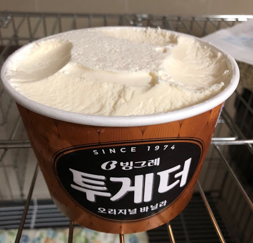
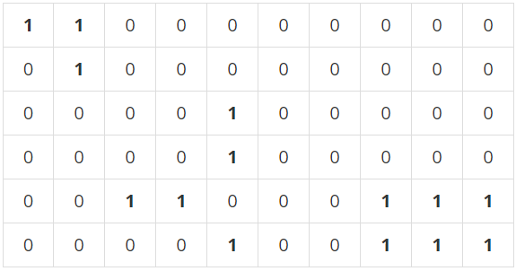

## 정신 못차린 대훈이

정신을 못차린 대훈이는 알고리즘을 손 놓은지 많은 시간이 지났다.

그래서 다시 개념을 정리 하면서 문제를 풀려고 한다.

원래도 잘 못했는데 손을 놓았으니 얼마나 머리가 굳어있을까

기본 개념부터 다시 정리하고 쉬운 난이도 문제들을 풀어보자

# BFS 와 DFS

Breadth First Search (넓이 우선 탐색)

알고 공부할때도 그나마 재미있었던 탐색 방법..

넓이 우선 탐색이 무슨말이냐

현재 정점에서 갈 수 있는 곳을 다 탐색하고, 탐색한 곳에서 갈 수 있는곳을 또 탐색하는것

말로 이해가 힘들 수 있다.


출저-BFS 위키백과

이처럼 윗부분 부터 다 탐색한뒤 깊이 들어간다고 생각하면 된다.

조금더 쉽게 이해를 위해서



EX)투게더 아이스크림 먹을때 위에서 부터 천천히 파먹는거처럼

반대로 DFS는 투게더 먹을때 옆부분을 먹는게아니라 땅바닥 보일때 까지 파먹고

그다음 옆부분을 먹고 또 땅바닥 까지 파먹고 이렇게 생각하자.


출저 - DFS 위키백과

이처럼 Depth First Search 는 한 지점에서 깊이 갈수 있는곳으로 다 간다음

다음 정점으로가 그 정점의 끝까지 가는것을 말한다.

개념 정리 다시 했으닌깐 문제를 풀어보자 대훈아.

어려운거 부터 풀면 또 손 놓을 수 있으닌깐 실버1 문제로

### 백준 1012

문제 원본 https://www.acmicpc.net/problem/1012

#### 문제 
차세대 영농인 한나는 강원도 고랭지에서 유기농 배추를 재배하기로 하였다. 농약을 쓰지 않고 배추를 재배하려면 배추를 해충으로부터 보호하는 것이 중요하기 때문에, 한나는 해충 방지에 효과적인 배추흰지렁이를 구입하기로 결심한다. 이 지렁이는 배추근처에 서식하며 해충을 잡아 먹음으로써 배추를 보호한다. 특히, 어떤 배추에 배추흰지렁이가 한 마리라도 살고 있으면 이 지렁이는 인접한 다른 배추로 이동할 수 있어, 그 배추들 역시 해충으로부터 보호받을 수 있다.

(한 배추의 상하좌우 네 방향에 다른 배추가 위치한 경우에 서로 인접해있다고 간주한다)

한나가 배추를 재배하는 땅은 고르지 못해서 배추를 군데군데 심어놓았다. 배추들이 모여있는 곳에는 배추흰지렁이가 한 마리만 있으면 되므로 서로 인접해있는 배추들이 몇 군데에 퍼져있는지 조사하면 총 몇 마리의 지렁이가 필요한지 알 수 있다.

예를 들어 배추밭이 아래와 같이 구성되어 있으면 최소 5마리의 배추흰지렁이가 필요하다.

(0은 배추가 심어져 있지 않은 땅이고, 1은 배추가 심어져 있는 땅을 나타낸다.)



#### 1이 배추닌깐 배추가 안전하려면 배추벌레가 최소 5마리 필요

```java

public class 유기농배추 {
static int map [][];
static boolean visit[][];
static int result,M,N,K;
static int dx[] = {0,-1,0,1};//오른쪽,아래,왼쪽,위
static int dy[] = {1,0,-1,0};
	public static void main(String[] args) throws IOException{
		
		BufferedReader br = new BufferedReader(new InputStreamReader(System.in));
		int testcase = Integer.parseInt(br.readLine());
		for(int t =0 ; t<testcase; t++) {
			StringTokenizer st = new StringTokenizer(br.readLine());
			 M = Integer.parseInt(st.nextToken());//가로길이
			 N = Integer.parseInt(st.nextToken());//세로길이
			 K = Integer.parseInt(st.nextToken());//배추갯수		
			
			result = 0; //에벌레수
			map = new int[N][M];//배추 담을 2차원배열
			visit = new boolean[N][M];//방문확인
			
			for(int k=0; k<K; k++) {
				st = new StringTokenizer(br.readLine());
				int x = Integer.parseInt(st.nextToken());
				int y = Integer.parseInt(st.nextToken());
				map[y][x]=1;
			}
			//작업시작
			for(int x=0; x<N; x++) {
				for(int y=0; y<M; y++) {
					//배추가 있고 방문안한곳이면 벌레뿌리기
					if(map[x][y]==1&&!visit[x][y]) {
						result++;
						bfs(x,y);
					}
				}
			}
			System.out.println(result);
		}
	}
	private static void bfs(int x, int y) {
		visit[x][y]=true;//시작점 방문체크
		Queue<Integer> q = new LinkedList<>();
		q.add(x);
		q.add(y);
		//애벌레 체크
		while(!q.isEmpty()) {
			int X = q.poll();
			int Y = q.poll();
			for(int k=0;k<4;k++) {
				int nextX = X+dx[k];
				int nextY = Y+dy[k];
//				if(nextX>=N||nextY>=M||nextX<0||nextY<0) {
//배열밖나가면통과
//					continue;
//				}
//				if(visit[nextX][nextY]||map[nextX][nextY]==0) {
//방문한곳이거나배추가없으면 통과
//					continue;
//				}
				if(nextX<N&&nextY<M&&nextX>=0&&nextY>=0
				&&!visit[nextX][nextY]&&map[nextX][nextY]==1) {				
				visit[nextX][nextY]=true; //방문체크
				q.add(nextX);
				q.add(nextY);
				}
			}
			
		}
		
	}

}
```
주석을 지우고 주석처리되어있지 않는 부분 if 를 주석처리해도 똑같은말이다.

큐를 이용해서 기초적인 BFS문제를 풀어보았다.

DFS 문제도 풀어보자.