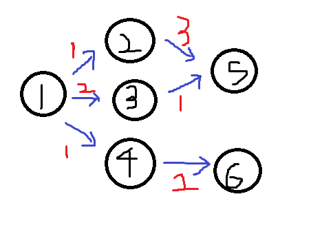
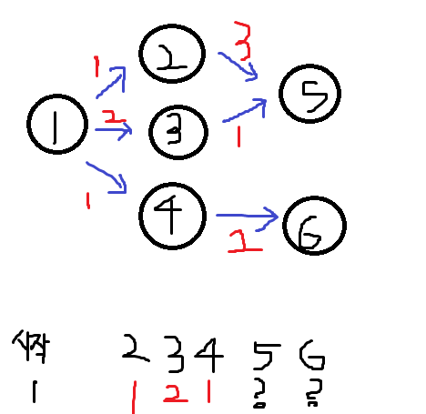
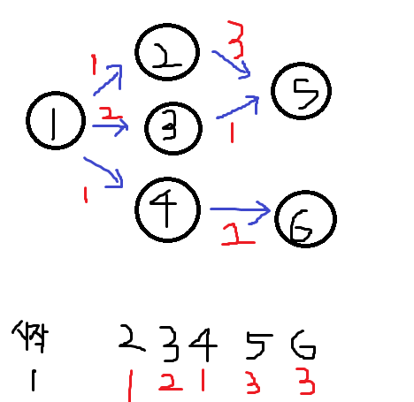

## 정신 못차린 대훈이2

알고 쫄보 대훈이는 다익스트라 알고리즘도 다시 공부하려고 한다.

오랜만에 문제를 푸는데 계속 흥미를 유지하기위해 쉬운 다익스트라 문제를 하나 또 풀어보자.

골드 5 최단경로 문제를 풀어보자.

기본 개념부터 다시 정리하고 쉬운 난이도 문제들을 풀어보자

# 다익스트라 알고리즘

한 노드에서 다른 노드까지의 최단 거리를 구하는 알고리즘이다.

여기서 가중치(거리)가 음수가 존재하면 안된다.

내가 좋아하는 플로이드-와샬 알고리즘이랑 비슷한데

1. 다익스트라는 하나의 노드로부터 최단경로를 구하는것

2. 플로이드 와샬은 가능한 모든쌍들에 대한 최단 거리를 구하는것

이렇게 두가지만 기억하면 된다.

최단 경로 알고리즘 중 하나인 다익스트라. 꼭 알아두자

네비게이션, 지하철 등 실생활 검색 엔진 서비스에서도 경로 알고리즘은 항상 사용되닌깐

## 다익스트라 알고리즘 개념

구글과 나무위키등 검색 해보고 마음에 드는 설명 글이 없다.

아주 간단하게 개념을 정리하고싶은데 역시 공부에는 야매가 없는것 같다.

내가 공부한것을 바탕으로 최대한 간단하게 설명해보자

내가 그린 기린 그림인데



1번을 시작점으로 하는 모든 노드들의 최단거리를 구하려고 한다.


1. 파랑색은 화살표는 방향이고

2. 빨강색은 거리 비용 (가중치)

3. 1번을 시작점으로 한다.

<방문한 노드 1>



그럼 1번이랑 붙어있는 2,3,4는 거리가 얼마나 걸리는지 1,2,1,?,?로 알수있다.

그다음 가중치가 작은 2번 4번중 하나를 기준으로 또 거리 계산을 시작한다.

2번은 5번으로 향하고있고 5번까지 가는데 비용이 3이닌깐

5까지의 거리는 총 4이다.

<방문한 노드 1,2>

1,2,1,4,?

그다음 가중치가 제일 작은 4번 노드는 6으로 가는데 비용이 2닌깐 1+2


<방문한 노드 1,2,4>

1,2,1,4,3 이된다.

다음은 가중치가 작은 3번에서 계산한다.

#### 3번이 5번으로 가는데 비용이 1 드닌깐 총비용은 3.

1번에서 2번, 2번에서 5번 으로 비용 = 4
1번에서 3번, 3번에서 5번 으로 비용 = 3

새로 발견한 길이 비용이 더 적을때 비용을 갱신해준다.
1,2,1,4,3 이

1,2,1,3,3 으로 바뀌는거다.



<방문노드 1,2,4,3>

나머지 5,6은 화살표가 없으닌깐 끝

이해가 힘들면 구글 나무위키를 참조하자.

### 백준 1753 최단경로 풀어보기
문제원본 https://www.acmicpc.net/problem/1753

### 문제 
방향그래프가 주어지면 주어진 시작점에서 다른 모든 정점으로의 최단 경로를 구하는 프로그램을 작성하시오. 단, 모든 간선의 가중치는 10 이하의 자연수이다.

### 입력 
첫째 줄에 정점의 개수 V와 간선의 개수 E가 주어진다. (1≤V≤20,000, 1≤E≤300,000) 모든 정점에는 1부터 V까지 번호가 매겨져 있다고 가정한다. 둘째 줄에는 시작 정점의 번호 K(1≤K≤V)가 주어진다. 셋째 줄부터 E개의 줄에 걸쳐 각 간선을 나타내는 세 개의 정수 (u, v, w)가 순서대로 주어진다. 이는 u에서 v로 가는 가중치 w인 간선이 존재한다는 뜻이다. u와 v는 서로 다르며 w는 10 이하의 자연수이다. 서로 다른 두 정점 사이에 여러 개의 간선이 존재할 수도 있음에 유의한다.

#### 문제푸는중


```java

public class 유기농배추 {
static int map [][];
static boolean visit[][];
static int result,M,N,K;
static int dx[] = {0,-1,0,1};//오른쪽,아래,왼쪽,위
static int dy[] = {1,0,-1,0};
	public static void main(String[] args) throws IOException{
		
		BufferedReader br = new BufferedReader(new InputStreamReader(System.in));
		int testcase = Integer.parseInt(br.readLine());
		for(int t =0 ; t<testcase; t++) {
			StringTokenizer st = new StringTokenizer(br.readLine());
			 M = Integer.parseInt(st.nextToken());//가로길이
			 N = Integer.parseInt(st.nextToken());//세로길이
			 K = Integer.parseInt(st.nextToken());//배추갯수		
			
			result = 0; //에벌레수
			map = new int[N][M];//배추 담을 2차원배열
			visit = new boolean[N][M];//방문확인
			
			for(int k=0; k<K; k++) {
				st = new StringTokenizer(br.readLine());
				int x = Integer.parseInt(st.nextToken());
				int y = Integer.parseInt(st.nextToken());
				map[y][x]=1;
			}
			//작업시작
			for(int x=0; x<N; x++) {
				for(int y=0; y<M; y++) {
					//배추가 있고 방문안한곳이면 벌레뿌리기
					if(map[x][y]==1&&!visit[x][y]) {
						result++;
						bfs(x,y);
					}
				}
			}
			System.out.println(result);
		}
	}
	private static void bfs(int x, int y) {
		visit[x][y]=true;//시작점 방문체크
		Queue<Integer> q = new LinkedList<>();
		q.add(x);
		q.add(y);
		//애벌레 체크
		while(!q.isEmpty()) {
			int X = q.poll();
			int Y = q.poll();
			for(int k=0;k<4;k++) {
				int nextX = X+dx[k];
				int nextY = Y+dy[k];
//				if(nextX>=N||nextY>=M||nextX<0||nextY<0) {
//배열밖나가면통과
//					continue;
//				}
//				if(visit[nextX][nextY]||map[nextX][nextY]==0) {
//방문한곳이거나배추가없으면 통과
//					continue;
//				}
				if(nextX<N&&nextY<M&&nextX>=0&&nextY>=0
				&&!visit[nextX][nextY]&&map[nextX][nextY]==1) {				
				visit[nextX][nextY]=true; //방문체크
				q.add(nextX);
				q.add(nextY);
				}
			}
			
		}
		
	}

}
```
