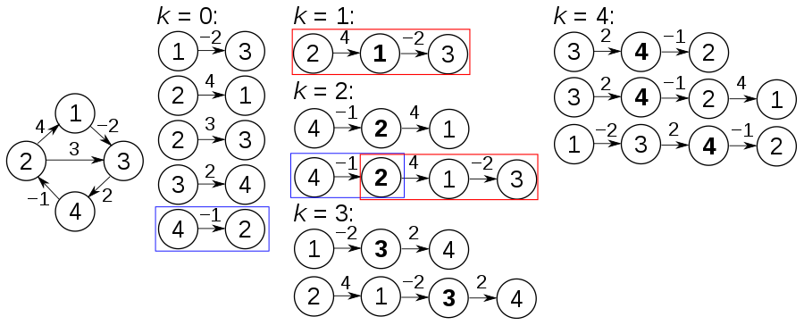

## 정신 못차린 대훈이3

정신을 못차린 대훈이는 알고리즘을 손 놓은지 많은 시간이 지났다.

그래서 다시 개념을 정리 하면서 문제를 풀려고 한다.

옛날에 좋아했던 플로이드 와샬 알고리즘을 사용하여 문제를 풀어보자.

백준의 플로이드 와샬 알고리즘은 문제의 난이도는 낮다.

문제의 난이도에 비해 문제의 티어는 높기때문에 경험치를 냠냠하자.

# 플로이드와샬-알고리즘

저번에는 한 노드에서 최단 거리를 구하는 다익스트라 알고리즘을 공부했다.

이번 플로이드 와샬 알고리즘은 한노드가 아닌 모든 노드에서 모든 최단 경로를 계산하는 방식이다.


출저-플로이드 위키백과


개념만 알면 굉장히 쉬운 알고리즘이다.

이개념만 생각하자 "시작점과 도착점 중간에 경유지를 들린다."

창원에서 서울로 가는데 일직선으로 가면 거리가 100이다.

창원에서 대구로 갔다가 서울로 가면 거리가 150이 된다.(기각)

창원에서 구미로 갔다가 서울로 가면 거리가 80이 된다.(채택)

이러면 창원에서 서울로 가는데 거리는 80이 되는것이다.

이렇게 중간에 경유지로 모든 점들을 넣어본다고 생각하면된다.

이렇게 생각하면 코딩에서도 아주 간단하다.

```java
//거쳐가는 대구,구미,등 노드들
for(int i =0; i<N; i++){

	//창원,서울,어느지역이든 출발 노드들
	for(int j =0 ; j<N; j++){

		//서울,창원,어느지역이든 도착 노드들
		for(int k=0; k<N; k++){

			//이곳을 집중
		}
	}
}
```

이곳을 집중이라는 부분에 이제 창원 에서 서울 로 가는데 대구를 들려서 갔을때
비용이 만약 적어진다면 그 비용을 적는 란이다.

```java
if(d[i][j]>d[i][k]+d[k][j]){
	d[i][j]=d[i][k]+d[k][j];
}
//이것을 이렇게 바꿔서 보면된다.
if(d[창원출발][서울도착]>d[창원출발][대구경유]+d[대구경유][서울도착]){
	d[창원출발][서울도착]=d[창원출발][대구경유]+d[대구경유][서울도착];
}
```
개념 정리를 완료했으니 쉬운 백준문제를 하나 풀어보자.

### 백준 11404 플로이드
문제원본 https://www.acmicpc.net/problem/11404

#### 문제
n(1 ≤ n ≤ 100)개의 도시가 있다. 그리고 한 도시에서 출발하여 다른 도시에 도착하는 m(1 ≤ m ≤ 100,000)개의 버스가 있다. 각 버스는 한 번 사용할 때 필요한 비용이 있다.
모든 도시의 쌍 (A, B)에 대해서 도시 A에서 B로 가는데 필요한 비용의 최솟값을 구하는 프로그램을 작성하시오.

#### 입력
첫째 줄에 도시의 개수 n(1 ≤ n ≤ 100)이 주어지고 둘째 줄에는 버스의 개수 m(1 ≤ m ≤ 100,000)이 주어진다. 그리고 셋째 줄부터 m+2줄까지 다음과 같은 버스의 정보가 주어진다. 먼저 처음에는 그 버스의 출발 도시의 번호가 주어진다. 버스의 정보는 버스의 시작 도시 a, 도착 도시 b, 한 번 타는데 필요한 비용 c로 이루어져 있다. 시작 도시와 도착 도시가 같은 경우는 없다. 비용은 100,000보다 작거나 같은 자연수이다.

시작 도시와 도착 도시를 연결하는 노선은 하나가 아닐 수 있다.

```java
import java.io.BufferedReader;
import java.io.IOException;
import java.io.InputStreamReader;
import java.util.StringTokenizer;
public class 플로이드 {
	static int n, m;
	static int map[][];
	public static void main(String[] args) throws IOException {
		BufferedReader br = new BufferedReader(new InputStreamReader(System.in));
		n = Integer.parseInt(br.readLine());// 도시갯수
		m = Integer.parseInt(br.readLine());// 버스갯수
		map = new int[n + 1][n + 1];
		for (int i = 1; i <= n; i++) {
			for (int j = 1; j <= n; j++) {
				map[i][j] = 987654321;// 비용 초기화
			}
		}
		// 시작도시 a 도착도시b 비용c
		for (int i = 0; i < m; i++) {
			StringTokenizer st = new StringTokenizer(br.readLine());
			int a = Integer.parseInt(st.nextToken());
			int b = Integer.parseInt(st.nextToken());
			int c = Integer.parseInt(st.nextToken());
			if(map[a][b]>c)map[a][b] = c;
			//입력값 거르기
		}
		//플로이드와샬알고리즘
		for (int k = 1; k <= n; k++) {
			for (int i = 1; i <= n; i++) {
				for (int j = 1; j <= n; j++) {
					if (i==j||j==k||k==i)
						continue;
					if (map[i][j] > map[i][k] + map[k][j]) {
						map[i][j] = map[i][k] + map[k][j];
					}
				}
			}
		}
		for (int i = 1; i <= n; i++) {
			for (int j = 1; j <= n; j++) {
				if (map[i][j] >= 987654321) {
					map[i][j] = 0;
				}
				System.out.print(map[i][j] + " ");
			}
			System.out.println();
		}

	}

}
```


