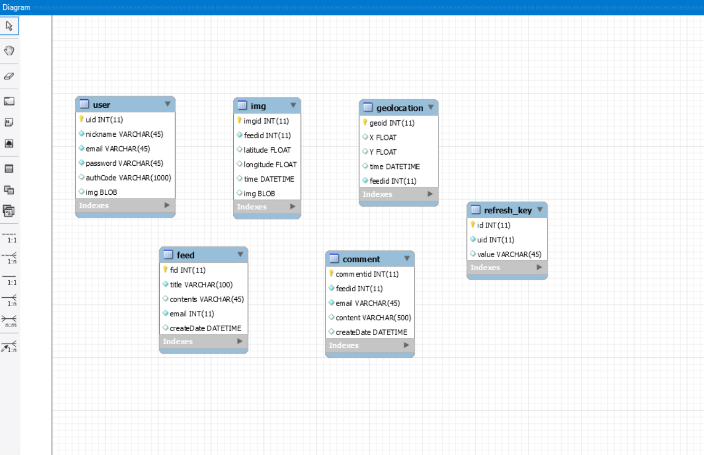
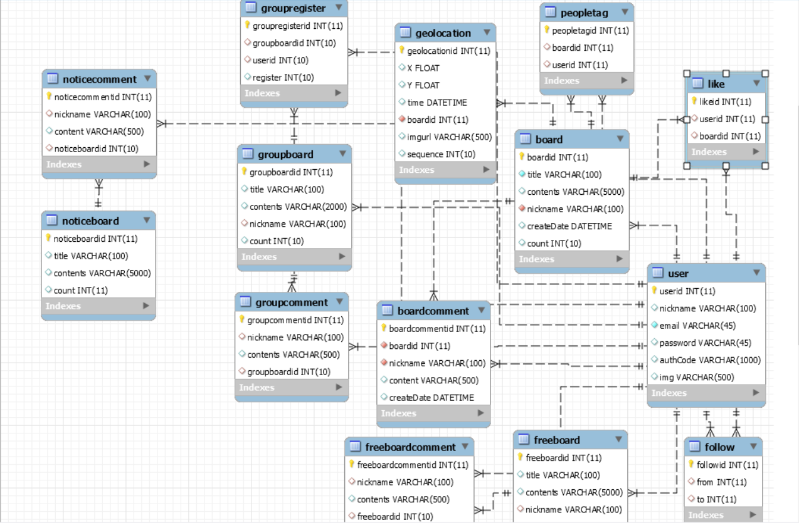

## 자전거 프로젝트란

> 이전에 소개글 참고

<https://daehun93.github.io/%EC%9E%90%EC%A0%84%EA%B1%B0SNS%ED%94%84%EB%A1%9C%EC%A0%9D%ED%8A%B8-%EC%8B%A4%EC%8A%B5/>


### 그래서 지금 까지 완성된 백 

실력이 아직 한참 부족하다.ㅠㅠ

VO , DAO , SERVICE 까지 미완성ㅠㅠ

현재 DB 설계만 구체적으로 완성된 단계다.

사용자 같은 경우에는 이메일 인증 부터 회원가입, 이메일로 비밀번호 찾기, 계정삭제
까지 완성했다.



첫날 DB설계가 이랬다면 지금은



약간 복잡해 보일수 있는데 구동 원리는 간단하다.

사용자 유저 테이블을 기준으로

1. 리뷰 게시판 (테이블명 BOARD)
2. 모임 게시판 (테이블명 groupboard)
3. 공지 게시판 (테이블명 noticeboard)
4. 자유 게시판 (테이블명 freeboard)

그 외에 Like 는 좋아요한 게시물관리
peopletag는 사람태그 추가
follow는 팔로우 팔로워 기능을 넣을 생각이다.

백같은 경우 프론트와 맞춰서 작업하기보다 먼저 만들어 놓으라는
컨설턴트님 말씀을 따라 만들기 시작했는데 많이 늦었다.

더 효율적인 DB설계가 가능할꺼 같지만 어서 컨트롤러 작업을 시작해야겠다.

### 이메일 인증 기능 

이메일 인증을 구현하는 와중에 javax.mail 오류
때문에 고생을했다.ㅠㅠ 

알고보니 pom.xml 버전만 최신으로 바꿔주면 해결되는것을..

이렇게
1.5.0 버전으로 바꿔주니 오류가 해결됬다.ㅠㅠ

``` java
<!-- https://mvnrepository.com/artifact/javax.mail/mail -->
		<dependency>
			<groupId>javax.mail</groupId>
			<artifactId>mail</artifactId>
			<version>1.5.0-b01</version>
		</dependency>
```

갓진균 형님한테 더 배워서 따라가야겠다.

https://jksk0115.tistory.com/


### 다음에도 참고하려고 적는 메일전송 VO
```java
public class MailSender implements Runnable {
	private User user;
	private String context;

	public MailSender(User user, String context) {
		this.user = user;
		this.context = context;
	}

	@Override
	public void run() {
		// 보내는 사람(개발자) 설정
		// gmail 사용시, 구글 보안 수준 변경 필요
		// https://www.google.com/settings/security/lesssecureapps -> 허용
		String host = "";
		final String mailId = ""; // 아이디, @naver.com제외
		final String mailPw = ""; // 비밀번호
		int port = ; // 포트번호

		// 메일 내용
		String recipient = user.getEmail(); // 받는사람 = user 이메일
		String subject = "새로운 " + context + "가 전송되었습니다.";

		String code = null;
		if (context.equals("비밀번호") == true) {
			code = user.getPw();
		} else if (context.equals("인증코드") == true) {
			code = user.getAuthCode();
		}
		String body = "<div>" + context + "는 " + code + " 입니다.</div>";

		// 정보를 담기 위한 객체 생성
		Properties props = System.getProperties();

		// SMTP 서버 정보 설정
		props.put("mail.smtp.host", host);
		props.put("mail.smtp.port", port);
		props.put("mail.smtp.auth", "true");
		props.put("mail.smtp.ssl.enable", "true");
		props.put("mail.smtp.ssl.trust", host);

		// Session 생성
		Session session = Session.getInstance(props, new javax.mail.Authenticator() {
			protected javax.mail.PasswordAuthentication getPasswordAuthentication() {
				return new javax.mail.PasswordAuthentication(mailId, mailPw);
			}
		});

		Message mimeMessage = new MimeMessage(session);
		try {
			mimeMessage.setFrom(new InternetAddress("")); // 발신자
			mimeMessage.setRecipient(Message.RecipientType.TO, new InternetAddress(recipient)); // 수신자
			mimeMessage.setSubject(subject);
			mimeMessage.setContent(body, "text/html; charset=utf-8");
			Transport.send(mimeMessage);
		} catch (Exception e) {
			e.printStackTrace();
		}
	}
}

```

### 다음에도 참고하려고 적는 Controller
```java
  @ApiOperation(value = "계정명이 id인 사용자를 생성하고 해당 사용자의 인증코드를 반환한다.")
	@RequestMapping(value = "/create", method = RequestMethod.POST)
	public ResponseEntity<String> create(@RequestBody String id) throws Exception {

		User user = null;
		ObjectMapper mapper = new ObjectMapper();

		// 기존DB에 id가 존재하는 경우
		if (userService.checkIdDuplication(id)) {
			user = userService.get(id);

			// 인증란이 pass인 경우, 즉 회원가입이 완료된 id인 경우
			if (user.getAuthCode().equals("pass") == true) {
				return new ResponseEntity<String>(mapper.writeValueAsString(1), HttpStatus.OK);
			}
			user.setAuthCode(User.createRandomCode(12));
			userService.update(user);
		} else {
			// id가 이메일 형태인지 확인하는 부분 작성 요망...
			user = new User(id);
			userService.create(user);
		}

		MailSender mailSender = new MailSender(user, "인증코드");
		Thread mailSenderThread = new Thread(mailSender, "메일센더 스레드");
		mailSenderThread.start();

		return new ResponseEntity<String>(mapper.writeValueAsString(0), HttpStatus.OK);
	}

```