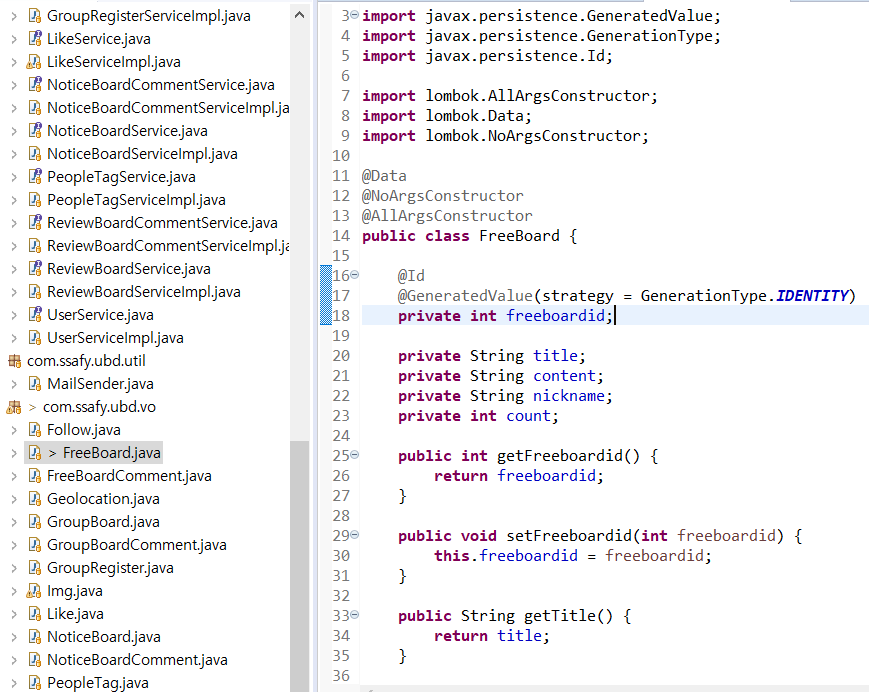
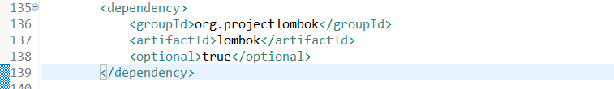

## 진행현황

> 이전에 소개글 참고

<https://daehun93.github.io/%EC%9E%90%EC%A0%84%EA%B1%B0%EC%BB%A4%EB%AE%A4%EB%8B%88%ED%8B%B0-%EB%B0%B1%EA%B0%9C%EB%B0%9C/>

<iframe width="100" height="100" src="https://www.youtube.com/watch?v=uCOMvwyHQdE&t=1067s" frameborder="0" allowfullscreen></iframe>


### 주말 동안 완성 시킨 VO DAO SERVICE 


이 DB 테이블들의 VO와 DAO, SERVICE를 완성시키자

#### VO 부터



지금 사용한 lombok 부터 알아보자


설치 방법은 아주 간단하다. lombok 홈페이지에서 jar 다운받고 실행 한뒤
pom.xml 에 의존성을 추가해주면 된다.

class 위에 @Data를 보면
>@Data는 @ToString,@EqualsAndHashCode,@Getter,@Setter,@RequiredArgsConstructor을 모두 생성해준다.

그래서 사용할때 조심히 용도에 맞게 사용하는걸 추천.
>@Getter,@Setter는 위에 그림처럼 getter,setter를 쓸 필요없이 만들어주는 어노테이션이다.

>그리고 내가 사용한 @NoArgsConstructor은 디폴트 생성자를 생성한다.

>@AllArgsConstructor은 모든 필드의 생성자를 생성한다.

그외에도 엄청 많은 어노테이션이 있는데 lombok홈페이지를 참고하면 된다.

나는 위 코드에서 DB에 데이터를 입력할때 Javax.persistence 를 사용해서
>@Id는 클래스의 필드를 테이블에 기본키로 매핑하기 위해서 사용했다.

>@GeneratedValue는 해당 Id값을 어떻게 자동으로 생성할지 선택한다.

저 사진을보면 지금까지 설명을 바탕으로 freeboardid 는 DB에 자동으로 추가되고
기본키로 사용한다는것을 알 수있다.

그리고 디폴트 생성자와 모든 필드의 생성자를 생성하기때문에 따로 선언할 필요가 없다.

#### DAO 인터페이스
```java

public interface FreeBoardDAO {

	// 자유게시판 작성
	public boolean insertFreeBoard(FreeBoard freeboard) throws Exception;

	// 자유게시판수정
	public boolean updateFreeBoard(FreeBoard freeboard) throws Exception;

	// 자유게시판 삭제
	public boolean deleteFreeBoard(int freeboardid) throws Exception;

	// 자유게시판 목록
	public List<FreeBoard> searchAllFreeBoard();

	// 내가 쓴글 보기
	public List<FreeBoard> searchMyFreeBoard(int uid) throws Exception;

	// 조회수,인기별로 검색
	public List<FreeBoard> searchFreeBoardByCount() throws Exception;

}
```
DAO 인터페이스 같은경우 사용 설명서라고 생각하면 편하다.

어떤 메소드들을 넣을것인지 간단한 주석과 함께 인터페이스를 만든다.

가장 간단한 자유게시판 DAO를 보면 CRUD를 넣고 추가적으로 내가 쓴 글과 조회수로 검색을 넣었다.

```java
@Repository
public class FreeBoardDAOImpl implements FreeBoardDAO {

	@Autowired
	private SqlSession sqlSession;
	private final String namespace = "FreeBoardMapper.";

	@Override
	public boolean insertFreeBoard(FreeBoard freeboard) throws Exception {
		int cnt = sqlSession.insert(namespace + "insertFreeBoard", freeboard);
		if (cnt != 0) {
			return true;
		}
		return false;
	}

	@Override
	public boolean updateFreeBoard(FreeBoard freeboard) throws Exception {
		int cnt = sqlSession.update(namespace + "updateFreeBoard", freeboard);
		if (cnt != 0) {
			return true;
		}
		return false;
	}

	@Override
	public boolean deleteFreeBoard(int freeboardid) throws Exception {
		int cnt = sqlSession.delete(namespace + "deleteFreeBoard", freeboardid);
		if (cnt != 0) {
			return true;
		}
		return false;
	}

	@Override
	public List<FreeBoard> searchAllFreeBoard() {
		return sqlSession.selectList(namespace + "searchAllFreeBoard");
	}

	@Override
	public List<FreeBoard> searchMyFreeBoard(int uid) throws Exception {
		return sqlSession.selectList(namespace + "searchMyFreeBoard", uid);
	}

	@Override
	public List<FreeBoard> searchFreeBoardByCount() throws Exception {
		return sqlSession.selectList(namespace + "searchFreeBoardByCount");
	}

}
```
>@Repository는 클래스가 데이터 저장소를 정의한다는것을 말한다.
레퍼지토리는 데이터베이스에 직접 액세스 한다.

>@Autowired는 의존 자동 주입이다. 스프링이 알아서 의존 객체를 찾아준다.

### Service 구조와 Controller 구조는 다음시간에

```java
모임게시판테이블
모임게시판pk
만든사람
제목
내용
총거리
도보
자전거
최대받을사람

모임게시판 댓글 테이블

모임게시판회원신청테이블
pk
모임게시판번호(외래키)
회원신청한사람userid


모임게시판용 좌표테이블
pk
모임게시판번호(외래키)
X축
Y축
```
추가 되어야할 DB 테이블이 생겼기 때문에.. 주르륵

<iframe width="10" height="100" src="https://www.youtube.com/embed/uCOMvwyHQdE?autoplay=1" frameborder="0" allow="accelerometer; autoplay; encrypted-media; gyroscope; picture-in-picture" allowfullscreen></iframe>