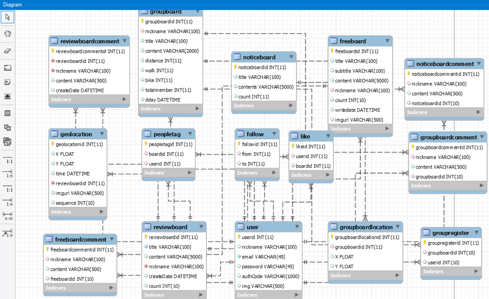
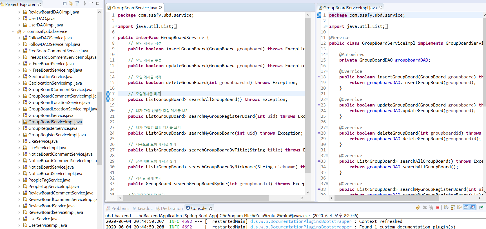

## 진행현황

> 이전에 소개글 참고

<https://daehun93.github.io/%EC%9E%90%EC%A0%84%EA%B1%B0%EC%BB%A4%EB%AE%A4%EB%8B%88%ED%8B%B0-%EB%B0%B1%EA%B0%9C%EB%B0%9C2/>
<!-- SCM Music Player https://www.scmplayer.net -->

<!-- SCM Music Player script end -->

### SERVICE 부분과 CONTROLLER부분 건들어보자

저번에 프론트 친구들에게 부탁을 받고 DB 테이블 몇몇 부분이 수정되었다.

#### SERVICE

인터페이스 구현체 부분의 문제를 살펴보자

### 집가서 아랫부분 마저 완성
