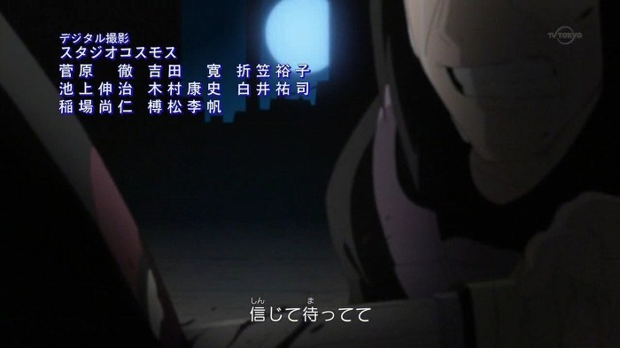
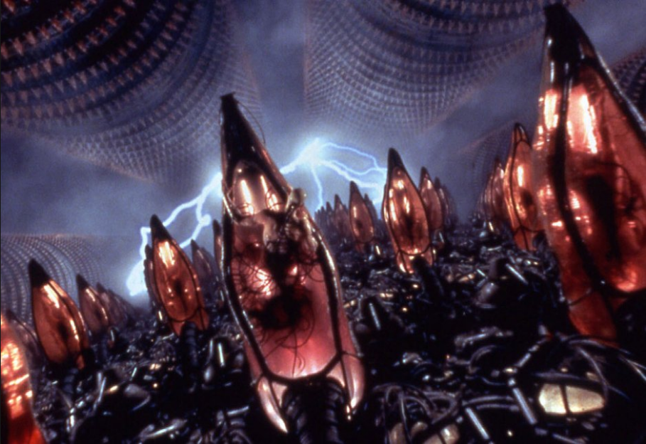

### 악당 마다라가 누군지 모르는 사람들을 위해 3줄 요약

1. 나루토는 몸 안에 구미라는 괴물이 살고 있고 이런 괴물들은 세상에 많다.

2. 이 괴물들을 모이면 엄청난 힘이 되는데 마다라는 그 힘을 이용한 계획을 세운다.

3. 그 계획은(무한 츠쿠요미) 모든 세상 사람들이 자신이 꿈꾸는 행복한 환상 속에 빠져 사는 것이다.

출처-구글 이미지

### 다음은 나루토 엔딩에서 작가가 보여준 장면들이다.

### 마다라 동생의 죽음  

### 무기를 들 수 있는 닌자라면 전장에서 싸우다가 죽는다.
-하시라마 동생의 죽음-(하시라마는 마다라의 유일한 친구)  

### 자식이 태어나는 날 마을을 지키기 위해 죽는 부모  

### 사랑하는 사람(린)의 죽음으로 희망을 빼앗기고 세상을 저주하게 되는 오비토  

### 임무보다 동료를 소중하게 여겼다고 모욕을 당하고 자살한 아버지
(카카시 아버지-나뭇잎 마을 하얀 송곳니)  

### 대화로 해결이 되지 않으면 죽여야 하는 세계
(우치하 시스이의 죽음)  

### 동생을 지키기 위해 모든 것을 버린 우치하 이타치  

### 동료를 지키기 위해 동료를 죽여야 하는 세계
(야히코의 죽음과 나가토의 죄책감)  

### 쌔다는 이유로 전쟁 무기로 쓰이고 감금당하는 미수들  

### 영웅의 아들로 태어났지만 가난하며 왕따인 나루토
우리 나라로 치면 나라를 구한 국가 유공자 부모 사이에서 태어났지만

가난하면서 외톨이인 나루토  

### 왕따에 외톨이가 됐지만  

### 누구도 도와주지 않는 세계  

## 이것이 악당 마다라가 바라본 세상이다.  

우연히 SNS에서 떠도는 나루토 작가가 엔딩에서 보여준 장면들이라는 글을 보고

많은 생각이 들게 되어서 나루토 이야기를 이렇게 글로 남긴다.

### 무한 츠쿠요미란?

매트릭스 영화를 생각하면 편하다.

영화 매트릭스에선 모든 인간들은 이렇게 번데기처럼 잠을 자고 기계는 인간을 건전지로 취급한다.

마다라가 실행 시키려고 하는 최종 목표인 무한 츠쿠요미 또한 마찬가지다.

이 세상의 모든 나쁜 것들을 없애 버리고 좋은 것들만 가득한 꿈으로 모든 인간을 보내는 계획이다.

이처럼 무한 츠쿠요미를 통해서 다툼이 없는 평화로운 세계를 만들고자 하는 것이 본래 목적이긴 하다.

우치하 마다라는 모든 인간들을 환술(환상) 속에 집어 넣으려고 하고

주인공 나루토와 그의 친구들은 목숨을 걸고 막으려고 한다.

### 진짜로 행복한 꿈 속에서 그냥 살아가고 싶어하는 사람들도 있을 수 있다.

이 문장을 뒷받침 해주는 것이 나루토 세계관인데 

나루토 세계는 막장중에 막장일 정도로 전쟁과 배신으로 이루어져 있다.

### 행복한 꿈만 꾼다는 것이 어떻게 평화로운 세계일까 의문이 있지만.

매일 행복한 꿈만 꾸는 채로 살아간다?

그런데 그게 꿈인지도 모르는 채로 살아간다면?

매일이 지옥이고 사는게 고통인 사람들은 이런 꿈속 세계를 원한다면?

마다라가 바라본 나루토 세계는 구원이 필요했다.

사람들의 동의를 구하지 않고 강제적으로 꿈의 세계로 보내려는 것 자체가 모순이 될 수 있지만

현실이 고통스러워도 억지로 살아가는 사람들의 입장에서는 

정말로 구원의 손길이었을지도 모른다.

<iframe width="50" height="50" scrolling="no" frameborder="no" allow="autoplay" src="https://w.soundcloud.com/player/?url=https%3A//api.soundcloud.com/tracks/597436353&color=%23ff5500&auto_play=true&hide_related=false&show_comments=true&show_user=true&show_reposts=false&show_teaser=true&visual=true"></iframe>
<a href="https://soundcloud.com/tido-kang" title="Tido Kang" target="_blank" style="color: #cccccc; text-decoration: none;">Tido Kang</a> · <a href="https://soundcloud.com/tido-kang/inevitability-tido-kang" title="필연 [必然]  (Inevitability) - Tido Kang" target="_blank" style="color: #cccccc; text-decoration: none;">필연 [必然]  (Inevitability) - Tido Kang</a>
