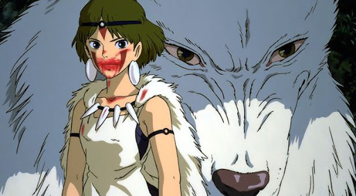
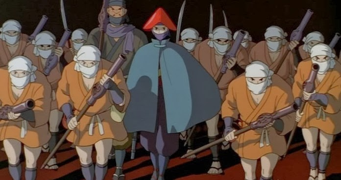
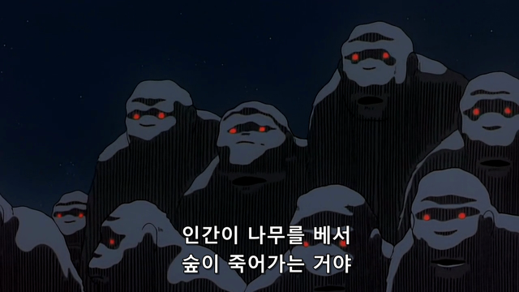
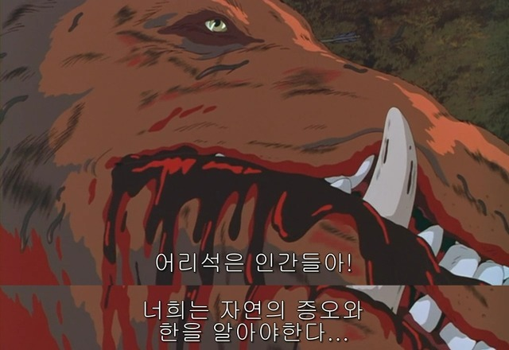
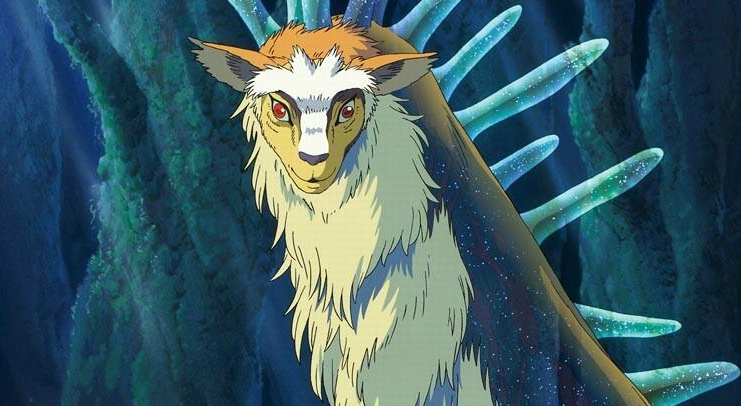
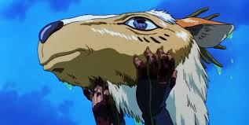
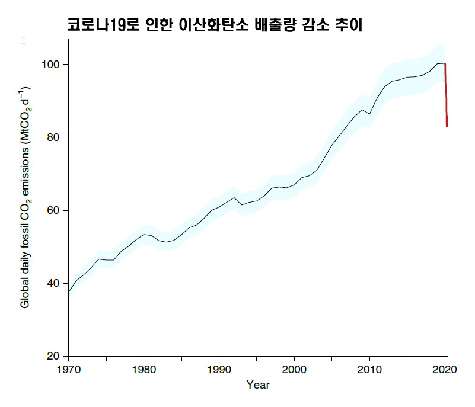

## 평점 ★★★★☆ 

한 15년 전으로 돌아가서 순수했던 마음으로 보면 평점 5점

속세에 찌들어 다시 보니 평점 4점

다시 봐도 명작인 일본 애니메이션의 전설

### 모노노케히메의 전설적인 기록

우리나라에서도 인기가 장난 아니었던 원령공주는 일본에서는 전설적인 애니이다.

일본 극장가 역대 최장 기간 상영 작이며

일본 관객 1420만 이라는 전설적인 기록은 유명하다.

후에 알게 된 사실인데 작품 구상기간은 16년

제작기간 3년 

제작 예산이 200억인 대작이다. 일본 아카데미상 수상작

출처-구글 이미지

### 절대선도 절대악도 없는 만화
자연을 파괴하는 인간이지만 나쁘게 그리지 않았고

인간을 증오하고 복수하려는 자연을 착하게 그리지 않았다.

작가는 인간과 자연의 중간에서 어느 것도 절대악으로 그리지 않았다.

### 마을의 부국강병을 위해 자연을 파괴하는 인간 

자연을 파괴하는 인간은 나쁘다.

생명을 지키는 자연은 착하다.

## 생명을 지키기 위해 자연을 파괴하는 인간은 착한 편인가 나쁜 편인가

이 만화에서 절대악을 정의 내리기 어려운 이유다.

인간은 자신 마을 사람들의 식량과 생활 공간을 위해서 전쟁한다.

그 전쟁으로 부터 마을 사람들을 지키기 위해 무기를 생산한다.

무기를 생산하는 과정에서 자연은 파괴되고 고통받는다.

사람들의 의식주를 위해서 자연을 파괴하는 인간은 과연 나쁜가

자연 파괴 행위의 결과물이 사람들의 식량과 환자들의 보호 공동체 건설이라면

절대악으로 정의할 수 없다고 생각한다.

관객의 가치판단에 따라 주제의식이 바뀌는 만화 영화.

## 생명은 생명의 희생으로 이루어진다 - 몽테뉴

어렸을 적에 멧돼지를 죽이는 인간들을 나쁘게 봤던 기억이 있었다.

지금 다시 영화를 관람하니 어렸을 적 가치관과 변한 나를 볼 수 있었다.

부상자들을 지키고 식량을 위해서 자연을 파괴하는 인간이 납득이 되고

마을을 무차별 공격하는 멧돼지들이 불쌍하고 가여웠다.

## 숲의 신(사슴 신)의 죽음

이 영화에서 사슴 신은 매우 중요한 역할로 등장한다.

숲의 신이자 모든 자연신들의 신

인간에 의해 고통받는 모든 자연과 동물들은 숲의 신에게 도움을 구한다.

하지만 숲의 신은 인간에게 어떠한 해도 가하지 않는다.

대자연의 섭리를 대변하듯이 중립을 지킨다.

하지만 인간의 욕심은 결국 대자연의 섭리를 벗어나고자 하고 숲의 신을 암살한다.

인간은 숲의 신의 목을 들고 달아나게 되고 이로써 인간은 재앙을 맞이하게 된다.

모든 마을이 불타버리고 숲 과 마을 모두 파괴된다.

인간들이 숲의 신에게 다시 목을 갖다 바침으로써 대자연의 섭리를 순응하자

숲은 다시 새롭게 생명을 탄생시키고 자연은 처음으로 돌아간다.

자신들의 파괴된 마을을 본 인간들 또한 잘못을 인정하고 다시 마을을 새롭게 건설하고자 다짐한다.

## 자연도 인간도 더 나은 세상으로 나아가기 위해 노력한다.

그 과정에서 많은 자연이 파괴되고 많은 인간들이 죽어도 새롭게 시작하며

노력과 변화를 추구한다.

모노노케히메 영화를 보며 지금 우리 세상 또한 사슴신의 벌을 받고 있는 게 아닐까

## 코로나 이후 전세계 이산화탄소 배출량 감소

코로나 라는 질병으로 인해서 출장과 휴가가 잦아들었고

비행기들은 지상에 머물게 되었고 

학생들의 수업은 집에서 

직장인들도 재택근무를 하는 경우가 많아졌다.

모든 인간들의 산업활동이 중단됨에 따라 대기오염 또한 줄어들었다.

## 더 나은 세상을 위한 인간들의 산업활동이 도를 넘어버린 것인가

조금 더 숲의 주도권을 갈망하던 인간들이 사슴 신의 목을 베어 대재앙을 맞이하고

잘못을 뉘우치고 다시 시작한 것 처럼 코로나라는 질병은 우리에게 재앙으로 다가왔다.

인간들의 마을이 파괴되어 자연이 다시 태어나고 숨쉬기 시작한 것 처럼

코로나로 인해서 멈춰진 산업활동으로 지구는 다시 숨 쉴 수 있게 된 것일까

## 코로나 이전의 세상은 더이상 지구에 존재하지 않는다.

사슴 신의 분노로 마을이 모두 파괴되어 잘못을 뉘우치고 다시 시작하는 것처럼

우리 또한 코로나 이후 산업과 환경이 상생할 수 있는 출구를 찾아야 하는 것은 아닐까

<iframe width="50" height="50" scrolling="no" frameborder="no" allow="autoplay" src="https://w.soundcloud.com/player/?url=https%3A//api.soundcloud.com/tracks/672235607&color=%23ff5500&auto_play=true&hide_related=false&show_comments=true&show_user=true&show_reposts=false&show_teaser=true&visual=true"></iframe>
<a href="https://soundcloud.com/tido-kang" title="Tido Kang" target="_blank" style="color: #cccccc; text-decoration: none;">Tido Kang</a> · <a href="https://soundcloud.com/tido-kang/09-tido-kang" title="09 전생 - Tido Kang" target="_blank" style="color: #cccccc; text-decoration: none;">09 전생 - Tido Kang</a>
