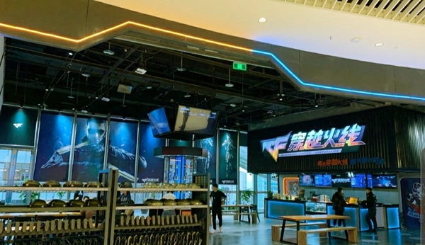

한때 나의 최애 게임이었던 크로스파이어 게임을 리뷰 해보겠다.

이게임이 우리나라에서 망해 서비스를 종료했기 때문에

포스트를 작성하는 지금 내 마음은 우울하다.

출처 - 구글 이미지

#### 이분이 누구인지 잘 아는 사람은 없을 것이다.
이 분은 국내 갑부 순위 4위를 하셨던 권혁빈 회장이다.

1위 이건희 삼성회장 2위 이재용 3위 서정진

이 사람은 스마일게이트 의장으로 자산이 6조 9천억 규모로 추정된다.

2019년 포보스 선정 한국 50대 부자에서 '8위'를 차지했다.

크로스파이어 게임 리뷰를 하려는데 갑자기 왜 이런 글을 올리나?

이 분이 수개월 동안 잠도 제대로 안자고 출시한 게임이

'크로스파이어'다.

출시한지 10년이 넘은 이 게임은 아직도 중국에서 돈벼락을 맞고있다.

### 크로스파이어 하나로 게임 역사의 한 획을 그었다.

게임 동접자수 800만명, FPS 동접자 세계 1위 기록을 가지고있고

통계상으로 전세계 6억 5000만 유저가 있다.

### 게임에서 동접자 800만명이 어느 정도인지 쉽게 설명해주겠다.
경상남도 인구 344만명 + 경상북도 인구 270만명 + 전라남도 인구 190만명

이렇게 하면 804만명인데 경상남도 경상북도 전라남도 남녀노소 모든 사람이

전부 크로스파이어를 동시에 플레이 한다고 생각하면 이게임 규모를 쉽게 체감할 수 있다.

또한 2017년 크로스파이어 결승전 글로벌 시청자 수는 3700만명

이 게임이 얼마나 흥했는지 는 이 숫자들로 이미 다 설명했다.

출처 - 스마일게이트

중국 쑤저우에는 크로스파이어 테마파크 1호점이 열렸고

주요 도시들을 중심으로 5호점까지 열린다고 한다.

이제부터 본격적으로 게임 리뷰를 시작해보자

### 나는 이 게임을 고스트 매치 때문에 했다.
크로스파이어가 그때 당시 AVA라는 피망 게임과 거의 동시 출시했던 걸로 기억한다.

그때 당시에 유행이 서든어택에 실증이 난 유저는 AVA로

그때 당시 고 사양인 AVA를 즐기지 못하는 사람들은 크로스파이어로

가는 경우가 많았는데 나는 폭파미션 처럼 정통FPS 매치는 AVA에서

팀데스매치와 고스트매치는 크로스파이어에서 즐겼던 기억이 난다.

크로스파이어에서 윈더걸스라는 아이디로 많은 클랜 제의를 받기도 했다.ㅎㅎ

(AVA도 JB.Bros라는 50위안에 드는 클랜에 있었음ㅎㅎ)

아무튼 이 고스트 매치 때문에 이 포스트를 쓰게 되었는데 간략하게 리뷰를 해보겠다.

### 레드팀은 칼을 쓰는 투명인간 블루팀은 총을 쏘는 군인

여기서 중요한것은

레드는 '투명인간이면서 숨소리를 낸다'

블루는 '총을 쏘면서 투명인간을 찾는다.'

2007년 당시 얼마나 혁신적인 게임모드인가

지금에서야 수많은 모드와 게임 매뉴얼들이 다양하게 등장했지만

저 때 당시 이렇게 신선한 모드는 나에게 충격적으로 다가왔다.

발소리와 숨소리를 들으면서 투명인간을 찾아내고

투명인간은 움직이면 프레데터 처럼 실루엣이 살짝 보이기때문에 조심해서 접근한다.

레드는 근접 무기만 사용할 수 있으며 폭탄을 설치하고

블루는 총을 사용하지만 적의 위치를 정확하게 알 수는 없다.

### FPS의 기본인 사운드 플레이를 강조한 모드라고 볼 수 있다.

위 아래 왼쪽 오른쪽 사운드 구별과 발자국 소리 숨소리로 상대의 위치를 예상하고

총 소리로 인해서 모든 소리가 차단될 때 적을 급습하는 재미

> 100발 짜리 기관총으로 사방을 쏘면서 다니면 되지않나?
그럼 적의 숨소리와 발소리를 예측 하기 어려워서 팀에게 민폐가 된다.

처음에 나왔을 당시 사운드 플레이에 적응이 안된 블루 팀에게 불리했지만

시간이 지날수록 레드 팀(고스트)들은 승리하기가 어려워졌고

대한민국 게이머들의 특징인 버그 찾기와 각종 기술들을 여기서 찾기 시작했고

개구리 점프 라는 버그를 이용한 투명상태에서 조금씩 움직이는 기술을 발견한다.

황소 개구리 점프를 이용해 먼 거리도 투명의 상태로 움직이는 법도 찾게 됬는데

이로 인해서 게임의 밸런스가 조금 맞아져서 개발자들이 이 버그를 수년간 방치했다 라는 말도 있다.

### 시간이 지날 수록 줄어드는 한국 유저 수
결국 서비스를 임시 중지하고 재 오픈을 했지만 2020년 3월 국내 서비스를 종료하게 되었다.

재 오픈 시점으로 총 유저수가 500명이었다고 한다...ㅠ^ㅠ

실제로 작년에 게임을 즐기려고 들어갔더니 방이 없었다..

우리나라 서버에서 망한 이유는 간단하다.

먼저 내가 플레이를 안했던 이유는 

### 과거 2007년 고스트 매치는 유사 모드로 넥슨 (ㅋㅇㅌㅅㅌㄹㅇㅋ 등) 이미 출시 됐다.
이미 많은 게임들에서 고스트매치를 모방했고 굳이 크로스파이어에서 

적은 유저들을 데리고 이 모드를 즐길 필요가 없어진 것이다.

### 뿔뿔이 흩어진 FPS 매니아 계층 
과거의 정통 FPS 매니아들은 배틀그라운드, 카운터 스트라이크, 레인보우 식스, 콜옵, 배틀필드로 떠났고

또 많은 매니아들은 아예 종목을 바꿔 롤과 오버워치 스팀, 에픽으로 떠나버렸다.

중국에서 대 흥행을 이룬 만큼 우리나라에서 충분히 인기가 많을 수 있었던

국내 한정 비운의 작품.. 해외에선 대박 작품..

AVA와 서든어택에 가려진 크로스파이어는 국내는 테스트서버로 해외를 본 서버 처럼 두게 된다.

### 서비스 종료가 된 시점에서 이젠 추억의 게임이 되어버린 나의 게임

