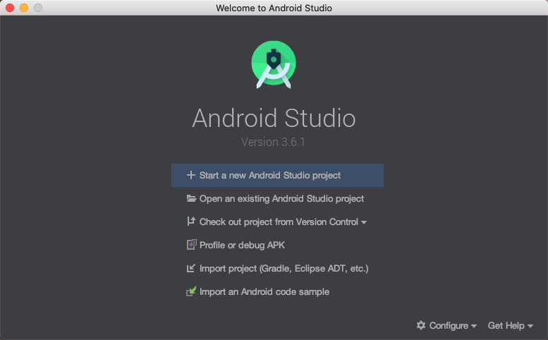
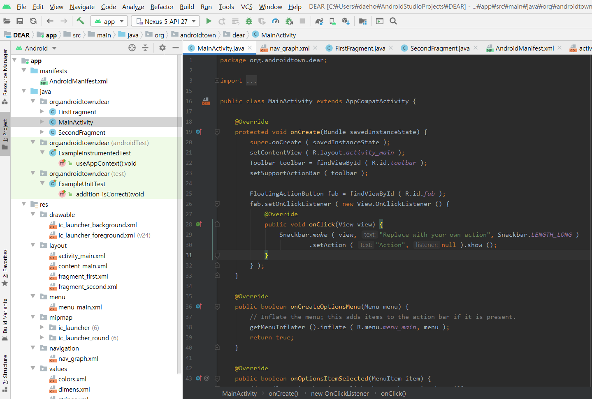

## 안드로이드 공부 시작

갑자기 문득 만들고 싶은 어플이 생긴 대훈이

안드로이드 스튜디오는 대학교때 잠시 다룬게 끝이여서

혼자 제대로 한번 만들어 보고자 한다.

그전에 기본 개념부터 다시 확실히 공부하고 프로젝트를 시작하자

### 기본 개념 공부 시작

먼저 안드로이드 스튜디오를 설치한다.

<https://developer.android.com/studio/?hl=ko>

-출처 안드로이드 개발자 페이지

>프로젝트 만들기

Welcome to Android Studio 창에서 Start a new Android Studio project를 클릭

>프로젝트 들어간다음

File > New > New Project를 선택.

>여러가지 템플릿중에 시작템플릿을 고른다.

Select a Project Template 창에서 아무 Activity를 선택하고 Next를 클릭.

Configure your project 창에서 다음을 완료.

>내가 만들 프로젝트 이름은 Dear
Name 필드에 'Dear'을 입력.

Package name 필드에 'com.example.dear'을 입력.

프로젝트를 다른 폴더에 배치하려면 Save 위치를 변경.

Language 드롭다운 메뉴에서 Java 선택.

Minimum SDK 필드에서 앱이 지원할 Android의 가장 낮은 버전을 선택.

앱에 기존 라이브러리 지원이 필요한 경우 Use legacy android.support libraries 체크박스를 선택.

Finish를 클릭.

## 만들어진 프로젝트 화면이다

여기서 부터 기본 개념과 문법 공부를 시작

### Activity 
기본 사용자 화면을 구성하는 컴포넌트

### Service 
백그라운드에서 실행되는 컴포넌트. 시각적인 인터페이스없음

### Intent
컴포넌트 들한테 액션이랑 데이터를 전달하는것

### Broadcast Receiver
특정 이벤트 브로드캐스트를 수신하고 반응하는것

이전에 문자가 올때마다 수신이벤트를 이걸로 발생시켜서 문자열을 읽은 경험있음.

### Content Provider
앱 간에 데이터 공유를 위해 표준화된 인터페이스 제공 컴퍼넌트

### 안드로이드 4대 주요 컴포넌트

액티비티,서비스,브로드캐스트리시버,콘텐트프로바이더 란다.

지금은 Fragment도 추가되었단다

### 안드로이드 앱 구조

다행히도 지금까지 열심히 공부했던 MVC패턴과 처음 듣는 MVP패턴 구조가 있다.

MVC패턴은 내가 지금까지 사용했던 대로
Model,View,Controller 였는데
MVP패턴은
Model,View,Presenter 란다
### Presenter?
Model과 View를 이어주는 다리같은 역할이란다.

기본적으로 데이터 관리는 Model에서 모든 화면표현은 View에서

그리고 이것들을 각각 호출하고 결과를 섞는애가 Presenter란다..

그럼 MVC하고 MVP차이가 뭐냐
단지 CONTROLLER와 PRESENTER 차이인데
MVC는 사용자가 새로운 URL 접근 요청하면 (RESTFUL API)
CONTROLLER에서 반응해가지고 URL에 맞게 VIEW가져와서 작업 처리했다치면

MVP는 먼저 View가 먼저 반응하고 > Presenter 에게 알리고 > 다시 View에 알린단다.

차이점이 거의 없는거 같긴한데..

사용자 입력이 View에서 제일 먼저 일어나서 View가 Controller역할도 해야한단다.

### 기본 프로젝트 코드 살펴보기

액티비티 역할을 위해서는 extends Activity로 클래스를 상속해야 사용가능.

onCreate()메소드에서 setContentView()메소드를 호출하고 있는데

R.layout.activity_main 호출하는 부분을 보면

이건 main.xml을 가르키는것이다.

지금 까지 모르고 사용해왔지만 R은 R클래스 내에 작성되어있는 정적클래스와  정적변수를 가르킨다.
R클래스는 안드로이드 빌드 시스템에서 자동으로 생성되는 자바클래스이고 리소스를 효율적으로
접근할 수 있도록 관리하는 역할을 한다.그러므로 R.java는 건들지말아야 한다.

그래서 리소스 자원을 R.mipmap.ic , R.string.app_name처럼 접근 가능하다.

## 액티비티 생명주기
무엇으로 개발을 하든 라이프 싸이클은 중요하다.

생명 주기에 따라 적절한 메소드가 호출해서 사용하자.

-출처 구글이미지

onCreate : 액티비티가 생성될때 호출 된다. 사용자 인터페이스 초기화

onStart : 정지 했다가 다시 시작되기 전에 호출

onResume : 사용자와 상호작용 하기 전에 호출

onPause : 다른 화면이 보여질때 호출 데이터 저장 스레드 중지 처리할때 좋음

onStop : 더이상 사용자에게 보여지지 않을때 호출

onDestroy : 액티비티 완전 소멸될때 호출

onRestart : 멈췄다가 다시 시작되기 전에 호출

onUserLeaveHint : 사용자가 홈키 눌렀을때 호출 되는 메소드 > 다음 onPause호출

### 다음 공부는 다음시간에 인생치킨먹으러 빠이