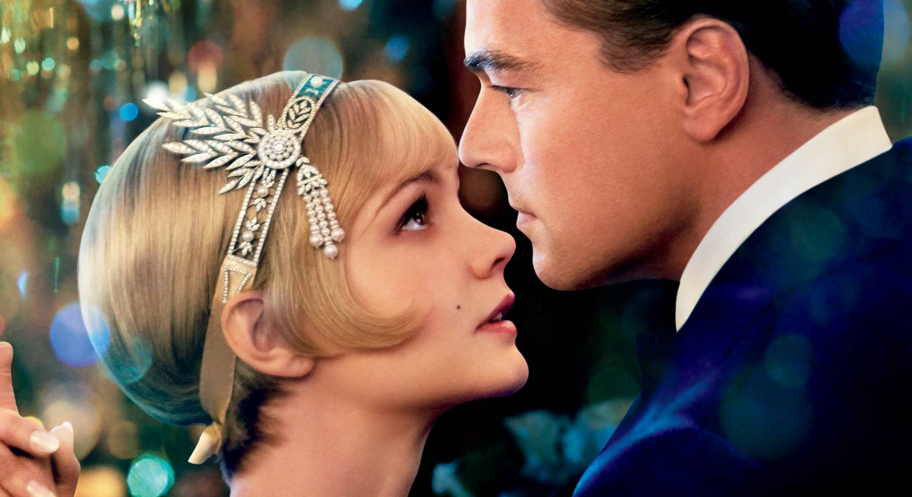
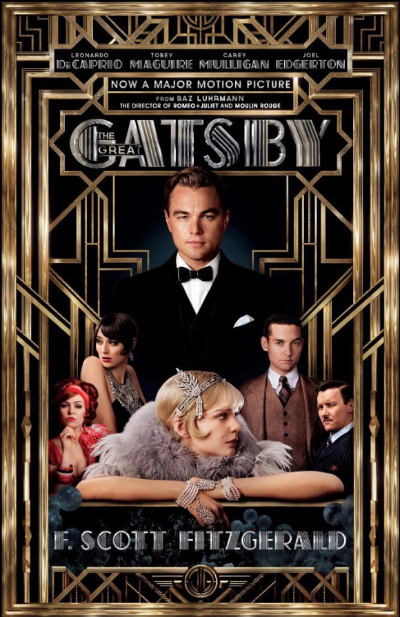
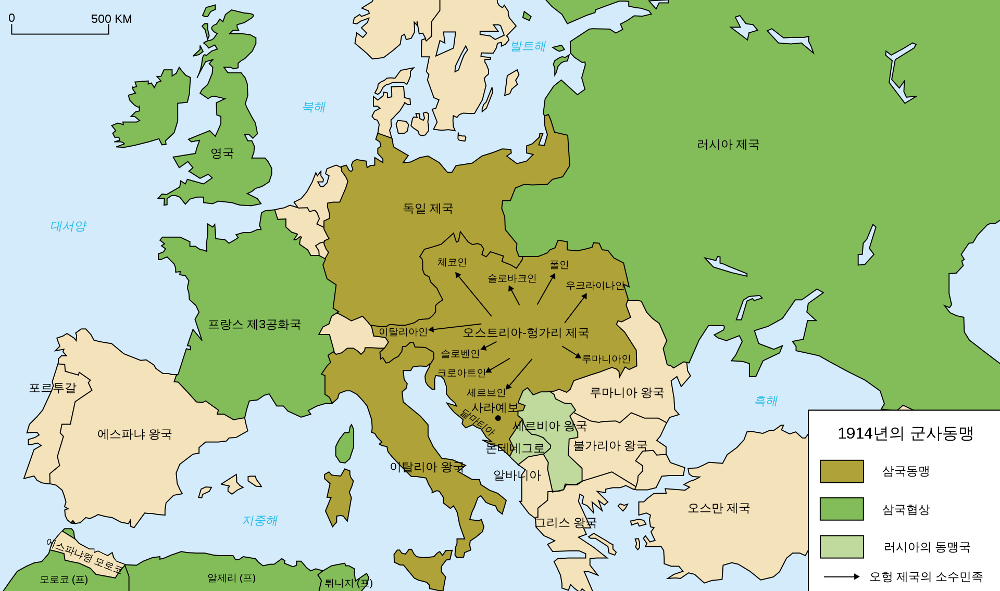
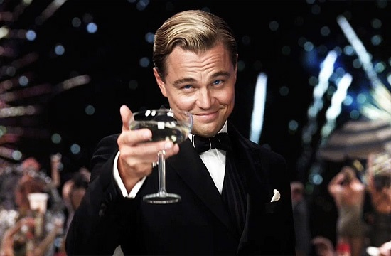
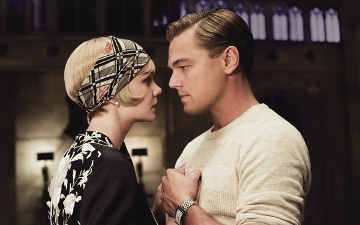

## 평점 ★★★☆☆ 스포있음

평점 3.5점 

이유 - 새드엔딩을 안 좋아하기 때문 단지 그뿐

어떤 장애물에도 데이지를 향한 그의 사랑은 계속 되었고

죽기 직전까지 그녀의 전화를 기다렸고

죽음으로써 개츠비 이놈은 진짜다며

개츠비를 집착이 아닌 순수한 사랑으로 바라볼 수 있었던 영화

원작소설기반의 영화의 피할 수 없는 숙명으로 많은 비판을 받은 영화

## 영화 줄거리 10줄 요약

출처 - 구글이미지 데이지와 개츠비

1. 데이지와 개츠비는 과거에 사랑했던 사이

2. 부유한 집안 데이지와 달리 가난한 개츠비는 전쟁이후 잠수

3. (불법적인) 사업으로 성공해서 나타난 개츠비

4. 이미 부자가문 톰과 결혼한 데이지

5. 톰은 데이지와 결혼했음에도 내연녀가 있고 바람둥이

6. 개츠비는 데이지와 도망치고 싶어함

7. 개츠비와 도망도 가고싶고 톰도 사랑한다고 말하는 데이지(통수)

8. 데이지의 살인까지 덮어쓰는 개츠비

9. 데이지와 사랑했던 과거의 추억으로 돌아갈 수 있다고 믿는 개츠비

10. 사랑에 배신당하고 개츠비의 죽음  
다이나믹듀오 -Ring My Bell(가사 중) "사랑에 배신당한 개츠비라도  눈물 짓지말고 다들 힘내라고 걱정들로부터 해방돼"

출처-구글 이미지

## Intense love does not measure, it just gives - Mother Teresa
사랑은 판단하지 않는다, 주기만 할 뿐이다. (마더테레사)

개츠비는 데이지에 대한 사랑을 판단하지 않는다.

그녀를 만나기 위해서 사람들을 위한 거대한 파티를 매번 개최하고

그녀를 만나고 나서도 사랑이란 감정에 의심하지 않는다.

반면에 개츠비를 제외한 모든 인물들을 보면 

데이지의 남편인 톰은 내연녀를 바꿔가며 항상 바람을 피고

그러면서 데이지의 대한 사랑을 의심하고 원한다.

데이지 또한 개츠비의 향한 자기 마음에 정답을 내리지 못하고

톰과 개츠비 둘 다 사랑한다며 말도 안되는 소리를 내뱉게 된다.

## 영화는 개츠비의 로맨스 적인 사랑과 그 시대 미국의 화려함을 담아냈다.

이것에 만 너무 초점을 두고 영화를 제작했다고 많은 사람들의 비난을 받은 것.  (나는 나름 재밌었다)

원작 소설에서는 1차세계대전 미국의 사회를 풍자하는 요소도 많으며

사회적인 관점에서도 작품을 바라보게 되면서 영화 보다 더 깊게 개츠비를 감상할 수 있다.

## 위대한 개츠비의 사회적 배경

왜 개츠비는 '위대한' 이라는 칭호가 붙었을까?

그 시대의 사회적 배경과 함께 개츠비를 바라보면 이유를 알 수 있다.

## 1차세계대전 후 미국의 경제 발전

위대한 개츠비를 좀 더 깊게 이해하기 위해서 그때 당시 세계를 살펴보자.

위대한 개츠비의 시대적 배경은 1차세계대전 직후다.

1차세계대전은 프랑스-러시아-영국 vs 독일-오스트리아-이탈리아 

각 나라들의 연합국과 동맹국의 전쟁으로 규모가 어마어마했다.

그때 당시 개츠비가 사는 미국은 어땠을까

## 최고의 비지니스는 전쟁이다. 미국에게 최고의 비지니스

1차세계대전 전까지 미국은 세계최대 채무국이었다.  (채무국:다른 나라에 빚을 진 나라)

하지만 세계대전이 발생하고 미국은 연합국에 엄청난 양의 물자와 돈을   빌려주게 된다.

전쟁 후 미국이 받아야할 돈은 126억 달러

전쟁이 미국에서 이루어진 것이 아니라 유럽에서 이루어 졌기 때문에

유럽은 전쟁으로 인해 모든 도시들이 폐허가 되고 공장들은 파괴되었다.

자연스럽게 미국은 세계적인 비지니스에 주도권을 지게 되었고 번영하게 되었다.

세계대전 후 초 강대국으로 껑충

### 황금기의 미국, 자본주의의 번화, 극심한 빈부격차

영화의 초반부터 황금기의 미국을 표현하기 위해서 화려한 음악과 파티가 계속된다.

아내가 있음에도 여자들을 호텔 파티에 불러서 노는 톰

개츠비의 저택에서 열리는 파티에 놀러오는 미국의 부자들

개츠비 이야기를 쓰는 닉은 개츠비 또한 이러한 속세에 찌든 미국의 부자들과 같다고 생각했다.

개츠비의 순수한 사랑을 알기 전까지

## 그래서 왜 '위대한'가

초 경제적 번영을 누리고 있는 미국

그것을 대변하는 매일 파티를 즐기고

남에게 과시하고 물질적으로 더 풍요를 원하고 낭비하는 미국 부자들

부를 과시하고 탐욕적이며 내연녀를 만든 데이지의 남편 톰

그와 반대로

오로지 자신이 사랑하는 사람을 위해 파티를 여는 개츠비

톰으로 부터 데이지와 다른 곳으로 도망가서 살려고 하는 개츠비

## "과거를 되돌릴 수 없다고? 아니야 당연히 되돌릴 수 있어"

데이지와 사랑했던 과거로 다시 돌아갈 수 있다고 생각한 개츠비

심지어 죽기 직전까지 그녀의 전화를 기다리며 개츠비는 희망을 놓지 않았다.

개츠비는 죽으면서 톰이 저지른 불륜을 뒤집어 쓰고

데이지가 죽인 불륜녀 살인 죄를 뒤집어쓰고

술을 팔고 마약을 팔았다는 모든 누명을 다 쓰고 죽는다.

진실을 아는 사람은 오로지 옆에 있던 닉

모든 미국의 부자들이 과시와 풍요를 원하고 속세에 찌들어 있을 때

오로지 사랑에 대한 희망에 모든 걸 다 갖다 바친 개츠비를 보며

우리는 위대한 단어를 붙일 수 있다.

경제적인 풍요와 강대국으로의 성장에 변질되어 버린 미국이 아닌

초창기 종교와 사회적인 자유를 위해 순수했던 희망을 가지고 모인 사람들의 미국

그 순수했던 희망이 개츠비를 통해서 다시한번 일깨웠으면 하는게 작가의 바램이 아니었을까

위대한 개츠비를 통해서 말이다.

## "결국 개츠비는 옳았어요. 내가 잠시나마 인간의 속절없는 슬픔과 환희에 대해 흥미를 잃어버린 것은 개츠비를 희생물로 삼은 것들, 개츠비의 꿈이 지나간 자리에 떠도는 더러운 먼지들 때문이었어요."

