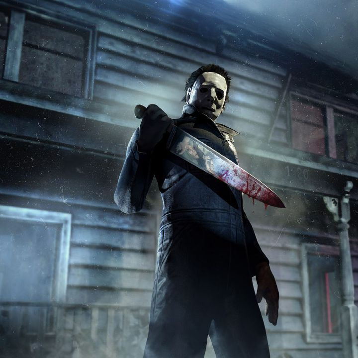
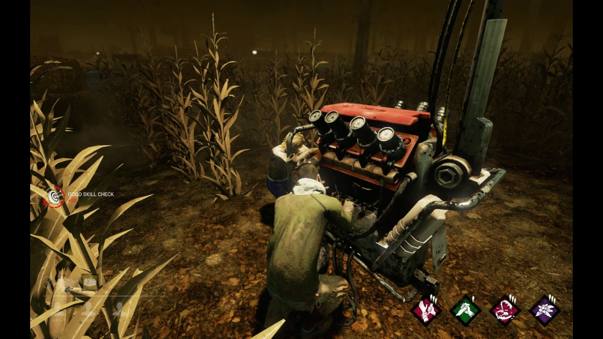
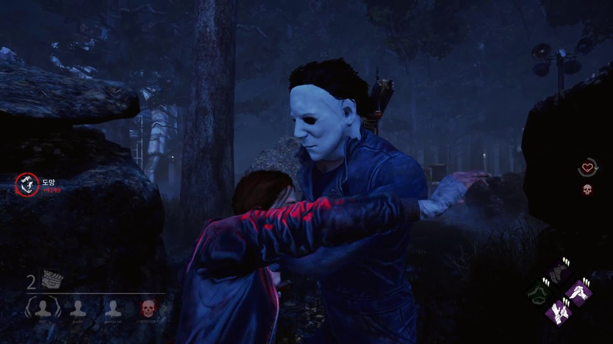
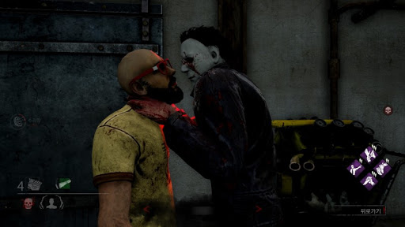
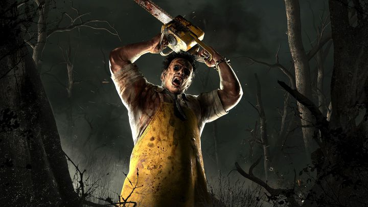
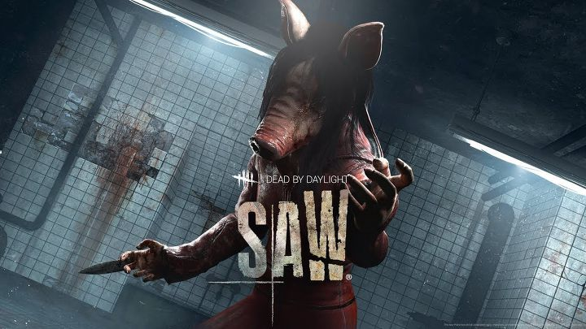
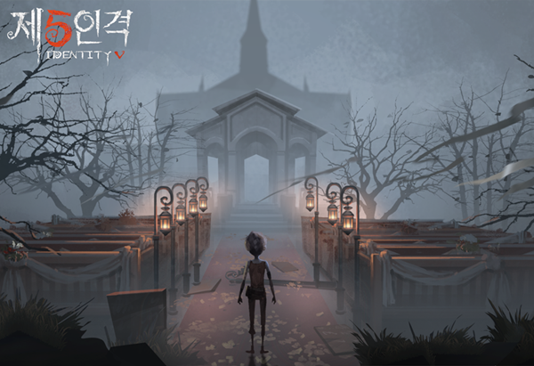

## 공포게임 추천해주세요

누구든지 게임을 취미로 즐기는 사람에게

공포게임 3개만 추천 해주세요 라고 말한다면

90% 확률로 데바데를 추천해 줄 것이다.

그만큼 공포 게임에서 유명세와 완성도는 유명하다.

게임이 출시되자 마자 친구들과 대학교 피시방에서 즐겼던 게임

출처 - 구글 이미지

### 게임 짧은 후기 및 평점 

평점 ★★★★☆

우와 이 게임 진짜 재밌다 - 데바데 1일차  
(7일 연속으로 함)
음 데바데 하고싶은데? 오늘 해볼까 - 14일차  
(2일 연속으로 함)
할 게임이 없네 데바데나 할까 - 1달차  
(하루 함)
오랜만에 데바데 ㄱ? 한 두 판 ㄱㄱ - 1년차  
(2시간만 함)

### 게임 진행 방법 간략 설명

5인이 플레이 함

1. 살인마는 생존자 4명을 찾아서 죽인다.

2. 생존자는 살인마로 부터 도망친다.

3. 경찰과 도둑 같은 시스템으로 생존자들끼리 협력 후 탈출

탈출은 어떤 방식으로?

-출처 구글이미지

이 사진처럼 발전기가 맵 곳곳에 숨어있다.

이 발전기를 생존자들이 찾아서 다 가동시키면

탈출 가능하다.

### 데바데 리뷰

이 게임의 진짜 장점은

처음 게임을 접하면 진짜 재밌다.

살인마들은 진짜 무섭게 다가오고

게임 사운드 그래픽 주변 환경까지

정말 내가 잡히면 죽는다 느낌이 들 정도로 몰입감이 좋다.

이 게임의 진짜 단점은

### 단점 - 인간은 적응의 동물이다 - 도스토예프스키

게임이 단점이 아니라 우리가 인간인 게 단점이다.

WHY? 적응이 끝나면 공포게임이 아니다.

## 게임이 그냥 RPG가 되 버린다. 진짜다.

게임에 적응 하게 되면 살인마는 그냥 보스 몬스터로 보이고

컨트롤 잘하는 유저가 보스 따돌리면서 탱커 역할을 한다.

나머지 유저들은 열심히 발전기 돌리면서 탱커가 잡히면 힐 해주고

분위기 좋은 보스 레이드 게임이 되 버린다. 진짜다

먼저 이런 시스템으로 가게 되는 이유를 살펴보자

### 1. 맵 을 적응하게 되었을 때

맵 을 완벽히 적응하게 되면 살인마를 따돌릴 장애물 위치가 파악되고

어디가 살인마를 따돌릴 때 시간을 많이 잡아먹는지 알게 되고

잡힐 꺼 같은 두려움 보다 우리 팀원들 실력을 먼저 체크하는 게임이 되 버림.REAL

### 2. 플레이 시간이 길수록 상승하는 랭크

이 게임의 랭크 시스템은 롤이나 배그 같이

실력에 따라 확 떨어지는 일이 드물다.

많이 플레이하고 많은 점수를 얻으면 랭크가 자연스럽게 올라가고

랭크가 높아지면 높아질수록 생존자들은 나뭇잎 마을 닌자들이 되어있어서

내가 중간만 하면 나뭇잎 마을 닌자들이 알아서 살인마를 가지고 놀아준다.

### 3. 그럼에도 꾸준히 진행되는 업데이트

장점이자 단점이다.

살인마와 생존자들의 종류는 시간이 지날수록 많아지고

알아야할 스킬과 맵 들이 꾸준히 증가한다. 좋은 장점이다.

꾸준히 업데이트를 해줘서 옛날에 가지고있던 많은 단점을 커버했는데

옛날에는 핑이 아주 많이 튀어서 유럽사람과 아시아사람이 플레이를 하면

렉도 심하고 게임플레이가 안되거나 튕기는 경우가 많았다.

### 두려움의 존재 아시아인

유럽 사람들 보다 아시아 사람들이 이 게임을 훨씬 잘한다고 하는데

도망자 4명이 다 아시아 사람이면 살인마는 그냥 나가버린다.

유럽사람들이 길거리서 농구하고 축구하고 야구하는 동안

### 초등학교때부터 옥상탈출과 경찰과 도둑 만렙찍는 한국인

어려 서부터 옥상탈출과 경찰과 도둑 심지어 온라인 게임에 마스터를 찍는 아시아인들

나뭇잎 마을 닌자 시험 다 통과하고 온 애들인데

유럽사람들이 이런 술래잡기 시스템을 어떻게 이기겠냐

### 4. 밸런스 문제

앞에 말했듯이 게임을 많이 하면 할수록 살인마는 생존자를 잡기 어려워지고

또 그 안에서 살인마 캐릭터 간의 밸런스 붕괴도 있기때문에

캐릭터가 좋은 살인마와 안 좋은 살인마의 밸런스 차이도 극심하다.

하지만 이것은 어쩔 수 없는 진리. 어느 한쪽이 강해지면 생존자 수가 줄어들고

살인마가 너무 약하면 살인마를 선택하지 않으니.. 뫼비우스의 띠다..

이와 같은 문제점들이 있지만

그만큼 재미 있기때문에 감안하고 충분히 즐길 만한 게임이다.

공포 살인마 게임이다 보니 그만큼 웃긴 장면들도 많이 나오는 게임

### 스토리가 있는 살인마들의 종류들

이 게임이 재미있는 또다른 이유 중 하나

우리가 어디선가 본 적 있고 접한 적이 있는 살인마들이 나온다.

종류가 워낙 많지만 유명한 몇개만 소개 하고자 한다.

### 할로윈 살인마

다들 본 적 있는 할로윈 살인마 식칼이 주 무기이고

원작의 디테일을 살려서 생존자를 몰래 훔쳐보면 볼 수록 강해지는 능력

내면의 악 게이지를 올리는 살인마

### 텍사스 전기톱 살인마

텍사스 전기 톱 살인마 모티브인 살인마다.

전기 톱 소리와 잔인한 처형 장면 목소리 등으로 공포감을 주는 존재

처음 게임을 하게 되면 이만한 무서운 존재는 없을 수도

### 나이트 메어 프레디 살인마

영화 나이트 메어 의 살인마

이 살인마 또한 원작의 디테일을 살려서 꿈속으로 생존자들을 끌어들이고

꿈속에서 생존자를 죽인다.

### 쏘우 살인마

영화 쏘우의 주인공 살인마

다음에 시간이 된다면 쏘우도 리뷰를 하겠다.

내가 평점 5점준 몇개 안되는 영화 중 하나인 쏘우1의 살인마 직쏘의 제자

이 살인마 또한 덫을 이용해 원작 영화의 디테일을 살린 기술을 이용한다.

### 다양한 종류의 생존자와 살인마로 즐기는 게임

공포게임에서 rpg 가 되어버린다는 단점이 있지만

친구들끼리 혼자 밤에 오락으로 즐기기엔 확실히 재미는 있다.

데바데 출시 이후 13일의 금요일 이라는 공포게임도 출시되고

라이센스를 받아서 우리들에게 잘 알려진 제5인격이라는 모바일게임도 있다.

아무튼 나도 과거에 친구들과 즐겼던 게임이고

지금도 가끔 생각나서 한 두 번 하는 게임인 만큼

공포 호러 게임으로써 월드 클래스에 드는 건 확실하다.

다만 다른 게임들보다 더 신규 유저와 기존 유저를 계속해서 

런칭하고 잡아 둘 방법을 모색하고 신경 써야 한다는 건 확실한 게임.
