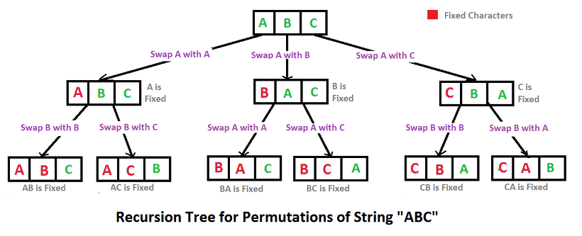

## 알고리즘 좀 매일 하자 매일 대훈아

프로그래머스 카카오 겨울 인턴십 2019 불량사용자 문제

level3

오늘 불량사용자 문제를 풀어보고 너무 충격에 빠졌다

이미지는 내 지금 멘탈 상태.

진짜 이 문제 하나를 하루종일 풀었다는거에 충격 먹었다 진짜.

## 카카오 인턴십 문제 불량사용자
문제출처 - <https://programmers.co.kr/learn/courses/30/lessons/64064>

### 문제
개발팀 내에서 이벤트 개발을 담당하고 있는 무지는 최근 진행된 카카오이모티콘 이벤트에 비정상적인 방법으로 당첨을 시도한 응모자들을 발견하였습니다. 이런 응모자들을 따로 모아 불량 사용자라는 이름으로 목록을 만들어서 당첨 처리 시 제외하도록 이벤트 당첨자 담당자인 프로도 에게 전달하려고 합니다. 이 때 개인정보 보호을 위해 사용자 아이디 중 일부 문자를 '*' 문자로 가려서 전달했습니다. 가리고자 하는 문자 하나에 '*' 문자 하나를 사용하였고 아이디 당 최소 하나 이상의 '*' 문자를 사용하였습니다.
무지와 프로도는 불량 사용자 목록에 매핑된 응모자 아이디를 제재 아이디 라고 부르기로 하였습니다.

예를 들어, 이벤트에 응모한 전체 사용자 아이디 목록이 다음과 같다면

응모자 아이디
frodo
fradi
crodo
abc123
frodoc

다음과 같이 불량 사용자 아이디 목록이 전달된 경우,

불량 사용자
fr*d*
abc1**

불량 사용자에 매핑되어 당첨에서 제외되어야 야 할 제재 아이디 목록은 다음과 같이 두 가지 경우가 있을 수 있습니다.

제재 아이디
frodo
abc123
제재 아이디
fradi
abc123
이벤트 응모자 아이디 목록이 담긴 배열 user_id와 불량 사용자 아이디 목록이 담긴 배열 banned_id가 매개변수로 주어질 때, 당첨에서 제외되어야 할 제재 아이디 목록은 몇가지 경우의 수가 가능한 지 return 하도록 solution 함수를 완성해주세요.

[제한사항]
user_id 배열의 크기는 1 이상 8 이하입니다.
user_id 배열 각 원소들의 값은 길이가 1 이상 8 이하인 문자열입니다.
응모한 사용자 아이디들은 서로 중복되지 않습니다.
응모한 사용자 아이디는 알파벳 소문자와 숫자로만으로 구성되어 있습니다.
banned_id 배열의 크기는 1 이상 user_id 배열의 크기 이하입니다.
banned_id 배열 각 원소들의 값은 길이가 1 이상 8 이하인 문자열입니다.
불량 사용자 아이디는 알파벳 소문자와 숫자, 가리기 위한 문자 '*' 로만 이루어져 있습니다.
불량 사용자 아이디는 '*' 문자를 하나 이상 포함하고 있습니다.
불량 사용자 아이디 하나는 응모자 아이디 중 하나에 해당하고 같은 응모자 아이디가 중복해서 제재 아이디 목록에 들어가는 경우는 없습니다.
제재 아이디 목록들을 구했을 때 아이디들이 나열된 순서와 관계없이 아이디 목록의 내용이 동일하다면 같은 것으로 처리하여 하나로 세면 됩니다.

[입력]

user_id	
["frodo", "fradi", "crodo", "abc123", "frodoc"]	
["frodo", "fradi", "crodo", "abc123", "frodoc"]	
["frodo", "fradi", "crodo", "abc123", "frodoc"]	

banned_id
["fr*d*", "abc1**"]
["*rodo", "*rodo", "******"]
["fr*d*", "*rodo", "******","******"]

result
2
2
3

### 문제를 제대로 안읽고 풀어서 두번풀었다..

3번째 입력 예제를 보면

frodo와 fradi 위치를 바꾼 상태로 banid에 들어가야하는데

무슨뜻이냐면

"fr*d*", "*rodo", "******","******"

여기에 입력값들이

fradi , frodo , abc123, frodoc 이 되어야한다.

내가 처음짠 코드는 입력 순서대로 banid를 확인한뒤 banid에 들어갈 수 있게되면

다음 껄로 넘어가서 이것이 문제가 되었다.


## 틀린코드에서 순열 적용해서 다시 풀기..

바보처럼 푼김에 순열공부도 다시 하고 풀어보자..

출처- https://www.geeksforgeeks.org/wp-content/uploads/NewPermutation.gif


## 순열 알고리즘

그림을 참고하여

1. 0번째 인덱스 원소를, 0번째 부터 n-1번째까지 위치를 바꿉니다. ( A B C를 기준으로 이 과정을 진행하면 A B C, B A C, C B A 가 됩니다.)
2. 1번 과정을 진행해서 나온 경우들을, 1번째 인덱스 원소를, 1번째 부터 n-1번째까지 위치를 바꿉니다.
3. 이러한 과정을 n-1번 진행합니다.

이미지의 가장 아래 단 6가지 경우가 위에서 언급한 순열의 모든 경우의 수 입니다. (처음과 중간 과정은 구하는 과정일 뿐입니다.)

만약 n개에서 r개만을 고르는 경우를 알고 싶다면 n-1번째가 아닌 r번만 반복하고, 순서의 0번째 부터 r번째 까지만 확인하면 됩니다.

출처 - https://siyoon210.tistory.com/76

### 순열을 적용하여 푼 java 코드

```java
package programmers;
public class 불량사용자다시 {
	static boolean flag;
	static int result;
	public static void main(String[] args) {
		String user_id[] = { "frodo", "fradi", "crodo", "abc123", "frodoc"};
		String banned_id[] = { "fr*d*", "*rodo", "******", "******" };
		solution(user_id, banned_id);
	}
	public static int solution(String[] user_id, String[] banned_id) {
		int userlength = user_id.length;
		int banlength = banned_id.length;
		int answer = 0;
		for (int i = 0; i < (1 << userlength); i++) {
			boolean userVisit[] = new boolean[userlength];
			int cnt = 0;
			for (int j = 0; j < userlength; j++) {
				if ((i & (1 << j)) > 0) {
					userVisit[j] = true;
					cnt++;
				}
			}
			if (cnt == banlength) {//뽑았다 갯수만큼 123456중 1234 뽑았으면 이걸로 만들 수 있는 조합 다해야함
				result = 0;
				flag = false;
				String [] user = new String[cnt];
				int temp =0;
				for(int kk=0; kk<userVisit.length;kk++) {
					if(userVisit[kk]) {
						user[temp]=user_id[kk];
						temp++;
					}
				}
				permutation(user,banned_id, 0, cnt);
				
				if(result!=0) {
					answer++;
				}
			}
			
		}
		System.out.println(answer);
		return answer;
	}

	private static void permutation(String [] arr, String[] banned_id, int depth , int r) {
		if(depth==r) {
			flag = false;
			for(int i = 0 ; i < arr.length; i++) {
				char[] userchar = arr[i].toCharArray();
				char[] banchar = banned_id[i].toCharArray();
				if(userchar.length==banchar.length) {
					for(int num = 0 ; num<userchar.length; num++) {
						if(banchar[num]!='*') {
							if(userchar[num]==banchar[num]) {
								continue;
							}else {
								flag =false;
								return;
							}
						}
					}
					flag = true;
				
				}else {
					flag = false;
					return;
				}
			}
		if(flag) {
			result++;
		}
			return;
		}
		for(int i=depth; i< arr.length; i++) {
			String temp = arr[depth];
			arr[depth] = arr[i];
			arr[i] = temp;
			permutation(arr, banned_id, depth+1, r);
			arr[i] = arr[depth];
			arr[depth]=temp;
		}
	}
}

```

코드가 개떡인거에는 변함이 없다.

문제를 푼 뒤 많은 사람들의 코드를 봤는데 너무나도 간단하게 잘 짜서

충격이었다.

일단 내 코드에서 순열부분은

```java
private static void permutation(String [] arr, String[] banned_id, int depth , int r) {
		if(depth==r) {
			return;
		}
		for(int i=depth; i< arr.length; i++) {
			String temp = arr[depth];
			arr[depth] = arr[i];
			arr[i] = temp;
			permutation(arr, banned_id, depth+1, r);
			arr[i] = arr[depth];
			arr[depth]=temp;
		}
	}
```

이부분이다. 문제를 다풀고 느낀건데 비트마스크로 할 필요없이

그냥 저 순열부분을 이용해서 기본 유저아이디와 밴아이디 수를 짜서

하면 그냥 쉽게 풀릴 문제..

ㅠㅠ 더 열심히 해보자..


## 처음 풀었던 틀린코드

```java
public class 불량사용자 {

	public static void main(String[] args) {

		String user_id[] = {"frodo", "fradi", "crodo", "abc123", "frodoc"};
		String banned_id[] = {"fr*d*", "*rodo", "******", "******"};
		solution(user_id,banned_id);
		
	}
	
	
	 public static int solution(String[] user_id, String[] banned_id) {
		 	int userlength = user_id.length;
		 	int banlength = banned_id.length;
		 	int answer = 0;
		 	
		 	for(int i = 0 ; i<(1<<userlength);i++) {
		 		boolean userVisit[] = new boolean [userlength];
		 		int cnt = 0 ;
		 		for(int j=0; j<userlength;j++) {
		 			if((i&(1<<j))>0) {
		 				userVisit[j]=true;
		 				cnt++;
		 			}
		 		}
		 		if(cnt==banlength) {//선택된 유저가 밴갯수랑 같을때 시작
		 			for(int c=0;c<userVisit.length;c++) {
		 				System.out.print(userVisit[c]+" ");
		 			}
		 			
		 			int tempNum = 0;
		 			
		 			boolean tempCheck[] = new boolean [banlength];

		 			for(int user = 0; user < userlength; user++) {
		 			
		 				if(userVisit[user]) {	//선택된놈이면 들간다
		 					
		 					
		 					for(int ban=0; ban<banlength; ban++) {
		 						if(!tempCheck[ban]) {
		 							String userid = user_id[user];
		 							char tempuserid [] = user_id[user].toCharArray();
		 							String banid = banned_id[ban];
		 							
		 						System.out.println(userid+"비교 "+banid);
		 						
		 							char tempbanid[] = banned_id[ban].toCharArray();
		 							if(tempuserid.length!=tempbanid.length) {
		 								continue;
		 							}else {
		 								boolean flag = false;
		 								for(int k=0;k<tempuserid.length;k++) {
		 									if(tempuserid[k]==tempbanid[k]) {
		 										continue;
		 									}else if(tempbanid[k]=='*') {
		 										continue;
		 									}else {
		 										flag = true;
		 										break;
		 									}
		 								}
		 								if(!flag) {//두단어가같음
		 								System.out.println("같다");
		 									tempCheck[ban]=true;
		 									break;
		 								}
		 							}
		 						}
		 					}
		 					
		 				}
		 				
		 				else{//선택되지않은아이디면 패스
		 					continue;
		 				}
		 				
		 			}
		 			boolean resultflag = false;
		 			for(int kkk=0; kkk<tempCheck.length;kkk++) {
		 				if(!tempCheck[kkk]) {
		 					resultflag=true;
		 				}
		 			}
		 			if(!resultflag) {
		 				System.out.println("추가됨");
		 				answer++;
		 			}
		 			
		 		}
		 	}
		 	System.out.println(answer+"답");
	        return answer;
	    }
}
```


틀린코드 와 위의 설명을 보면 알 수있듯이 순열이 필요한 문제였다..
