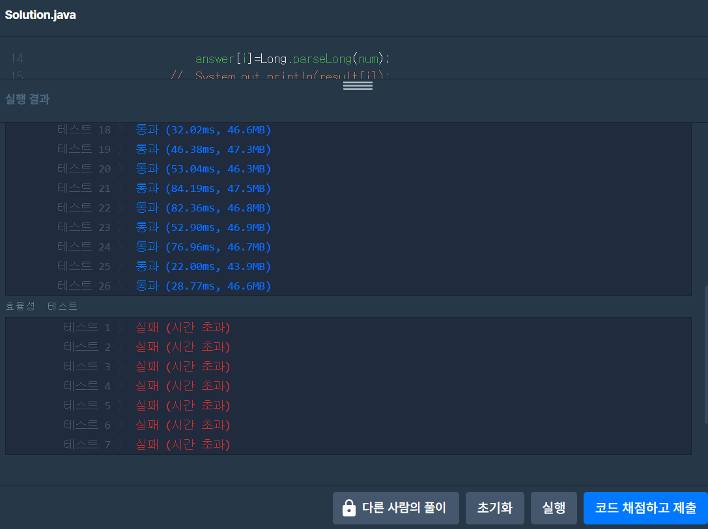

## 알고리즘 좀 매일 하자 매일 대훈아

프로그래머스 카카오 겨울 인턴십 2019 호텔 방 배정 문제

어머 level4

먼저 문제를 읽었을때 오잉 간단한데?

라고 생각한 머리가 굳어버린 대훈이

금방 풀어버리고 이 문제는 level4로써 정확성테스트 뿐만 아니라

효율성 테스트도 치루어진다는걸 깨달았다.

어제보다 한번 더 총 3번의 코드를 갈아 엎고 성공..

## 카카오 인턴십 문제 호텔 방 배정
문제출처 - <https://programmers.co.kr/learn/courses/30/lessons/64063>

### 문제

[본 문제는 정확성과 효율성 테스트 각각 점수가 있는 문제입니다.]

스노우타운에서 호텔을 운영하고 있는 스카피는 호텔에 투숙하려는 고객들에게 방을 배정하려 합니다. 호텔에는 방이 총 k개 있으며, 각각의 방은 1번부터 k번까지 번호로 구분하고 있습니다. 처음에는 모든 방이 비어 있으며 스카피는 다음과 같은 규칙에 따라 고객에게 방을 배정하려고 합니다.

한 번에 한 명씩 신청한 순서대로 방을 배정합니다.
고객은 투숙하기 원하는 방 번호를 제출합니다.
고객이 원하는 방이 비어 있다면 즉시 배정합니다.
고객이 원하는 방이 이미 배정되어 있으면 원하는 방보다 번호가 크면서 비어있는 방 중 가장 번호가 작은 방을 배정합니다.
예를 들어, 방이 총 10개이고, 고객들이 원하는 방 번호가 순서대로 [1, 3, 4, 1, 3, 1] 일 경우 다음과 같이 방을 배정받게 됩니다.

원하는 방 번호	배정된 방 번호
1	1
3	3
4	4
1	2
3	5
1	6
전체 방 개수 k와 고객들이 원하는 방 번호가 순서대로 들어있는 배열 room_number가 매개변수로 주어질 때, 각 고객에게 배정되는 방 번호를 순서대로 배열에 담아 return 하도록 solution 함수를 완성해주세요.

[제한사항]
k는 1 이상 1012 이하인 자연수입니다.
room_number 배열의 크기는 1 이상 200,000 이하입니다.
room_number 배열 각 원소들의 값은 1 이상 k 이하인 자연수입니다.
room_number 배열은 모든 고객이 방을 배정받을 수 있는 경우만 입력으로 주어집니다.
예를 들어, k = 5, room_number = [5, 5] 와 같은 경우는 방을 배정받지 못하는 고객이 발생하므로 이런 경우는 입력으로 주어지지 않습니다.

[입력]
k 
10
room_number 
[1,3,4,1,3,1]

[출력]
result
[1,3,4,2,5,6]


입출력 예에 대한 설명
입출력 예 #1

문제의 예시와 같습니다.

첫 번째 ~ 세 번째 고객까지는 원하는 방이 비어 있으므로 즉시 배정받을 수 있습니다. 네 번째 고객의 경우 1번 방을 배정받기를 원했는데, 1번 방은 빈 방이 아니므로, 1번 보다 번호가 크고 비어 있는 방 중에서 가장 번호가 작은 방을 배정해야 합니다. 1번 보다 번호가 크면서 비어있는 방은 [2번, 5번, 6번...] 방이며, 이중 가장 번호가 작은 방은 2번 방입니다. 따라서 네 번째 고객은 2번 방을 배정받습니다. 마찬가지로 5, 6번째 고객은 각각 5번, 6번 방을 배정받게 됩니다.

### 효율성을 생각 안해보고 일단 풀어보았다.

충격적인 코드부터 보고 가자
```java
public class 호텔방배정 {

	public static void main(String[] args) {

		long k = 10;
		long[] room_number = {1,3,4,1,3,1};
		solution(k,room_number);
	}
	 public static long[] solution(long k, long[] room_number) {
		 	
		 	int peopleCount = room_number.length;//신청 사람 수
		 	long[] answer = new long[peopleCount];	//신청한 사람 수 만큼 배열 만들고 답넣을꺼
		 	ArrayList<String> arr = new ArrayList<String>();
		 	
		 	for(int i=0; i<peopleCount; i++) {	//사람수 만큼 넣어보자
		 		String num = room_number[i]+""; //찾고자 하는 방번호 num
		 		while(true) {	//무한 반복문에서 추가
		 			if(!arr.contains(num)) {	//없으면추가
		 				arr.add(num);
		 				answer[i]=Long.parseLong(num);
		 			//	System.out.println(result[i]);
		 				break;					//무조건 아무방에 들어가야 나감
		 			}else {						//있으면 1더해서 다시 반복
		 				long tempNum = Long.parseLong(num)+1;
		 				num = tempNum+"";
		 			}
		 		}
		 	}
	        return answer;
	 }
}
```

입력 숫자가 10억을 넘어가닌깐 String으로 바꾸고 

ArrayList에서 찾으면서 있으면 +1 하고

while 무한반복문을 이용해서 풀면 개꿀

시간초과 이런거 생각안하고 풀어본 정신나간 코드다.

자 그럼 이코드의 결과는



이런 문제를 풀어보니 그래도 78점을 주는구나..

그리고 시간 단축을 위해서 선택한것은 HashMap

머리를 쥐어짜도 해결이 안되서 결국 힌트를 얻은 뒤

HashMap 특징부터 간략하게 알아보자

### 저장은 느리지만 많은 양의 데이터를 검색할때 뛰어난 성능

왜냐하면 이 HashMap은 Key와 Value를 가진다.

HashMap<Key,Value>

무슨 소리냐면 딱 이문제와 알맞게 호텔 방배정을 예를들면

짱구 철구 유리 모두 원하는 방은 4번

제일 먼저 들어간 짱구는 4번 Key를 얻고 value는 5번으로 추가한다.

다음 들어간 철구는 4번Key를 받으려닌깐 이미 짱구가 들어갔고 5번 value를 받는다.

그럼 철구는 받은 5번 value값으로 다시 5번 Key를 받고 value에 6을 저장

마지막으로 들어간 유리는 4번key를 이미 짱구,철구가 지나갔다는걸 알고

중간에 철구에 대한 정보도 HashMap에 추가하면

유리는 4번Key를 받고싶었지만 6을 받게된다.


### 다시말해서 KEY는 중복이 불가능 VALUE는 중복이가능

호텔방 키는 한명만

짱구 4번 5번 <4,5> 추가되고

철수 4번 6번 <4,6> 이 추가가 아니라 짱구 꺼에 덮어써진다. 

추가되는건 철수가 들어간 <5,6>

마지막으로 유리가 <4,7> 덮어써지고

추가되는건 유리가 들어간 <6,7>

### 제출한 정답 코드를 보자

```java
package programmers;

import java.util.HashMap;
import java.util.Map;

public class 호텔방배정다시 {
	static Map<Long,Long> hotel = new HashMap<>();

	public static void main(String[] args) {

		long k = 10;
		long[] room_number = {1,3,4,1,3,1};
		solution(k,room_number);
	}
	 public static long[] solution(long k, long[] room_number) {
		 			 	
		 	int peopleCount = room_number.length;//신청 사람 수
		 	long[] answer = new long[peopleCount];	//신청한 사람 수 만큼 배열 만들고 답넣을꺼
		 	
		 	for(int i = 0; i < answer.length; i++) {
		 		
		 		answer[i] = checkHotel(room_number[i]);
		 		System.out.print(answer[i]+" ");
		 	}
	        return answer;
	 }
	private static long checkHotel(long want) {
		if(!hotel.containsKey(want)) {
			hotel.put(want, want+1);
			return want;
		}
		//빈방을 찾으러 다시가야함
		long takeRoom = hotel.get(want);//다음가야할 장소받고 이러면 value값 = 실제 가야할 번호 나오지
		long emptyRoom = checkHotel(takeRoom);//실제가야할 번호 알았으닌깐 다시 들어가야지 다시들어가서 체크인하고 그번호는 +1 만들어야지
		hotel.put(want, emptyRoom);
		return emptyRoom;
	}
}

```

생각보다 알고리즘 문제에 HashMap이 자주 사용된다는걸 깨달았다.

HashMap문제랑 Set Map 차이 이런것들을 다시 공부할 필요성을 느낀다.