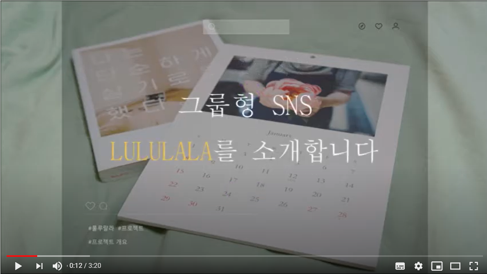

## 룰루랄라 프로젝트

SNS 기반으로 큐레이션과 그룹을 이용하여 사용자간의 취미를 공유하고

자유롭게 게시글을 올리는 웹 프로젝트

## 백문이불여일견 (클릭)

클릭하세요

## 프로젝트 소개

- 인터넷 URL 기반의 공유 SNS 입니다.

- SNS 기능으로 공개 설정 에따라 원하는 사용자에게만 제공합니다.

- 취미가 같은 사람들끼리 소통하고 정보를 공유하며 예전 감성을 자극하는 SNS입니다.

- 복잡하지않고 간단하며 사람들끼리 취미를 소통하는 국내 최초 감성 형 SNS 룰루 랄라 입니다.

## 개발 환경

### 프론트

자바 스크립트, HTML, CSS, SCSS,VUE와 YARN 을 사용 

### 백엔드

스프링부트와 마이바티스, MYSQL을 이용해서 프론트와 레스트풀, JSON을 통하여 통신했습니다.

## DB설계도

저희 프로젝트의 db설계도 입니다. 

저희는 회원가입한 유저를 기준으로 유저의 정보가 필요한 

모든 테이블에 외래키와 기본키를 설정하였습니다.

## 개발 결과 기능 설명

개발 결과 부분 – 동영상 시연영상 참고

1. 이메일 인증을통한 회원가입및 비밀번호 문자+숫자조합 아이디 이메일 형식
약관동의후 회원등록

2. 카카오 로그인 가능

3. 비밀번호 찾기 기능 소개 이메일로 통한 임시 비밀번호 발급

4. 프로필 업데이트 기능 소개 사진수정가능 닉네임 중복확인

5. 메인 피드 소개 좋아요, 댓글 추가 소개, 해쉬태그 및 사람 태그

6. 유저 검색 기능, 태그 검색 기능 소개

7. 좋아요한 피드 소개

8. 나를 태그한 피드 소개

9. 내가 큐레이션 등록한 피드 소개

10. 팔로워, 팔로잉 기능 소개

11. 글 올리기 기능 소개 (전체공개, 친구에게만 공개, 비공개)

## 메인 화면

## 글 보기 화면

