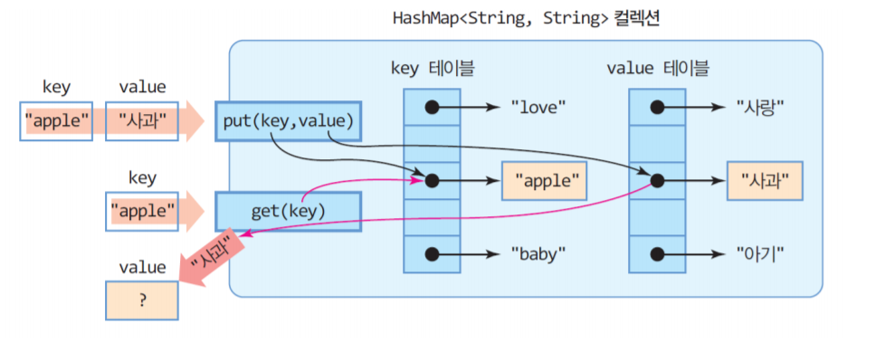

## 알고리즘 좀 매일 하자 매일 대훈아

카카오 인턴십 보석쇼핑 문제

효율성이 들어가있기때문에 99% 그냥 풀면

시간초과나서 실패로 뜰것이다.

해결해야할 방법은 HashMap

HashMap에 대해서 완전히 완전완전 마스터를 하고 문제로 넘어가자

## HashMap

Map의 인터페이스를 구현한 대포적인 Map컬렉션

알고 선생님 말씀으론 무우우우조건 HashMap은 완전히 

익히도록 하라고 하셨다.


-출처 구글이미지

Map은 키와 값으로 구성된 객체를 저장하는 구조

가장 중요한건 Key는 중복 저장이 불가능

Value는 중복 저장이 가능하다.

Hashing을 사용하기 때문에 많은 양의 데이터를

검색하는데 뛰어난 성능을 보인다.

여기서 HashMap이 왜 다른 것보다 뛰어난 성능을 보이는지

제대로 개념을 잡고 넘어가자

해싱이란것은 자료를 저장하는데 배열을 사용한다.

어떤 항목의 탐색 키만을 가지고 바로 항목이 저장되어 있는 배열의 인덱스를 결정하는 기법이 해싱이다.

HashMap 값 추가는

```java
HashMap<Integer.String> map = new HashMap<>();
map.put(1,"김대훈");
map.put(2,"서예지");
```
put을 이용하고(key,value)

System.out.println(map);

값 출력은 map을 출력하면 전체가 나오고

System.out.println(map.get(1));

이러면 김대훈만 나온다.

boolean containsKey(Object Key)

키가 포함되어있는지 알려주는 메소드

boolean containsKey(Object Value)

값이 포함되어있는지 알려주는 메소드

제거는 map.remove("1"); 으로 제거하면 없어진다.

## 카카오 인턴십 문제 징검다리건너기
문제출처 - <https://programmers.co.kr/learn/courses/30/lessons/67258?language=java>

### 문제

문제 설명
[본 문제는 정확성과 효율성 테스트 각각 점수가 있는 문제입니다.]

개발자 출신으로 세계 최고의 갑부가 된 어피치는 스트레스를 받을 때면 이를 풀기 위해 오프라인 매장에 쇼핑을 하러 가곤 합니다.
어피치는 쇼핑을 할 때면 매장 진열대의 특정 범위의 물건들을 모두 싹쓸이 구매하는 습관이 있습니다.
어느 날 스트레스를 풀기 위해 보석 매장에 쇼핑을 하러 간 어피치는 이전처럼 진열대의 특정 범위의 보석을 모두 구매하되 특별히 아래 목적을 달성하고 싶었습니다.
진열된 모든 종류의 보석을 적어도 1개 이상 포함하는 가장 짧은 구간을 찾아서 구매

예를 들어 아래 진열대는 4종류의 보석(RUBY, DIA, EMERALD, SAPPHIRE) 8개가 진열된 예시입니다.

진열대 번호	1	2	3	4	5	6	7	8
보석 이름	DIA	RUBY	RUBY	DIA	DIA	EMERALD	SAPPHIRE	DIA
진열대의 3번부터 7번까지 5개의 보석을 구매하면 모든 종류의 보석을 적어도 하나 이상씩 포함하게 됩니다.

진열대의 3, 4, 6, 7번의 보석만 구매하는 것은 중간에 특정 구간(5번)이 빠지게 되므로 어피치의 쇼핑 습관에 맞지 않습니다.

진열대 번호 순서대로 보석들의 이름이 저장된 배열 gems가 매개변수로 주어집니다. 이때 모든 보석을 하나 이상 포함하는 가장 짧은 구간을 찾아서 return 하도록 solution 함수를 완성해주세요.
가장 짧은 구간의 시작 진열대 번호와 끝 진열대 번호를 차례대로 배열에 담아서 return 하도록 하며, 만약 가장 짧은 구간이 여러 개라면 시작 진열대 번호가 가장 작은 구간을 return 합니다.

[제한사항]
gems 배열의 크기는 1 이상 100,000 이하입니다.
gems 배열의 각 원소는 진열대에 나열된 보석을 나타냅니다.
gems 배열에는 1번 진열대부터 진열대 번호 순서대로 보석이름이 차례대로 저장되어 있습니다.
gems 배열의 각 원소는 길이가 1 이상 10 이하인 알파벳 대문자로만 구성된 문자열입니다.

[입력]
gems	result
["DIA", "RUBY", "RUBY", "DIA", "DIA", "EMERALD", "SAPPHIRE", "DIA"]	
["AA", "AB", "AC", "AA", "AC"]
["XYZ", "XYZ", "XYZ"]	
["ZZZ", "YYY", ㅎ"NNNN", "YYY", "BBB"]	

[출력]
result
[3, 7]
[1, 3]
[1, 1]
[1, 5]

## 보석 풀이
먼저 총 구매할 보석 종류 갯수를 구한다음(HashMap으로)

갯수 저장해놓고 HashMap 초기화 하고

보석 배열에서 처음 부터 한개씩 HashMap에 다시넣는다

그러면서 동시에 Queue에 담는데

만약 중복된 보석이 들어왔다 그러면 Queue에서도 한개빼고

HashMap에서도 한개뺀다

그러면서 계속해서 저장해놓은 정답 갯수랑 HashMap사이즈랑 비교하는데

그거 두개가 같을때 내가 전부 쫙 구매하는 케이스기 때문에

그 경우만 다 저장했다가 마지막에 비교해도 된다.


### HashMap을 써서 풀어낸 정답코드
```java

import java.util.HashMap;
import java.util.LinkedList;
import java.util.Map;
import java.util.Queue;

public class 보석쇼핑 {

	public static void main(String[] args) {
		String [] gems = {"DIA", "RUBY", "RUBY", "DIA", "DIA", "EMERALD", "SAPPHIRE", "DIA"};
		solution(gems);
	}

	public static int[] solution(String[] gems) {
		int length =gems.length;
		int start = 0;
		int realstart = 0;
		int end = gems.length;
		Map<String,Integer> map = new HashMap<>();
		for(int i = 0; i< length; i++) {	//초기작업
			if(!map.containsKey(gems[i])){	
				map.put(gems[i], 1);
			}else {
				map.put(gems[i], map.get(gems[i])+1);
			}
		}
		int answerLength = map.size();//구매할 보석갯수
		map.clear();
		Queue<String> q1 = new LinkedList<>();
		for(int i = 0 ; i < length; i++) {
			if(!map.containsKey(gems[i])) {
				map.put(gems[i], 1);
			}
			else {
				map.put(gems[i], map.get(gems[i])+1);
			}
			q1.add(gems[i]);
			while(!q1.isEmpty()) {
				String left = q1.peek();
				int check = map.get(left);
				if(check>=2) {	//두개이상 들어가있다.
					map.put(left, map.get(left)-1);
					q1.poll();
					start++;
				}else {	//1개거나 0개다
					break;
				}
			}
			if(map.size()==answerLength&&end>q1.size()) {
				end=q1.size();
				realstart = start;
			}
		}
//		System.out.println(start+" "+end);
//		System.out.println(map.size());
		int[] answer = {realstart+1,realstart+end};
		return answer;
	}
}
```
