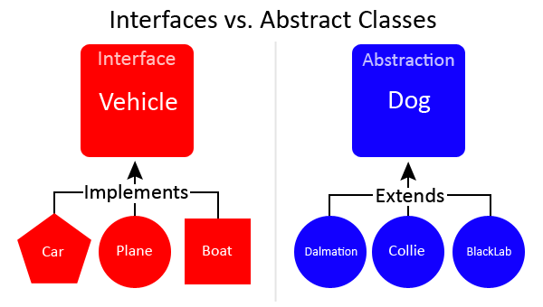

## 다시 

계속해서 코딩을 했지만 예전에 공부했던 기본적인 이론을

조금씩 까먹는 느낌이 들었다.

다시 기둥을 다지는 시간을 가지려고 하는 대훈이

자바에 대해서 그냥 의식의 흐름 기법으로 적어보자

## Java

- 프로그래밍 언어이다.

- 객체 지향적 프로그래밍 언어

- 객체 지향적이란? 

쉽게 생각해보면 절차지향적이란 비교해서 보자

절차지향적 - 컴퓨터 작업 처리방식이랑 유사

위에서 아래로 같은 느낌의 순차적인 느낌

그래서 실행속도가 빠르다.

절대 객체지향적 반대가 아니다. 절차는 순차적인 실행에 중심을 두고

자바(객체지향적) 은 객체 관계에 초점을 두고 있다.

객체지향적 - 우리 지금 현실 사물들을 객체로 보는 느낌

인간 중심적 프로그래밍

## 객체지향적 

### 추상화
추상화 - 필요없는 것들은 제끼고 필요한 부분만 선택하는 느낌

예를 들면 차 라는 클래스를 추상화 과정으로 설명해보자

앞으로 가기, 뒤로 가기, 브레이크, 경고등 넣기

이런 차들의 공통된 속성을 함수 기능에 넣으면

바퀴 4개 소나타 , 바퀴 많은 트럭, 바퀴 2개 오토바이,

이런 차들이 공통된 스킬들은 차 클래스에서 가지고 오고

여기에서 각자 바퀴 갯수 들은 다르게 가공하는 것이다.

```
          <자동차 Skill>
          /      /     /
      <소형차>  <트럭> <오토바이>
        /         /           /
      <티코>    <현대트럭>  <야마하>
```

이런 식으로 자동차 Skill은 공통점들을 모은 추상 클래스가 된다.


-출처 구글 추상화 이미지


### 캡슐화
캡슐화 - 타인이 외부에서 조작 할 수도 있으니 타인이 사용 할 수 없도록

접근 제한자를 이용해서 감추는 것을 말한다. 정보의 은닉성 이란 장점이 있음

private 로 외부 클래스가아닌 현재 클래스에서만 접근 가농하도록 지정

Getter, Setter로 정해놓은 함수를 통해서만 데이터에 접근하도록 함

이렇게 되면 데이터가 바뀌어도 다른 객체에 영향을 주지 않는다.

접근제어자 종류

private : 같은 클래스 내부에서만 접근 가능

default : (같은 클래스) + 같은 패키지 클래스에서만 접근 가능

protected : (같은 클래스) + (같은 패키지) + 자신을 상속받은 자손 클래스에서만 접근 가능

public : 자유롭게 접근 가능 

### 다형성

같은 자료형에 여러 객체를 대입해서 다양한 결과를 얻어내는 성질

아까 위에 내가 의식의 흐름기법으로 만들어놓은걸 토대로 짜보면

```java
interface CarSkill{
  void 직진();
  void 후진();
  void 브레이크();
  void 경고등();
}

class 소나타 implements CarSkill{
  public void 직진(){
    System.out.println("직진빠름");
  }
  public void 후진(){
    System.out.println("후진빠름");
  }
  public void 브레이크(){
    System.out.println("브레이크잘됨");
  }
  public void 경고등(){
    System.out.println("경고등2개");
  }

}

class 야마하오토바이 implements CarSkill{
  public void 직진(){
    System.out.println("직진매우빠름");
  }
  public void 후진(){
    System.out.println("후진매우느림");
  }
  public void 브레이크(){
    System.out.println("브레이크잘됨");
  }
  public void 경고등(){
    System.out.println("경고등1개");
  }

}

//여기서부터 Main 부분

CarSkill ck; //인터페이스 객체
String input;//원하는 차를 입력했다고 가정하고
if(input.equals("소나타")){
//소나타 클래스 소환
  ck = new 소나타();
}
else if(input.equals("야마하오토바이")){
//야마하 오토바이 소환
  ck = new 야마하오토바이();
}

//선택한 차종의 println이 나옴
ck.직진();
ck.후진();
ck.경고등();

```

내가 선택한 차에대해 다른 결과들을 얻을 수있고 이것이 다형성.

CarSkill이라는 인터페이스 안에 void로 되어있는 메소드들(추상메서드 선언)

인터페이스의 메소드들을 (직진,후진,경고등) 재정의 하는것이(오버라이딩)

내가 선택한 차가 자식 클래스에서 부모클래스(CarSkill)로 (업캐스팅)

부모 객체를 통해서 자식 메소드를 호출 하는것.

## 상속

부모클래스를 재사용해서 자식 클래스를 쉽게 코딩

위의 예제처럼 다형성을 구현

유지보수 편리(코드의 중복 문제 해결)


## 객체지향 설계원칙

1.단일 책임 원칙(SRP)Single Responsiblity Principle

모든 클래스는 하나의 책임만 가진다. 그책임을 완전히 캡슐화한다.

- 계산기 클래스는 오로지 계산기능만 책임지고 코드 수정은

계산기 기능 관련해서만 수정한다.

2.개방 폐쇄 원칙(OCP)Open Close Principle

수정은 닫아버리고 (기존코드 변경X) 기능은 추가 (열기)가 되도록 설계

- 탈것 이라는 클래스를 수정할때 자동차 비행기가 기본 속도가 다르다면

속도 구현을 하위 클래스에 주고 기본 탈것이라는 클래스는 수정X(닫힘)

속도 구현 부분만 재정의 한다(수정O 열림)

3.리스코프 치환 원칙(LSP)리스코프 Substitution Principle

자식 클래스는 언제나 자신의 부모 클래스를 대체 할수 있다는 원칙

- 무슨뜻이냐면 자식은 부모의 책임을 무시하거나 재정의하지않고 확장만해야한다.

4.인터페이스 분리원칙(ISP)
하나의 클래스는 자기가 안쓰는 인터페이스는 구현X

하나의 일반적인 인터페이스보다 구체적인 인터페이스를 선호

5.의존역전원칙(DIP)

의존 관계를 맺을때 변화가 자주 일어나는것 보다 변화가 잘 안일어나는것

변화가 거의 없는것에 의존하라. 구체적인 클래스에 의존하지말고

차라리 인터페이스나 추상클래스에 의존 관계를 맺어라.