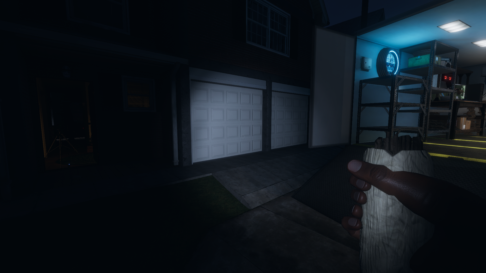
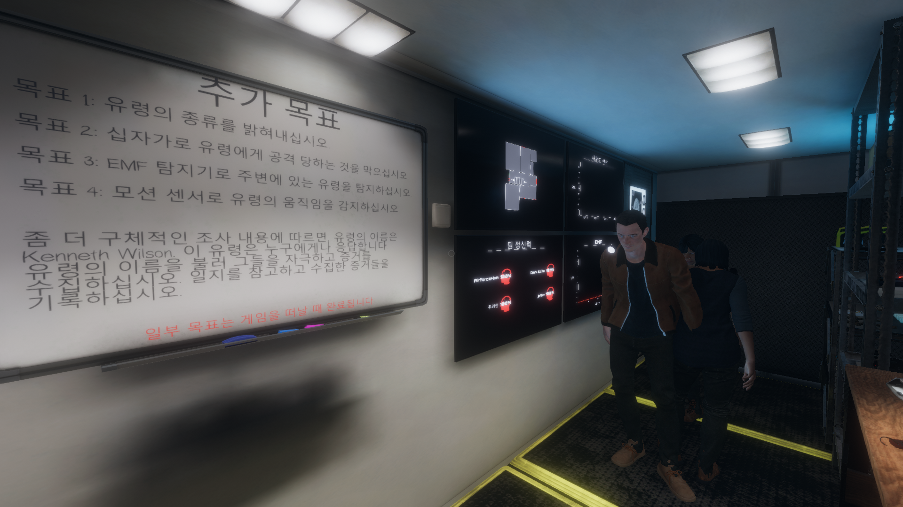
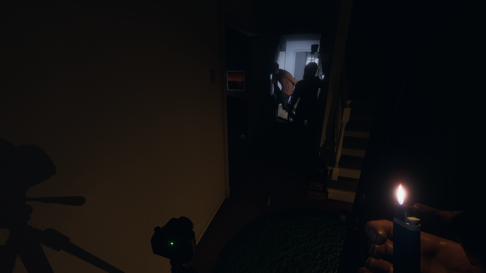
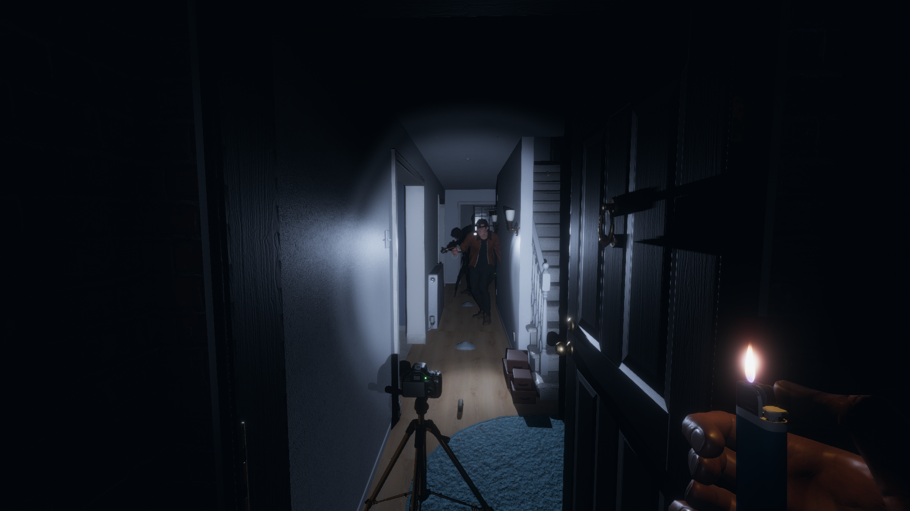
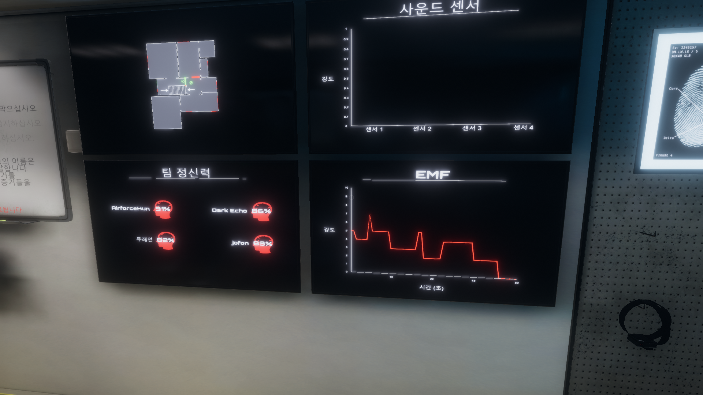
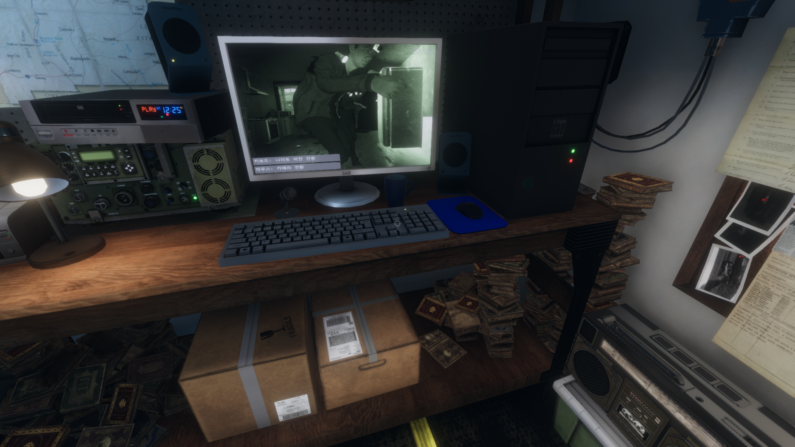

## 9월달에 출시된 따끈따끈한 신작 공포 게임

공포영화를 좋아하고 귀신을 별로 안무서워 해서

많은 공포게임을 찾아보고 플레이 해봤지만 별다른 감흥이 없던 와중

파스모포비아를 접하고 재밌게 플레이 했다.

유령의 발소리와 유령이 갑자기 옆에서 입김을 불때

움찔 움찔하는게 사운드로 이미 성공한 게임이다.

VR로도 가능한데 VR을 구매하면 꼭 VR로 플레이 할 것이다.

출시된지 2달만에 인기게임 1등을 차지한 파스모포비아

### 게임 짧은 후기 및 평점 

평점 ★★★★☆

처음에 접하면 어리둥절 하면서 어떤식으로 플레이를 해야할지

감이 안오는데 그때가 가장 재밌다.

도구들을 어떻게 사용해야하는지 하나씩 사용해가며

어떻게하면 유령을 만나는지, 유령한테 죽는지

몸소 다 겪어보는걸 추천한다.

#### 일단 마이크 필수는 아니지만 거의 필수

(게임 내에서 유령을 불러야 하는경우도 있음)

V로 근접 대화와 B 키로 팀원들간 라디오 대화가 가능

중국인 일본인들도 많은데

귀신으로부터 공포에 언어의 장벽을 넘고 

간단한 영어로 다들 소통 한다.

"EMF FIVE OK?"

"SO COLD HERE"

등등 해보면 알것이다.

### 게임 진행 방법 도구 설명

플레이는 혼자해도 가능하며 4인을 권장한다.

인원이 4명으로 갈수록 각자 역할을 나누고 플레이 시간이 단축된다.

#### 게임의 목표

-귀신이 출몰하는 집에 도착한 유령헌터들

게임의 목표는 어떤 종류의 귀신이 이장소에 있는지

그리고 최대한 많은 미션과 증거들을 수집과 완료해서 돈을 벌어서

도망치는것이 게임의 목표다.

일단 우리들은 귀신 탐사대 느낌으로 귀신이 출몰하는 곳에 투입된다.

실제 플레이 화면을 캡쳐해 보았다.

한글로 게임을 설정하면 한글로 바뀌는데 영어도 그리 어렵지 않다.

게임을 시작하면 이렇게 팀원들과 본부 트럭에서 시작한다.

칠판에 있는 목표들을 하나씩 성공 시키면 돈을 벌 수 있다.

-열심히 유령을 찾고 있는 우리 고스트 팀

-안전하게 문밖에서 팀원들을 구경하고 있는 중

위의 추가목표 사진을 확인하자

1.유령의 종류를 찾아내기

J버튼을 누르면 나만의 노트가 나오는데 마지막 장으로 가면

내가 수집한 증거들을 체크 한다음 이 장소에 있는 유령을 유추할 수 있다.

2.십자가로 유령이 공격하는것을 막으십시오.

게임을 할때 유령이 활발하게 활동하며 사람들을 공격을 할 때도 있다.

재빨리 십자가를 들어서 유령을 향해 던지거나 향초를 켜서

유령으로부터 달아나자  (죽게 되면 보상금액도 적어지고 일단 장비를 다 잃는다)

원래 게임내에서 기본장비로 아주 기본적인 템들만 주는데

(손전등은 초등학교 문방구 손전등을 줘서 켜도 앞이 잘 보이지도 않는다.

게임을 처음 하는 사람이라면 고급 손전등을 꼭 들고 다니자)

어쨋든 기본 장비들보다 고급 장비들을 구입해서 플레이하면 더 수월하다.

그래서 고급장비들을 구입하고 참가하는걸 권장한다.

(나중에 고급장비로는 시시하다며 기본장비만 쓰는 경우도 많음)

3번,4번 EMF 탐지기로 유령을 확인하라

게임의 목표는 매판 마다 변하는데 EMF탐지기 말고도 모션 센서로 

유령의 움직임을 확인하라던지 유령의 이벤트를 목격하라 등 

유령의 이벤트를 확인하는 목표라고 생각하면 된다.

### 게임 부가 설명

이사진을 보면 트럭 옆에 있는 정보들인데

왼쪽 위부터 시계방향으로 1번 사진은 맵이다.

미니맵에 우리 팀원들의 위치가 나와있으며 모션센서를 맵 곳곳에

부착하면 유령들의 움직임도 트럭에서 확인 할 수 있다.

이러한 미니맵으로 장소가 넓어서 길을 잃기 쉬운 학교나 정신병원은

팀원 한명이 트럭에서 본부로 오는 길을 알려주는 용도로 사용해도 된다.

2번째 사진은 사운드 센서인데 맵 곳곳에 부착해놓으면 

귀신 활동을 찾아낼 수 있는데 자주 사용하지는 않았다.

(고급 아이템 상점에서 구매하고 들어가야함)

3번째 사진은 EMF 활동량이다.

0일때는 활동이 없는거고 올라가면 올라갈 수록 귀신이 본격적으로 

활동하고 있다는 뜻이다. 게임 내내 0~10을 왔다갔다 한다.

10이 되면 들어왔던 정문이 닫히고 귀신이 사람을 죽일 수 있어서

10이되면 무조건 숨자 죽으면 돈 잃으닌깐(10 되면 무서움)

4번째 사진은 정신력인데 약간 체력이라고 생각하면 편하다.

낮아질 수록 귀신에게 당하기 쉽고 귀신을 만날경우 잘 죽는거 같다.

진통제로 올릴 수 있는데 또한 상점에서 사고 플레이해야한다.

안죽으면 또 생기기 때문에 항상 사서 들어가는거 추천.

이 사진은 트럭에서 cctv나 우리팀들이 얼굴에 헤드 카메라를 썻을때

우리팀의 시선과 CCTV를 확인하면서 귀신이 남긴 흔적들을 찾을 수 있다.

카메라 상으로 흔적을 남기는 귀신이 있고 흔적이 없는 귀신이 있기 때문에

이 화면으로 어떤 귀신인지 유추하는데 사용된다.

결론적으로 게임을 해보니 왜 지금 스팀에서 핫 한 게임인지 알 수 있었다.

출시 된지 얼마 안된 게임이라 각종 작은 오류들이 있었는데 

오류는 다음과 같다.

## Phasmophobia 오류 

우선 마이크 테스트할때 음성인식이 안된다고 안되는건 아니다.

게임 내에서 팀원들끼리 마이크는 되는데 

게임옵션에서 마이크 인식을 못하는 경우가 있다.

게임 내에서 음성 채팅이 되면 귀신도 들으닌깐 귀신에게 말 걸 수있다.

옵션에서 음성인식이 안될때 영어 음성팩을 설치해서 재접속 하거나

(영어 음성팩 설치하기 구글링 하면 따라하기 쉽다)

모든 언어를 한국어가 아닌 영어로 바꾼다음 음성 테스트를 하면 된다.

귀신의 집 안에서만 사람이 죽는데 밖에서 죽을때도 간혹 있다.

벽을 통과하진 못하지만 카메라 같은것을 벽 바로앞에 설치하면 뚫리는 현상

아주 사소한 오류들이 몇개 있지만 게임에 영향을 주진 않는다.

## 게임의 흥행을 위한 개선방향

우선 개발자들이 열심히 개발하고 있겠지만 맵의 종류가 다양하지 않다.

물론 난이도가 있어서 나중에 난이도를 높이면서 게임플레이를 하면 

계속 신선도를 유지할 수 있지만 벌써부터 고인물들이 

생기고 있기 때문에 더 다양한 맵을 추가해야 하며

더 다양한 귀신 이벤트를 만들어 내는것도 중요하다.

지금은 싱크대가 틀어지거나 전기가 다 나가거나 액자가 떨어지고 

문이 닫히는 이런 이벤트 뿐만아니라 더 다양한 이벤트가 있으면 

유저들에게 공포감을 줄 수 있을꺼 같다.

출시된지 2달도 안됬지만 이렇게 많은 관심을 받고 있으니 

공포 스릴 게임으로써 데바데 처럼 유저들에게 정복 안당하려면

전문가들과 초보자들을 위한 시스템들이 

지속적으로 업데이트 되어야 한다고 생각한다.

다음은 인사일러스 라는 최근에 출시된 협력 공포 게임이 있는데 

그 게임 또한 재밌게 플레이 해봤으니 다음에 후기를 간략하게 남기겠다.

<iframe width="50" height="50" scrolling="no" frameborder="no" allow="autoplay" src="https://w.soundcloud.com/player/?url=https%3A//api.soundcloud.com/tracks/482923884&color=%23ff5500&auto_play=true&hide_related=false&show_comments=true&show_user=true&show_reposts=false&show_teaser=true&visual=true"></iframe>
<a href="https://soundcloud.com/halloween2018" title="Halloween 2018" target="_blank" style="color: #cccccc; text-decoration: none;">Halloween 2018</a> · <a href="https://soundcloud.com/halloween2018/halloween-movie-2018-theme-song" title="John Carpenter - HALLOWEEN (2018) Theme" target="_blank" style="color: #cccccc; text-decoration: none;">John Carpenter - HALLOWEEN (2018) Theme</a>
