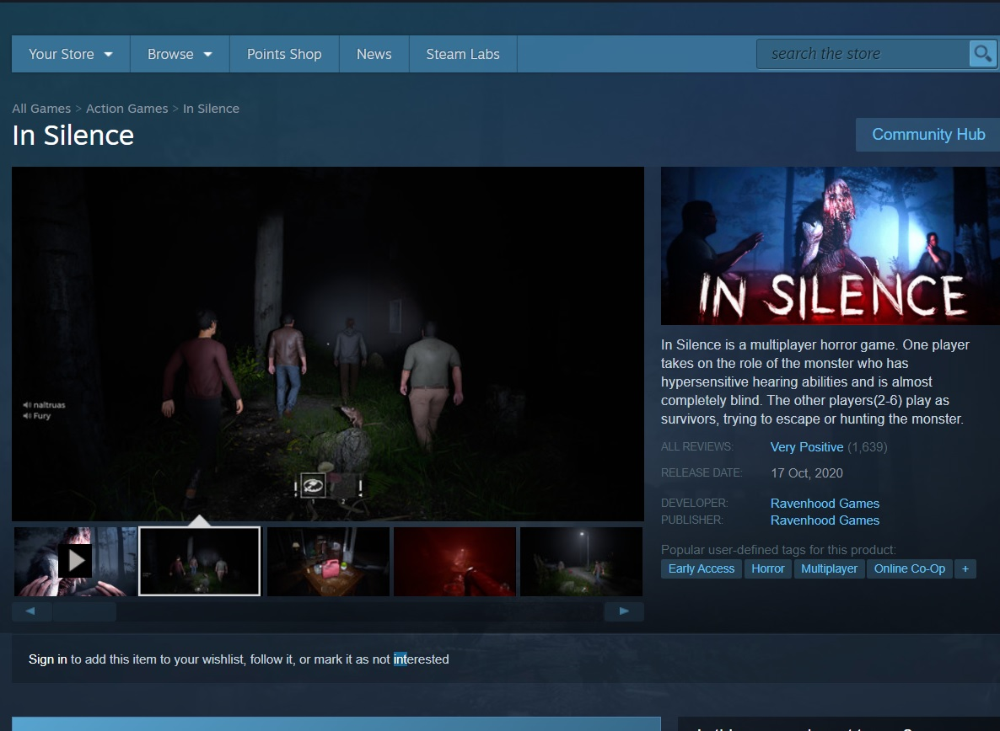
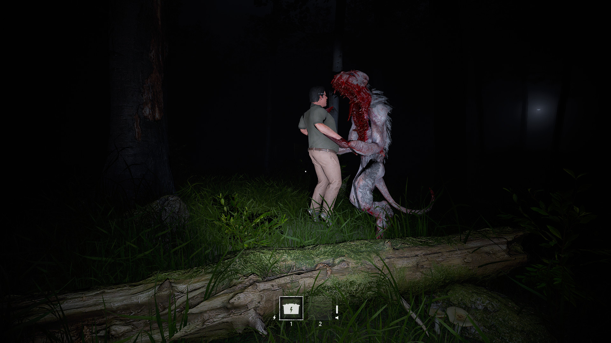
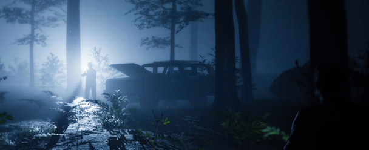
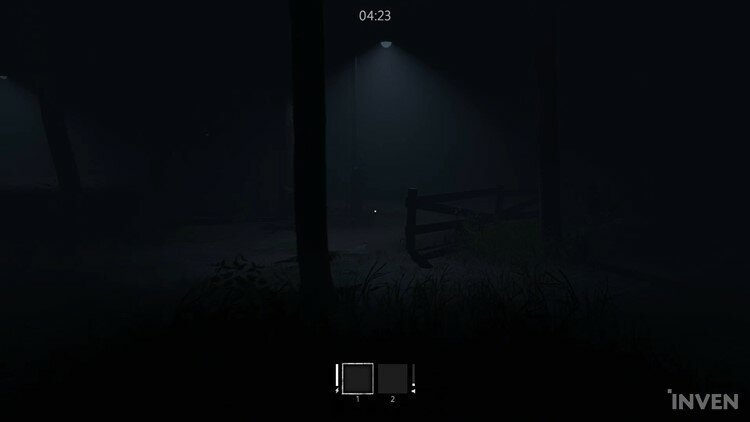
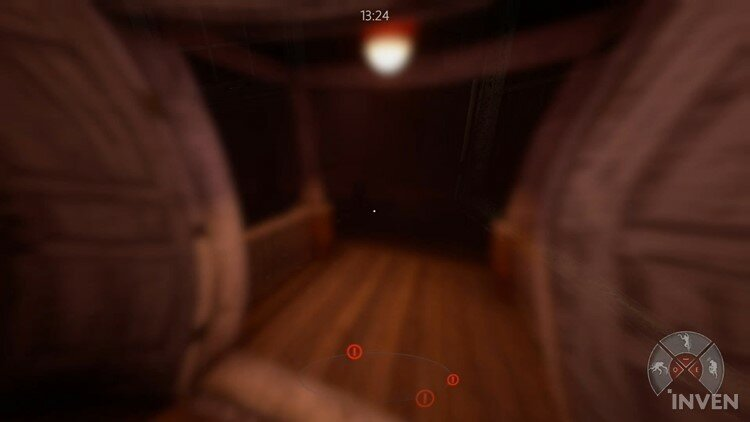
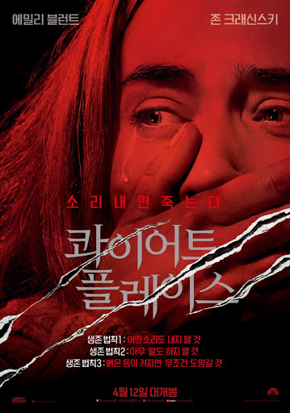

## 출시된 지 한달도 안된 따끈따끈한 신작 스릴러 게임

Phasmophobia에 이어서 곧바로 다른 스릴러 게임을 소개하고자 한다.

또 스릴러 게임을 소개하고 후기를 작성하니 벌써 들뜬다.

스팀에서 최고 인기제품에 당당히 첫 페이지에 올라와 있는 Insilence

배포 날짜를 보면 10월 17일 

벌써부터 아시아 유럽 일본에서는 인기를 조금씩 차지하고 있다.

게임에 접속해보면 우리나라 사람들보다 외국인들이 훨씬 많고

아직까지 한국에서 인기는 그 닥 많지는 않다.

최근 공포게임을 하면서 느낀 생각과 

평점부터 리뷰까지 간략하게 작성하겠다.

## 공포게임이 왜 재밌는가 -주관적인 분석

"롤러코스터를 타는 것, 공포영화를 보는 것"

나는 놀이동산에 가면 놀이 기구를 타지 못 한다.

부끄러운 말이지만 살면서 자이러 드롭, 롤러코스터를 타본 적 없다.

이유는 오로지 "높은 곳이 무서워서", "죽을 수 있을 것 같아서"

그러나 공포영화와 공포게임은 미친듯이 좋아한다.

"무섭지만 진짜 나는 죽지 않는다는 걸 알아서"

공포 란 어디서 오는 것일까 

여기서 내 생각은 불안이다.

죽을 수 있다는 불안감. 스트레스 모든 것이 합쳐진 게 공포다.

(고소공포증을 아직도 가지고 있으니 김대훈은 겁쟁이가 분명함)

롤러코스터와 자이러 드롭 등 놀이기구들은 

기계가 잘못 되면 죽는다는 공포에 아직도 완전히 사로잡혀 있다.

공포게임에서는 인간의 이러한 불안한 심리적 요소와 스트레스를 적절하게 활용한다.

### 재미있는 공포게임의 주된 게임 기법

스릴러, 호러 게임들을 포함에서 멀티 플레이가 가능한 게임들만

예를 들어서 설명해 보겠다.

먼저 설명할 요소들은

첫번째 "혼자만 남게 하는 심리적 불안감"

두번째 "적에게 대항할 수 없는 무능함을 이끌어내는 스트레스"

세번째 "머릿속으로 위험을 감지하게 하는 청각과 시각적 요소"

멀티 플레이와 솔로 플레이 게임들 모두 공통적으로 가지고 있는 요소이다.

먼저 멀티게임의 경우 함께 힘을 합쳐서 공포를 이겨내는 것은 표면적으로

보여주는 요소이고 사실은 내재된 게임의 흥미 유발 시스템은

### "여럿이 있다가 혼자만 남게 해서 주는 심리적 불안감" 에서 재미가 온다.

-출처 구글 이미지

인간은 사회적 동물이며 사회성을 띄고 함께 미션을 완료하기위해

협력하면서 게임을 진행한다. "우리는 사실 여기서 속고 있는 것이다."

공포라는 심리를 이끌어 내기 위해서 "혼자만 남았을 때 불안감을 발생시키기 위해"

-출처 구글이미지

멀티플레이 공포게임들을 즐기면 알 듯이

살인마는 절대 한번에 다수를 죽이는 능력을 가지지 않는다.

팀원 한명이 고통스럽게 혹은 잔혹하게 죽는 모습을 다른 팀원들에게 상기시키면서

"그 장면이 나에게 올 수 있다는 불안감을 더 심어 주기 위해서"

살인마는 한 턴에 한 명을 죽인다.

### 두번째 공포게임의 특징인 "나의 무능함에서 나오는 스트레스"

공포게임의 특징이다. 

내가 만약 대 천사 미카엘의 지팡이를 손에 쥐고있거나

부활의 머리띠를 착용하고 있거나, 목숨을 2~3개 가지고 있다.

그러면 살인마가 무서울 리가 없다. 죽는다는 불안감이 적기 때문이다.

내가 살인마에게 대항할 수 있는 요소가 없다면 ?

그러면 말이 달라진다. 갑과 을은 절대 변할 수 없고 

항상 도망자 입장이 되 버리는 것이다. 살인마를 잡는다는 정의감 보다

살아남아야 한다는 생존을 위한 공포가 머릿속에 자리잡으며

그것이 게임에 대한 스릴로 이어진다.

-출처 구글이미지

자동차를 수리해서 이 장소에서 도망치는게 승리조건인 인사일러스

-출처 구글이미지

발전기를 수리해서 이장소에서 도망치는게 승리조건인 데바데

### 세번째 "머릿속에서 공포를 느끼게 하는 시각과 청각요소"

멀티 공포 게임들을 즐기다 보면 내가 위험한 상황에 닥칠 것이다

라는 심리적 불안감을 시각과 청각적으로 전달한다.

먼저 청각적인 요소에서 우리의 심장소리와 비슷한 양상을 뛰는 경우

심장 소리로 착각할 수 있을 만한 사운드를 제공함으로써

우리의 심장이 차분하게 뛰고있어도 빠르게 뛰고있다는 착각을

청각적인 요소로 착각하게끔 만든다.

마치 클럽이나 감성주점에서 빠르고 강렬한 비트들이 괜히

내 심장이 강렬하게 뛰고있다는 착각을 주는 것 처럼

심장소리가 아닌 차분하고 잔잔하게 흘러나오는 배경음악은

청각적인 요소를 이용해 이 상황에 사용자를 완전히 몰입 시키기도 한다.

이러한 청각적인 요소들은 공포게임에서 분명히 중요한 위치를 차지하고 있다.

(지금 이 글의 배경음악 처럼)

시각적인 요소들은 항상 피를 상징하는 빨간색이나 어둠을 상징하는 검은색을

뛰는 경우가 많은데 빨간색을 보면 피를 연상하여 불안감을 띄우고

검은색을 보면 어둠과 갑자기 예상할 수 없는 불안감을 제공함으로써 

공포게임들은 검정색과 빨간색을 적절히 활용하여 시각적인 요소로 

사용자들을 "공포"라는 심리속에 집어넣기 위해서 노력한다.

분석이야기를 적다 보니 이야기가 길어졌고 본론으로 돌아가서

인사일러스 게임에 대해 이야기 해보자

## 일단 스릴러닌깐 별점 3개먹고 들어가자

평점 ★★★★☆

데바데와 Phasmophobia와 같이 2%의 뭔가 부족함은 채우질 못한 게임.

확실히 몰입도는 있고 그래픽면에서도 파스모포비아 보다 나으며

데바데 게임과 비슷한 느낌의 게임이라고 생각하면 된다.

확실히 스릴러 게임의 사운드와 긴장감은 존재하기 때문에 재미있다.

개인적으로 우리나라 유저들에게도 사랑받아서 더 큰 인기를 누렸으면 좋겠다.

## 게임리뷰 - 소리내면 죽는다.

데바데처럼 살인마 vs 생존자 다수 로 이루어진 게임

스릴러 게임들은 대부분 술래잡기와 비슷한 양상을 띄는데

이 게임 또한 강한 술래 1명과 약한 생존자들로 스릴을 만들어 낸다.

이 게임의 승리조건은 살인마는 생존자를 다 죽이는 것이고

생존자는 곳곳에 숨겨져 있는 자동차 부품들을 찾아서 자동차를 수리하여

탈출하거나 무기고 암호를 알아내서 무기를 얻은 뒤 괴물을 잡는 것이다.

내가 플레이했을 때 무기고를 열었던 적은 한번도 없다...ㅠㅠ

## 게임의 특징

살인마인 괴물의 시각이다.

살인마는 시각이 덜 발달되어 앞이 잘 보이지 않는다.

하지만 청각이 매우 뛰어나기 때문에 소리로 사람을 찾아 다닌다.

이 게임이 주는 재미 요소이다.

생존자들은 서로의 보이스 음성을 최소한으로 하면서

뛰어다니거나 문을 열고 뭔가 행동을 할 때 항상 조심해야한다.

소리를 듣고 괴물이 뛰어오기 때문이다.

영화 - 콰이어트 플레이스의 괴물과 비슷함

### 게임의 개선방향

요즘 출시되는 게임들은 사용자들의 마이크 셋팅을 필수로 요구하는 듯 하다.

파스모포비아도 그렇고 협력게임에서 헤드셋은 선택이 아닌 필수.

일단 한국인 유저가 매우 적은 것에 안타까운 점.

아이템 드롭 장소는 항상 랜덤이어서 추가적인 맵 이 필요 없는 듯 하지만

더 다양한 맵 들이 나와야 공포게임을 빠르게 적응하는 유저들의 관심을 계속

묶어 둘 수 있을 듯 하다.

또한 아직까지 괴물 Ai와 괴물 유저의 차이점을 극복하지는 못한 점

추후 업데이트가 되겠지만 현재 괴물이 너무나도 유리한 점

(이런 건 인간 유저들이 금방금방 꼼수를 찾아내긴 한다)

청각만 발달된 괴물이 있다면 시각만 있는 괴물이 나온다던 지

폭죽이나 더 다양한 함정으로 괴물을 방해할 수 있는 요소

이러한 점들이 개선방향으로 보인다.

배포 시작한지 한달도 지나지 않은 게임이므로 

앞으로의 행보가 매우 기대되는 게임이다.

<iframe width="50" height="50" scrolling="no" frameborder="no" allow="autoplay" src="https://w.soundcloud.com/player/?url=https%3A//api.soundcloud.com/tracks/482923884&color=%23ff5500&auto_play=true&hide_related=false&show_comments=true&show_user=true&show_reposts=false&show_teaser=true&visual=true"></iframe>
<a href="https://soundcloud.com/enis1-1" title="Halloween 2018" target="_blank" style="color: #cccccc; text-decoration: none;">Halloween 2018</a> · <a href="https://soundcloud.com/enis1-1/cry" title="Cry (free downloads)" target="_blank" style="color: #cccccc; text-decoration: none;">Cry (free downloads)</a>
