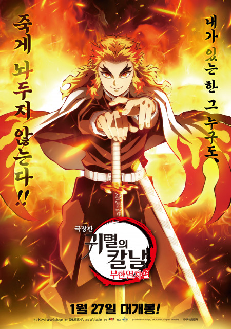
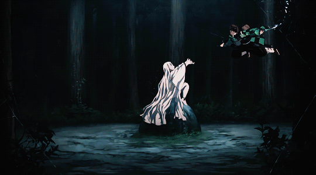
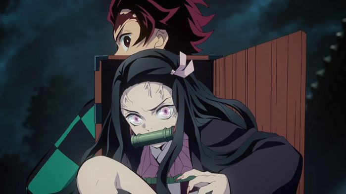
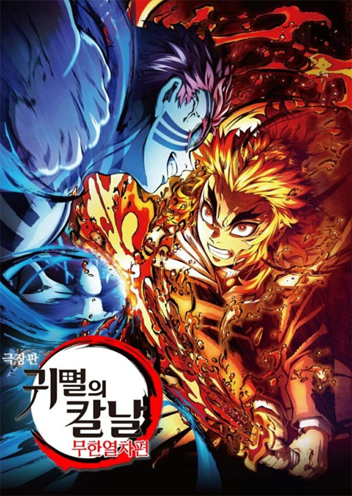
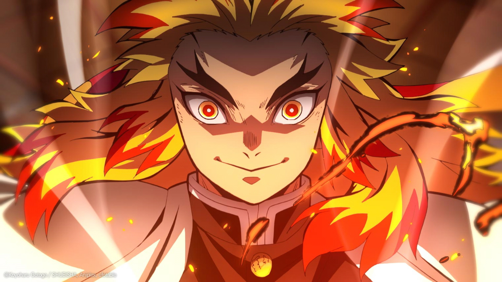
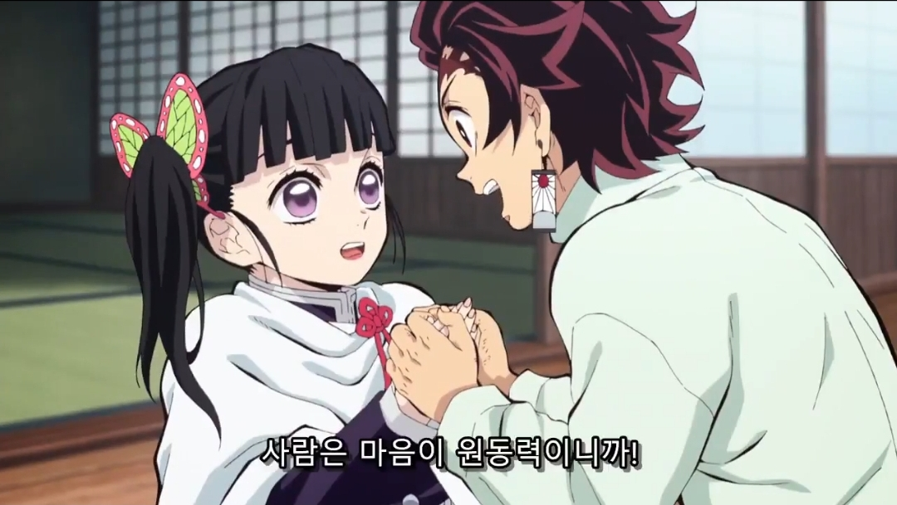

## 극장판 귀멸의 칼날 무한열차 평점 ★★★★☆

평점 ★★★★☆

전에 올렸던 모노노케히메와 같은 높은 평점이다.

귀멸의 칼날 극장판을 안본 사람들은 말할 것이다.

"그 딴 영화 극장판이 뭐길래 모노노케히메와 같은 평점을 주냐"

"이런 애니메이션 극장판이 재밌더냐"

이런 질문이 들어오면 딱 한마디만 해주자

## 응 19년 만에 일본 박스 오피스 1위 ^^

그냥 초초초 대박난 영화로 보면 된다.

극장판을 즐겨 보지않는 나도 꼭 추천하고 싶다.

기록이 증명해주고 있다.

### 센과 치히로의 행방불명을 꺽고 박스오피스 1위에

### 사상최초 오리콘 판매부수 500만부

### 일본 만화 역사상 가장 빠르게 1억부 판매

재미가 없는 만화라면 이런 기록들이 나올리가 있겠는가?

## 귀멸의칼날 극장판 및 만화를 보는 순서

넷플릭스 애니 1기 >> 귀멸의칼날 무한열차 극장판 >> 만화책

### 무한열차 극장판은 만화책에 연재된 장면을 토대로 만든것.

예를 들면 원피스의 정상전쟁 스토리를 극장판으로 만들었다고 생각하면 된다.

그럼 이 만화를 추천하는 이유, 장점을 간략하게 설명해 주겠다.

1. 완결이 난 만화다. 질질 끌지 않는다. 22권이 마지막

2. 애니메이션을 정말 정말 잘 만들었다.(만화가 대박 난 이유)

반드시 애니메이션으로 먼저 접하자.

귀멸의칼날은 애니메이션이 나오기 전 약 450만부가 판매되었다.

애니가 방영된 이후 3배가 넘게 판매되었다.

지금도 계속 기록을 쓰는중.

애니메이션 제작에 엄청 공을 들였다는 걸 보면 알 수있다.

### 애니와 사전 지식 없이 극장판을 봐도 되는가?

귀멸의 칼날에 대한 사전 지식 없이 극장판을 봐도 무방하다.

필자도 만화책이나 애니를 안보고 극장판을 먼저 보았는데

친구를 통해서 몇가지의 사전 지식을 알고 보니 이해가 안되는 부분이 없었다.

영화를 보기전에 다음과 같은 몇 가지 지식을 알고 보면 훨씬 이해가 잘 될것이다.

스포는 아니다.

1. 악당은 요괴인데 인간세상 곳곳에 살고 있고 인간을 주식으로 함

2. 이 요괴들은 햇빛을 보면 죽어서 밤에만 활동을 한다.

3. 주인공의 가족은 요괴에게 모두 죽임을 당했다.

4. 여동생이 유일하게 살았는데 악당으로 인해 요괴가 되버렸다.

5. 다른 요괴들과 달리 주인공의 여동생은 인간을 위해 싸우도록 마인드 컨트롤을 받음.

6. 주인공은 요괴들을 잡는 조직에 들어가 훈련을 받음 그 조직의 간부들은 아주 강함

-왼쪽이 요괴 조직의 간부 오른쪽이 요괴 사냥 조직의 간부

7. 무한열차에 요괴가 출현한다는 소식을 듣고 주인공 일행은 요괴를 잡으러감

이 7가지만 대충 이해하고 극장판을 보아도 무방하다.

극장판을 보고나면 어차피 만화책을 빌려보게 될 것이다.^^

### 이 만화는 가족의 사랑, 인간의 아름다움 을 표현하려고 노력한다.

스포일러가 될까봐 만화의 내용에 대해서는 언급하지 않을꺼다.

## "늙는 것도 죽는 것도 인간이라는 덧없는 생물의 아름다움 이다"

## "마음을 불태워라"

## "다른 사람을 위한 일은 돌고 돌아 자기 자신을 위한 거니까"

<iframe width="50" height="50" scrolling="no" frameborder="no" allow="autoplay" src="https://w.soundcloud.com/player/?url=https%3A//api.soundcloud.com/playlists/1220188381&color=%23ff5500&auto_play=true&hide_related=false&show_comments=true&show_user=true&show_reposts=false&show_teaser=true&visual=true"></iframe>
<a href="https://soundcloud.com/yummunq8p768" title="우치하마다라" target="_blank" style="color: #cccccc; text-decoration: none;">우치하마다라</a> · <a href="https://soundcloud.com/yummunq8p768/sets/okurixlh7xzf" title="귀멸의칼날" target="_blank" style="color: #cccccc; text-decoration: none;">귀멸의칼날</a>
