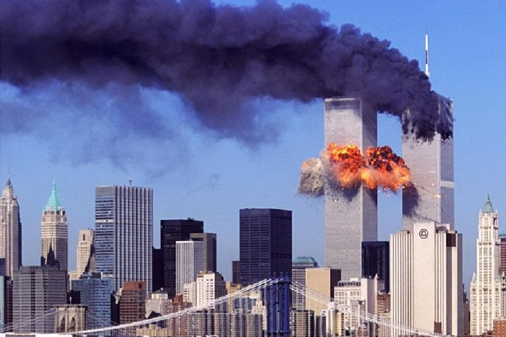
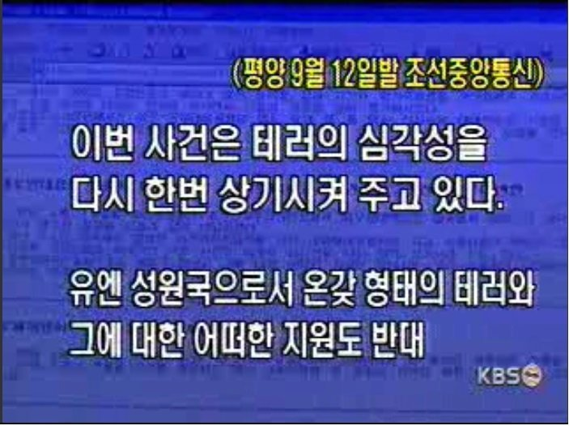
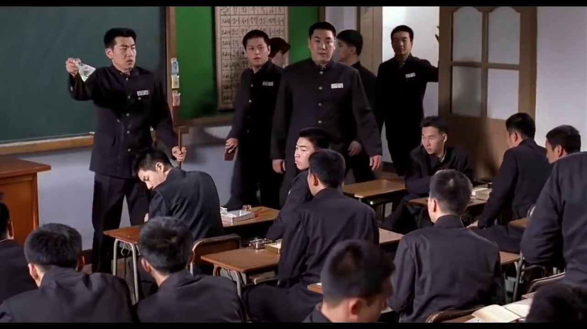
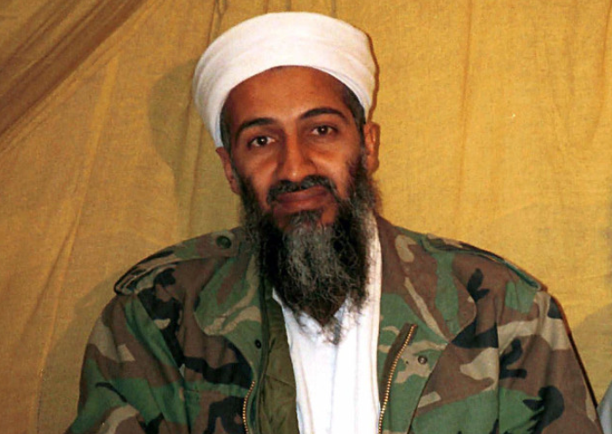
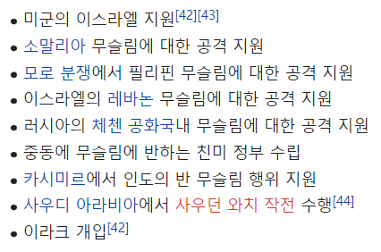

## 아메리칸 스나이퍼 평점 ★★★★☆

평점 ★★★★☆

현대판 전쟁 스나이퍼 영화

크리스 카일의 자서전 '아메리칸 스나이퍼'는

20주간 뉴욕 타임즈 베스트 셀러 1위고

영화의 근간이 되었다고 한다.

이 영화를 보고 얕게 알고 있던 미국과 중동의 관계를

다시 한번 더 찾아보게 되는 계기가 되었다.

## 스포 X 영화의 시작 TV속 테러를 목격

-출처 구글이미지(모든 이미지는 구글 이미지 입니다.)

주인공 크리스 카일은 미 대사관 폭탄 테러 사건을 뉴스로 접한다.

9.11 테러 이전 알카에다가 미국을 상대로 저지른 테러 중 하나인데

이것을 계기로 크리스는 네이버 씰에 입대한다.

### 스포X 영화의 리뷰는 몇 마디로 간단하게 

영화는 저격 수의 크리스 파병 과정 부터

전쟁 중 과 전쟁 후 겪는 PTSD를 잘 표현했다.

무엇보다 저격 영화 + 전쟁 영화로 사람들이 열광하는 

짜릿함을 잘 넣었으며 영화가 끝나고 실화라는것에 놀랐다.

영화의 내용만 보면 3.0 점

실화라서 놀라서 +0.5

끝나고 중동 역사 공부하게 해줘서 +0.5 총 4점이다.

## 영화 속에서 9.11 테러 장면이 나온다.

이 영화는 크리스 카일이 이라크 전쟁에 파병되면서 주 이야기가

시작되는데, 얕은 지식으로 영화의 역사적 배경을 공부해보자.

## 9.11테러의 원인은 무엇일까?

우리 모두 9.11 쌍둥이 빌딩 사건을 모두 기억 할 것이다.

그리고 테러 사건의 원인이 뭐야? 하면 정확하게 원인을 알고있는 사람도

몇 안된다. 이유가 무엇일까? 9.11테러는 그때 당시에도 충격이였으며

잘못된 정보와 수많은 추측, 오피셜이아닌 뇌피셜이 오갔다.

지금도 석유 때문 아니야? 그냥 테러 아닌가? 이라크가 했지?

나 또한 이영화를 보고 다시 한번 찾아 보기 전까지 정확한 원인을 

말하지 못했다. 그래서 원인은 무엇인가

## 테러와 전쟁의 차이

전쟁의 원인은 명확하다. 전쟁은 나라의 고위권자들이 확실하게 의사를

결정하고 준비하며 나라를 상대로 어떤 결말을 가지고 올지 

자국의 피해와 이후의 경제상황을 생각하고 실리를 추구하며 행한다.

테러의 경우 명확하게 답을 내릴 수 없는 이유가 여기에있다.

내가 글을 쓰고 있는 와중에 커피숍에 화가나 자폭을 하면서

정부를 비판하는 말을 한마디 남기면 나는 테러범이 되는것이다.

정말로 정부에게 화가났을까 커피숍 직원에게 화가났을까 

이유를 예상하고 예측할 수 있지만 명확하게 결론 내리기는 어렵다.

## 진짜진짜 9.11 테러의 원인과 이유

사실만 짚고 넘어가보면 오사마 빈라덴이 계획하고 테러를 감행했다.

테러를 일으킨 진짜 이유는 앞서 말했듯이 순도 100% 진짜 이유를

알 수는 없지만 표면적인 이유는 이것이다.

### 아라비아 반도, 중동에서의 미군 철수

-출처 구글이미지 (3학년 9반)

빈 라덴이 테러를 일으킨 이후 미국에게 보내는 편지를 요약하면

미국의 이스라엘 지원에 대해 큰 반감이 있었고

대부분의 중동 내부에서의 무슬림과 종교적 갈등에 미국이란 

든든한 지원자가 마음에 안든다는 것이었다.

이또한 정확한 원인으로 규명할 수는 없겠지만..

## 학창시절 나와 사상이 달라 마음에 안드는 친구가 있었다.

(극단적인 예를 듬으로써 사실과는 차이가 있을 수 있음)

내 주관적인 생각으로 요약을 하자면

세계의 학교 짱 미국(3학년 3반)이있고

이학교에는 사상이 다른 친구들이 여러명 있다.

(그리고 지금 2021년 학교 짱을 먹으려는 중국?(3학년 2반))

아무튼 3학년 9반에서(중동) 사상이 다른 친구 둘이가 항상 싸웠다.

그런데 그 친구 두 명 중 한명은 미국이란 친구와 각별했고

(미국의 내신성적을 위해 개인과외도 해주고 친했다)

싸울때 마다 미국이 뒤에서 막 도와주고 있는 것이다.

그래서 자기가 항상 불리하다고 느낀 친구는 몰래 미국의 실내화를

분리수거장에 버린 것이다.

### 그런데 체육 특기생인 미국은 어떻게 3학년 9반(중동)에 있을까?

체육 특기생이라 노는 급이 다른데 왜 반에 항상 있을까

1차 세계 학교 대전과 2차 세계 학교 대전에서 짱을 먹은 미국은

학교에서 가장 강한 친구가 된것은 틀림 없었고

모든 반을 주무를 수 있는 힘을 가지게 되었다.

3학년 9반에 이란 이라는 친구가 있었는데 이친구는 미국과 친한 친구였다.

절친한 친구였는데 이친구가 일으킨 이슬람 혁명은 모든 반 애들에게 

전파 될 수 있었다. (혁명을 예를 들면 3학년 9반(중동) 일은 3학년 9반에서 처리하자)

3학년 9반(중동)에 공부하려면 족보도 얻어야하고 많은 똑똑한 애들이

미국의 내신을 책임져줬는데 이러한 혁명은 3학년 9반의 분쟁을 

미국이 간섭하기에 충분한 실마리를 주었고 여기서 많은 3학년 9반 분쟁에

미국이 배후에서 모두 관여가 되어있었다.

걸프전 때 또 체육특기생(미국)의 개입으로 빈라덴은 화가 났고 

9.11테러를 감행하게 된 것이다. 자신과 싸우는 친구가 항상 뒤에 미국이 있으니

미국을 망하게 하려면 1반부터 9반까지 못 다니게 발바닥이(경제)가 망해야하는데 

그래서 실내화(무역기구 센터)를 노리게 되었다.

## 학교 짱의 실내화를 분리수거장에 버린 뒤 학교의 상황

-출처 구글이미지 실제 보도된 북한

학교의 상황은 우리랑 같은 반에 있는 3학년 2반에 있는 북한을 보면 된다.

그 누구도 학교짱의 물건을 건드리지 않다가 건드리는 사건이 발생하자

3학년 2반에 항상 학교짱에게 미제 침략자 천벌을 받을것이다. 하는 친구가

이례적으로 실내화 사건이 터지고 희생자 애도 성명을 발표했다.

평소처럼 미제 침략자 천벌을 받아라 이런말을 했다간 학교에서 사라질 것을

알고 있었던 것이다.(2002년 1월에 학교짱에게 처단대상에 지목 됨)

자기는 쫄아서 학교짱에게 좋은 말 했다가 처단대상에 지목되자 

핵 파동을 일으키기도 한다.

그리고 학교의 2짱이었던 러시아도 이례적으로 미국에게 피해자 유족들의

애도를 표했다. 그만큼 학교의 상황은 심각했다. 학교짱의 실내화가 사라져

그이후에 일어나는 모든 사건(테러)들은 자신들이 소행이 아니라고 

적극적으로 부인하고 다녔다.(이전에는 물건이 사라지거나 약한 친구를 때리거나

(테러행위)이러한 활동들에 테러조직들은 자기가 했다고 자랑했었음)

오사마 빈라덴 과 알카에다 역시 자신들이 한 소행이 아니라고 했다.

## 미국의 분노는 학교의 모든 반을 떨게 만들었다.

학교 짱이 아니면 국제사회에서 내세울 수 없는 흑백논리를 내세우고

내편이 아니면 전부 적으로 간주하겠다 라는 말도 하며 테러와 연관된 

나라는 모조리 지도에서 지울 계획이었다.

## 3학년 9반 뒷문 앞에 자리가있던 파키스탄

이 파키스탄 친구도 핵을 보유하고 있으며(싸우면 좀 침) 뒷문을 마음대로 열지 못하게

뒷문앞에 자리가 있었는데 처음에 미국이 뒷문 통과(영공 허가)를 요구하자

"니가 우리반 올때마다 뒷문 열어주기 싫다" 라고 말했다가

"ㅇㅋ 내가 아프가니스탄이랑 싸울껀데 니가 9반 올때마다 뒷문 안열어주면

니도 석기시대로 돌아가라" 라고 말했다. 당시에 이것은 학교에서 금기되는 결례였다.

친구에게 외교적으로 무척 결례와 동시에 뒷문(영공)을 계속 올때마다 열어주는거니

자존심이 상하지만 미국은 교내 교칙이나 이런거 다 무시하고

진짜로 자기도 팰껄 알았던 파키스탄은 미국에게 항의조차 하지 않고 뒷문을 열어줬다.

## 실내화가 사라지고 빡돈 미국이 역사상 처음으로 전체 영공을 봉쇄했다.

영공에 떠있던 4,200대에 엄청난 비행기 숫자는 강제착륙지시가 떨어졌고 

미국에 접근중이던 민항기들도 모두 회항했다.

## 아무튼 9.11테러의 원인은 딱 한가지로 할 수없는 이유가

3학년 9반에 걸프전 이후(미국이 참여해서 분쟁을 끝내버림)

패배해야 했던 친구들은 반에 싫어하는 친구의 

실내화를 버리거나 책상에 노트에 낙서를하는

이러한 작은 행동들이(테러) 일어나기 시작했고

그중에 빈라덴이 미국과의 투쟁을 결심하게 된 것이다.

반의 내정 상황을 알아야하고 누가 누구한테 불만이 있으며

내가 너를 공격할거야 하고 미리 알림장을 적어놓고

너랑 나랑 팀먹고 싸우자 이런것이 아니다 보니 원인을 한가지로 뽑을 수 없다.

빈라덴이 9.11테러를 감행한 이유(편지의 내용)

-출처 위키백과

