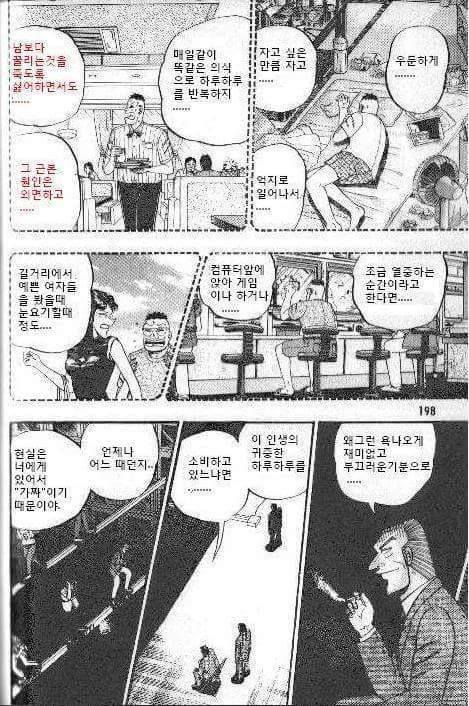
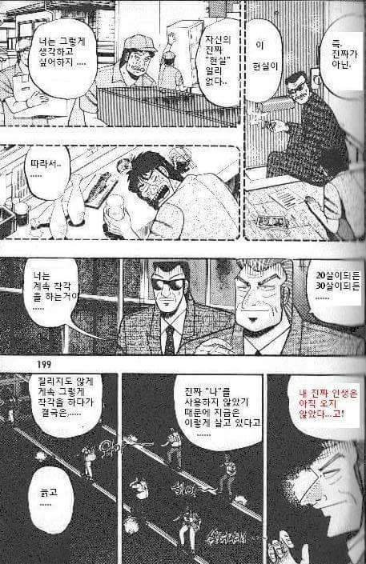

## 오징어게임 평점 ★★★★☆

평점 ★★★★☆ 

솔직한 나의 평점 3.5점

드라마를 보는 내내 재밌게 본 아리스 인 보더랜드와

(모든 이미지 출처-구글이미지)

도박묵시룩카이지가 생각이 났다. 

이 드라마에 진짜 집중해서 재밌게 본 사람이라면 

도박묵시룩카이지가 정말 인생 만화가 될 수 있다고 생각한다.

(오징어게임의 한 장면 같은?)

(카이지 명대사 명장면)

자본주의, 적자생존 이런 내용을 떠나서 한편 한편 게임의 재미만

생각한다면 아리스 인 보더랜드가 조금 더 재밌다고 생각했다.

하지만 나의 생각과 다르게 오징어게임은 지금 해외에서 

엄청난 대성공을 했고 그 이유를 곰곰히 생각해봤다.

## 아무튼 9.11테러의 원인은 딱 한가지로 할 수없는 이유가

3학년 9반에 걸프전 이후(미국이 참여해서 분쟁을 끝내버림)

패배해야 했던 친구들은 반에 싫어하는 친구의 

실내화를 버리거나 책상에 노트에 낙서를하는

이러한 작은 행동들이(테러) 일어나기 시작했고

그중에 빈라덴이 미국과의 투쟁을 결심하게 된 것이다.

반의 내정 상황을 알아야하고 누가 누구한테 불만이 있으며

내가 너를 공격할 거야 하고 미리 알림장을 적어놓고

너랑 나랑 팀먹고 싸우자 이런것이 아니다 보니 원인을 한가지로 뽑을 수 없다.

-출처 위키백과
빈라덴이 9.11테러를 감행한 이유(편지의 내용)

다음번에는 중동과 세계 정황에 대해 현재상황을 알아보자

