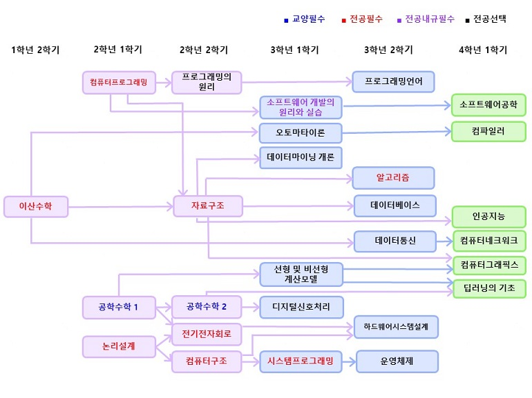

## 알고리즘 좀 매일 하자 매일 대훈아

오랜만에 돌아왔습니다.

최근 1년간 취업으로 상경도 하고 회사업무에 몰두하느라 업데이트가 늦었습니다.ㅠㅠ

알고리즘 문제들은 꾸준히 풀고 있었기 때문에 업데이트를 다시 시작하겠습니다.

꾸준히 찾아주셔서 감사합니다.

## 위상정렬? 왜 배워야 하는가?

위상정렬 알고리즘은 코딩 테스트에서 배점이 높은 문제로 종종 등장한다.

정렬하는 알고리즘에 있어서 매우 빠르고 효율적이라서 위상정렬 사용하지 않으면

시간 초과가 나는 문제들이 존재 하기 때문입니다.

알고리즘을 정확하게 이해하면 어렵지 않은데

제대로 개념을 습득하지 않아 항상 미끄러졌었던 기억이 납니다.

딱 한장의 사진으로 위상정렬을 설명 하겠습니다.

## 위상정렬이란?



대학교의 이수 계통도를 생각하면 됩니다.

위상정렬의 중요한 조건중 첫번째

방향은 존재하지만 싸이클이 존재하면 안된다 입니다.

(F받고 재수강 하면 위상정렬 실패..? 시간낭비가 적은 알고리즘이 맞네요)

자료구조 수업을 듣지 않으면 알고리즘 수업을 못 듣는것 처럼

방향은 존재하고 알고리즘 수업을 들었다가 다시 자료구조 수업을 못 듣는 것처럼

사이클이 존재하면 안됩니다.

사이클이 존재하지 않으며 방향이 존재하는 그래프 이것이 위상 정렬입니다.

(항상 공부하는 입장이기 때문에 태클이나 조언은 언제든지 환영입니다.)

## 위상정렬 설명 이게 끝이냐

백준 줄세우기 골드 3 문제를 통해서 위상정렬 알고리즘을 사용하여 풀어보겠습니다.

쉽게 문제를 설명하면 키순서대로 줄을 세울껀데

A학생 키 > B학생 키

C학생 키 > B학생 키

라는 정보를 알고 있으면 위상정렬을 통해 정답은

A C B 가 나오거나 

C A B 가 나오게 됩니다. 즉 중복 정답이 가능하다는 뜻.

## BOJ 2252 줄세우기
문제출처 - <https://www.acmicpc.net/problem/2252>

### 문제

문제 설명
N명의 학생들을 키 순서대로 줄을 세우려고 한다. 각 학생의 키를 직접 재서 정렬하면 간단하겠지만, 마땅한 방법이 없어서 두 학생의 키를 비교하는 방법을 사용하기로 하였다. 그나마도 모든 학생들을 다 비교해 본 것이 아니고, 일부 학생들의 키만을 비교해 보았다.

일부 학생들의 키를 비교한 결과가 주어졌을 때, 줄을 세우는 프로그램을 작성하시오.

[입력]

첫째 줄에 N(1 ≤ N ≤ 32,000), M(1 ≤ M ≤ 100,000)이 주어진다. M은 키를 비교한 회수이다. 다음 M개의 줄에는 키를 비교한 두 학생의 번호 A, B가 주어진다. 이는 학생 A가 학생 B의 앞에 서야 한다는 의미이다.

학생들의 번호는 1번부터 N번이다.

3 2
1 3
2 3


[출력]
첫째 줄에 학생들을 앞에서부터 줄을 세운 결과를 출력한다. 답이 여러 가지인 경우에는 아무거나 출력한다.

1 2 3

### 코드의 주석을 보시면 이해가 편하실 겁니다.

A 학생 키 > B 학생 키

C 학생 키 > B 학생 키 

이렇게 두가지의 정보가 온다면 B학생은 키큰 애들한테 2번 호출 당하지만

A학생은 0번 C학생은 0번으로 볼 수 있다.

즉 선행 수업인 A와 C는 자료구조 과목이고 B 학생은 알고리즘에 해당한다.

이렇게 A->B, C->B 이런식으로 도착점에 해당하는 횟수(호출을 당하는 횟수)를 

배열에 넣어주면서 호출이 당하는 횟수가 0 번인 애들을 Q에 넣으며

위상정렬을 사용하여 간단하게 풀 수 있다.

```java

import java.io.BufferedReader;
import java.io.IOException;
import java.io.InputStreamReader;
import java.util.ArrayList;
import java.util.LinkedList;
import java.util.Queue;
import java.util.StringTokenizer;

public class 줄세우기 {
	static int N,M,StudentNum[];
	static ArrayList<Integer> arr[];

	public static void main(String[] args) throws IOException{
		BufferedReader br = new BufferedReader(new InputStreamReader(System.in));
		StringTokenizer st = new StringTokenizer(br.readLine());

		N = Integer.parseInt(st.nextToken()); //N명의 학생들
		M = Integer.parseInt(st.nextToken()); //키 비교 횟수
		
		StudentNum = new int [N+1]; //순서별로 키를 몇번 재야하는지(내가 호출을 몇번 당하는지)
		arr = new ArrayList[N+1];	//내랑 키 재야하는사람 번호 담기 
		
		for(int i = 0 ; i<arr.length; i++) {
			arr[i] = new ArrayList<Integer>();
		}
		for(int i = 0 ; i<M; i++) {
			st = new StringTokenizer(br.readLine());
			int A = Integer.parseInt(st.nextToken());
			int B = Integer.parseInt(st.nextToken());
			//A가 더 키가 크다 B 보다
			//키가 작은 B는 키가 큰 A가 키 재러 와라 하면 와야한다. (사이클에서 키를 재기위해 불리는 도착 점이 B) 
			arr[A].add(B);	//"A랑 B랑 키를 재야한다" 를 넣는다.
			StudentNum[B]++; //B가 몇번 키를 재야하는지
		}
		ArrayList<Integer> result = new ArrayList<Integer>();
		Queue<Integer> q1 = new LinkedList<>();
		
		for(int i=1;i<=N;i++) {
			if(StudentNum[i]==0) {	// 키를 잴때 더이상 호출을 안 당하는 키 큰 애들을 Q에 넣기
				q1.add(i);
			}
		}
		while(!q1.isEmpty()) {
			//"키재기 시작" 불림을 안당하는 녀석들이 나오기땜에 q에서 꺼낼때 마다 출력하면 됨
			int A = q1.poll();
			result.add(A);
			
			for(int i=0;i<arr[A].size();i++) { //나보다 작은애들이면서 키재야 하는 애들 불러낸다
				int B = arr[A].get(i);
				StudentNum[B]--;	//불렸으니 불릴 횟수 -1해준다
				if(StudentNum[B]==0) {
					q1.add(B);		//나도 이제 더이상 안 불린다면 나보다 작은 애들 부르기위해 Q에들어감.
				}
			}
		}
		for(int i=0; i< result.size(); i++) {
			System.out.print(result.get(i)+" ");
		}
		
		
		
	}

}

```

이상입니다.