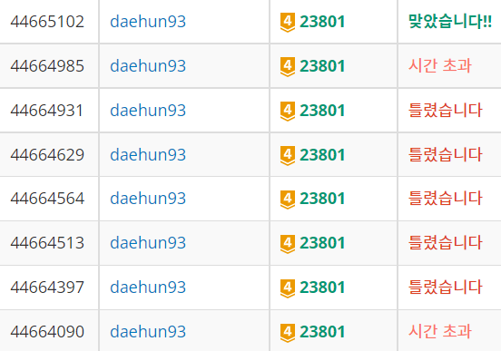

## 알고리즘 좀 매일 하자 매일 대훈아

이번에는 다익스트라 알고리즘을 활용하여 

백준의 두 단계 최단경로 2를 풀어봤습니다.



기존처럼 그냥 풀고 넘어가려고 했는데 

위의 사진 처럼 저와 같이 헷갈리시는 분이 있으실 까봐 리뷰하게 되었습니다.

혹시 저처럼 계속하여 실패하셔서 구글링을 통해 검색을 하시고 오셨다면

메모리 초과, 정답률 96%에서 실패 하는 경우 두가지가 있었는데 

저는 다음과 같이 해결했습니다. 문재 아래에 적어 놓겠습니다.

## BOJ 23801 두 단계 최단 경로 2
문제출처 - <https://www.acmicpc.net/problem/23801>

### 문제

문제 설명
서준이는 아빠로부터 생일선물로 세계 지도를 받아서 매우 기뻤다. 세계 지도에서 최단 경로를 찾는 프로그램을 개발해서 아빠께 감사의 마음을 전달하려고 한다. 세계 지도는 도시를 정점으로 갖고 도시 간의 도로를 간선으로 갖는 무방향성 그래프이며(undirected graph), 도로의 길이가 간선의 가중치이다. 출발 정점 X에서 출발해서 P개의 중간 정점 중 적어도 한 개의 정점을 반드시 거친 후 도착 정점 Z에 도달하는 최단 거리를 구해서 우리 서준이를 도와주자.

[입력]

첫째 줄에 정점의 수 N (10 ≤ N ≤ 100,000), 간선의 수 M (10 ≤ M ≤ 300,000)이 주어진다.

다음 M개 줄에 간선 정보 u v w가 주어지며 도시 u와 도시 v 사이의 가중치가 정수 w인 양방향 도로를 나타낸다. (1 ≤ u, v ≤ N, u ≠ v, 1 ≤ w ≤ 1,000,000)

다음 줄에 X Z가 주어진다. (1 ≤ X, Z ≤ N, X ≠ Z)

다음 줄에 P가 주어진다. (1 ≤ P ≤ N - 3)

다음 줄에 P개의 서로 다른 중간 정점 Y (1 ≤ Y ≤ N, X ≠ Y ≠ Z)가 빈칸을 사이에 두고 주어진다.

[출력]
출발 정점 X에서 출발해서 P개의 중간 정점 중 적어도 한 개의 정점을 반드시 거친 후 도착 정점 Z에 도달하는 최단 거리를 출력한다. 도착 정점 Z에 도착할 수 없는 경우 -1을 출력한다.


## 문제의 핵심은 출발해서 최단 거리로 도착을 해라

단 문제에서 주어진 점들 중 하나를 지나라 입니다.

A - > B 로 가는데 

C,D,E 라는 중간 지점이 주어지면 

A -> C -> B ,  A -> D -> B 

이런식으로 반드시 중간정점을 지나는 최단거리를 찾아라 입니다.

이경우 A점에서 모든 지점과의 거리를 다익스트라로 돌리고

B 지점에서 모든 지점과의 거리를 다익스트라로 돌린뒤 

A지점에서 다른 지점으로 걸린 거리들을 []에 담고

B지점에서 다른 지점으로 걸린 거리들을 []에 담은뒤

중간지점의 C,D,E 의 [] 에서 각각 더하여 가장 짧은 거리를 출력했습니다.

```java

for (int i = 0; i < road.size(); i++) {
			int find = road.get(i);
			if (result > costX[find] + costZ[find]) {
				result = costX[find] + costZ[find];
			}
		}

```

문제 자체는 평소에 접하는 다익스트라와 다른점이 없었습니다.

하지만 계속되는 메모리 초과와 틀렸습니다.에 멘붕이 왔고

계속해서 코드를 수정하여 정답을 받았지만 코드가 엉망진창이 되었습니다..ㅠㅠ

메모리 초과와 96%에서 실패했습니다.를 해결한 방법입니다.

## 메모리 초과의 경우 큐 안에서 다익스트라를 실행할때

```java
	private static void dik(int start) {
		PriorityQueue<Node> q1 = new PriorityQueue<Node>();
		q1.add(new Node(start, 0));
		while (!q1.isEmpty()) {
			Node node = q1.poll();
			int to = node.end;
			long cost = node.cost;
			if(cost>costX[to]) {
				continue;
			}
			for (int i = 0; i < arr[to].size(); i++) {
				int from = arr[to].get(i).end;
				long costFrom = arr[to].get(i).cost;
				if (costX[from] > cost + costFrom) {
					costX[from] = cost + costFrom;
					q1.add(new Node(from, costX[from]));
				}
			}
		}
	}

```

다익스트라를 돌리는 큐입니다. START의 경우 

```java

if(cost>costX[to]) {
				continue;
			}

```

이 부분처럼 이미 비용이 더 커서 지날 필요가 없는 지점은

가지치기를 해줘서 해결했습니다.

이 부분을 해결한 뒤 96%까지 정답입니다 까지 나왔습니다.

정말 멘붕이였다는..(알고리즘 실력이 너무 허접하네요 ㅠㅠ)

그 뒤의 부분은 다음과 같이 해결했습니다.

```java

	private static final long MAXLONG = 300000l * 1000000l + 1;

	for (int i = 0; i < N + 1; i++) {
		costX[i] = MAXLONG; // 비용최대로 담아놓기
		costZ[i] = MAXLONG;
		arr[i] = new ArrayList<Node>(); // 도시 이동간의 거리를 담는다.
	}	
```

문제에서 한점의 최대 가중치가 1백만이고 정점의 수가 10만이기 때문에

int형으로는 담을 수 없는 수치가 나오기 때문에 long으로 해결했습니다.

저 처럼 실수 하지마시고 다시 푸셔서 해결하시길 바랍니다.

감사합니다.

```java

public class 두단계최단경로2 {

	static int N, M, X, Z, P;
	static long costX[], costZ[];
	static ArrayList<Integer> road;
	static ArrayList<Node> arr[];
	private static final long MAXLONG = 300000l * 1000000l + 1;

	public static void main(String[] args) throws IOException {
		BufferedReader br = new BufferedReader(new InputStreamReader(System.in));
		StringTokenizer st = new StringTokenizer(br.readLine());
		N = Integer.parseInt(st.nextToken());
		M = Integer.parseInt(st.nextToken());
		costX = new long[N + 1];
		costZ = new long[N + 1];
		arr = new ArrayList[N + 1];
		for (int i = 0; i < N + 1; i++) {
			costX[i] = MAXLONG; // 비용최대로 담아놓기
			costZ[i] = MAXLONG;
			arr[i] = new ArrayList<Node>(); // 도시 이동간의 거리를 담는다.
		}
		for (int i = 0; i < M; i++) {
			st = new StringTokenizer(br.readLine());
			// u 도시와 v 도시의 w 비용
			int u = Integer.parseInt(st.nextToken());
			int v = Integer.parseInt(st.nextToken());
			int w = Integer.parseInt(st.nextToken());
			arr[u].add(new Node(v, w));
			arr[v].add(new Node(u, w));
		}
		st = new StringTokenizer(br.readLine());
		X = Integer.parseInt(st.nextToken());// 출발점
		Z = Integer.parseInt(st.nextToken());// 도착점
		P = Integer.parseInt(br.readLine());
		// 중간 정점 갯수 P 와 중간 정점들 <= N-3
		st = new StringTokenizer(br.readLine());
		road = new ArrayList<>();
		for (int i = 0; i < P; i++) { // 지나야하는 중간 정점들을 담는다.
			road.add(Integer.parseInt(st.nextToken()));
		}
		dik(X);
		dik2(Z);
		long result = MAXLONG;
		for (int i = 0; i < road.size(); i++) {
			int find = road.get(i);
			if (result > costX[find] + costZ[find]) {
				result = costX[find] + costZ[find];
			}
		}
		if (result == MAXLONG)
			result = -1;
		System.out.println(result);

	}

	private static void dik(int start) {
		PriorityQueue<Node> q1 = new PriorityQueue<Node>();
		q1.add(new Node(start, 0));
		while (!q1.isEmpty()) {
			Node node = q1.poll();
			int to = node.end;
			long cost = node.cost;
			if(cost>costX[to]) {
				continue;
			}
			for (int i = 0; i < arr[to].size(); i++) {
				int from = arr[to].get(i).end;
				long costFrom = arr[to].get(i).cost;
				if (costX[from] > cost + costFrom) {
					costX[from] = cost + costFrom;
					q1.add(new Node(from, costX[from]));
				}
			}
		}
	}

	private static void dik2(int start) {
		PriorityQueue<Node> q1 = new PriorityQueue<Node>();
		q1.add(new Node(start, 0));
		while (!q1.isEmpty()) {
			Node node = q1.poll();
			int to = node.end;
			long cost = node.cost;
			if(cost>costZ[to]) {
				continue;
			}
			for (int i = 0; i < arr[to].size(); i++) {
				int from = arr[to].get(i).end;
				long costFrom = arr[to].get(i).cost;

				if (costZ[from] > cost + costFrom) {
					costZ[from] = cost + costFrom;
					q1.add(new Node(from, costZ[from]));
				}

			}
		}
	}

	static class Node implements Comparable<Node>{
		int end;
		long cost;

		Node(int end, long cost) {
			this.end = end;
			this.cost = cost;
		}

		@Override
		public int compareTo(Node o) {
			return this.cost > o.cost ? 1 : -1;
		}
	}
}

```
