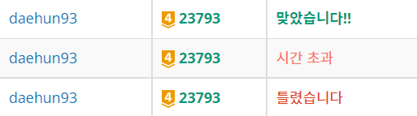

## 알고리즘 좀 매일 하자 대훈아

저번에 두 단계 최단경로 2에 이어서 이번에는 최단경로 1을 풀었습니다.



이 또한 마찬가지로 2와 마찬가지로 틀렸습니다 -> 시간초과 -> 정답

2번의 실수를 했는데 이유는 이전의 <https://daehun93.github.io/다익스트라-정리-최단경로/>
에서 했던 실수와 같았습니다.

저처럼 풀었다고 생각했는데 시간초과와 틀렸습니다 결과가 나온다면

위의 링크에서 설명했던 것들을 수정해서 제출하시면 될꺼 같습니다.

## BOJ 23801 두 단계 최단 경로 2
문제출처 - <https://www.acmicpc.net/problem/23793>

### 문제

문제 설명
서준이는 아빠로부터 생일선물로 세계 지도를 받아서 매우 기뻤다. 세계 지도에서 최단 경로를 찾는 프로그램을 개발해서 아빠께 감사의 마음을 전달하려고 한다. 세계 지도는 도시를 정점으로 갖고 도시 간의 도로를 간선으로 갖는 방향성 그래프이며(directed graph), 도로의 길이가 간선의 가중치이다. 도시의 번호는 1부터 N까지이다. 출발 정점 X에서 출발하여 중간 정점 Y를 거쳐서 도착 정점 Z에 도달하는 최단 거리, 출발 정점 X에서 출발하여 중간 정점 Y를 거치지 않고 도착 정점 Z에 도달하는 최단 거리를 각각 구해서 우리 서준이를 도와주자.

[입력]

첫째 줄에 정점의 수 N (1 ≤ N ≤ 100,000), 간선의 수 M (1 ≤ M ≤ 200,000)이 주어진다.

다음 M개 줄에 간선 정보 u v w가 주어지며 도시 u에서 도시 v로 가중치가 w인 단방향 도로를 나타낸다. (1 ≤ u, v ≤ N, u ≠ v, 1 ≤ w ≤ 10,000, w는 정수) 모든 간선의 (u, v) 쌍의 값은 서로 다르다.

다음 줄에 X Y Z가 주어진다. (1 ≤ X, Y, Z ≤ N, X ≠ Y, X ≠ Z, Y ≠ Z)

[출력]
첫째 줄에 두 정수를 출력한다. 첫 번째 정수는 정점 X에서 출발해서 정점 Y를 거쳐서 정점 Z에 도달하는 최단 거리를 의미한다. 두 번째 정수는 정점 X에서 출발해서 정점 Y를 거치지 않고 정점 Z에 도달하는 최단 거리를 의미한다.

만약, 정점 Z에 도달할 수 없는 경우 -1을 출력한다.


## 최단경로 2와 차이점은 정점을 지나치고 안 지나치고 두가지를 구하라

## 두단계최단경로2는 양방향이였다면 최단경로1은 단방향

### 두단계최단경로2

```java
		for (int i = 0; i < M; i++) {
			st = new StringTokenizer(br.readLine());
			// u 도시와 v 도시의 w 비용
			int u = Integer.parseInt(st.nextToken());
			int v = Integer.parseInt(st.nextToken());
			int w = Integer.parseInt(st.nextToken());
			arr[u].add(new Node(v, w));
			arr[v].add(new Node(u, w));
		}
```

### 두단계최단경로1
```java

for(int i=0; i<M; i++) {
			st = new StringTokenizer(br.readLine());
			int u = Integer.parseInt(st.nextToken()); //출발
			int v = Integer.parseInt(st.nextToken()); //도착
			int w = Integer.parseInt(st.nextToken()); //비용
			arr[u].add(new Node(v,w));
		}
```

양방향과 단방향은 이런식으로 차이점을 두고 

나머지 레파토리는 최단경로2와 동일하게 풀었습니다.


## 문제에서의 핵심인 다익스트라

```java
	private static void dik(int start) {
		PriorityQueue<Node> pq = new PriorityQueue();
		pq.add(new Node(start,0));
		while(!pq.isEmpty()) {
			Node node = pq.poll();
			int from = node.start;
			long cost = node.cost;
			if(cost>costX[from])continue;
			for(int i=0;i<arr[from].size();i++) {
				Node endNode = arr[from].get(i);
				if(costX[endNode.start]>cost+endNode.cost) {
					costX[endNode.start] = cost+endNode.cost;
					pq.add(new Node(endNode.start,cost+endNode.cost));
				}
			}
		}
	}
```

최단경로2와 다른점이 없습니다. 마지막에 정답을 구할때

```java
		if(costX[Y]+costZ[Z]>=MAXLONG) {
			result1 = -1;
		}else {
			result1 = costX[Y]+costZ[Z];
		}
		dik2(X);	//Y 중간지점을 지나지 않고 Z까지 다익스트라
		if(costY[Z]>=MAXLONG) {
			result2=-1;
		}else {
			result2=costY[Z];
		}
```

이 차이점만 존재합니다.

## 정답코드입니다.

저와 다르게 코드를 이쁘게 하나의 dik()함수로 통일해주세요.

```java
import java.io.BufferedReader;
import java.io.IOException;
import java.io.InputStreamReader;
import java.util.ArrayList;
import java.util.LinkedList;
import java.util.PriorityQueue;
import java.util.StringTokenizer;

public class Main {

	static int N,M,X,Y,Z;
	static long costX[],costZ[],costY[];
	static ArrayList<Node> arr[];
	private static final long MAXLONG = 300000l * 1000000l + 1;
	public static void main(String[] args) throws IOException{
		BufferedReader br = new BufferedReader(new InputStreamReader(System.in));
		StringTokenizer st = new StringTokenizer(br.readLine());
		N = Integer.parseInt(st.nextToken());
		M = Integer.parseInt(st.nextToken());
		costX = new long[N+1];
		costZ = new long[N+1];
		costY = new long[N+1];
		arr = new ArrayList[N+1];
		for(int i=1; i<=N;i++) {
			costX[i]=MAXLONG;		//최대비용 담아놓기
			costZ[i]=MAXLONG;
			costY[i]=MAXLONG;
			arr[i] = new ArrayList<Node>();
		}
		for(int i=0; i<M; i++) {
			st = new StringTokenizer(br.readLine());
			int u = Integer.parseInt(st.nextToken()); //출발
			int v = Integer.parseInt(st.nextToken()); //도착
			int w = Integer.parseInt(st.nextToken()); //비용
			arr[u].add(new Node(v,w));
		}
		st = new StringTokenizer(br.readLine());
		X = Integer.parseInt(st.nextToken());	//X에서 출발해서
		Y = Integer.parseInt(st.nextToken());	//Y를 무조건 들려서, 무조건 안들려서
		Z = Integer.parseInt(st.nextToken());	//Z로
		
		dik(X);	//X에서 중간지점 Y까지 다익스트라
		dikZ(Y);//Y에서 도착지점 Z까지 다익스트라	이 두값을 더하면 중간지점을 지난 다익스트라

		long result1,result2;
		if(costX[Y]+costZ[Z]>=MAXLONG) {
			result1 = -1;
		}else {
			result1 = costX[Y]+costZ[Z];
		}
		dik2(X);	//Y 중간지점을 지나지 않고 Z까지 다익스트라
		if(costY[Z]>=MAXLONG) {
			result2=-1;
		}else {
			result2=costY[Z];
		}

		System.out.println(result1+" "+result2);
	}
	
	private static void dik(int start) {
		PriorityQueue<Node> pq = new PriorityQueue();
		pq.add(new Node(start,0));
		while(!pq.isEmpty()) {
			Node node = pq.poll();
			int from = node.start;
			long cost = node.cost;
			if(cost>costX[from])continue;
			for(int i=0;i<arr[from].size();i++) {
				Node endNode = arr[from].get(i);
				if(costX[endNode.start]>cost+endNode.cost) {
					costX[endNode.start] = cost+endNode.cost;
					pq.add(new Node(endNode.start,cost+endNode.cost));
				}
			}
		}
	}
	private static void dikZ(int start) {
		PriorityQueue<Node> pq = new PriorityQueue();
		pq.add(new Node(start,0));
		while(!pq.isEmpty()) {
			Node node = pq.poll();
			int from = node.start;
			long cost = node.cost;
			if(cost>costZ[from])continue;
			for(int i=0;i<arr[from].size();i++) {
				Node endNode = arr[from].get(i);
				if(costZ[endNode.start]>cost+endNode.cost) {
					costZ[endNode.start] = cost+endNode.cost;
					pq.add(new Node(endNode.start,cost+endNode.cost));
				}
			}
		}
	}
	private static void dik2(int start) {
		PriorityQueue<Node> pq = new PriorityQueue();
		pq.add(new Node(start,0));
		while(!pq.isEmpty()) {
			Node node = pq.poll();
			int from = node.start;
			long cost = node.cost;
			if(cost>costY[from])continue;
			for(int i=0;i<arr[from].size();i++) {
				Node endNode = arr[from].get(i);
				if(endNode.start==Y)continue;
				if(costY[endNode.start]>cost+endNode.cost) {
					costY[endNode.start] = cost+endNode.cost;
					pq.add(new Node(endNode.start,cost+endNode.cost));
				}
			}
		}
	}

	static class Node implements Comparable<Node>{
		int start;
		long cost;
		Node(int start, long cost) {
			this.start=start;
			this.cost=cost;
		}
		@Override
		public int compareTo(Node o) {
			return this.cost > o.cost? 1:-1;
		}
	}
}

```