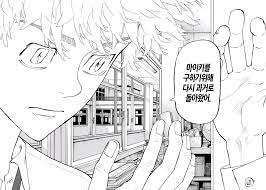
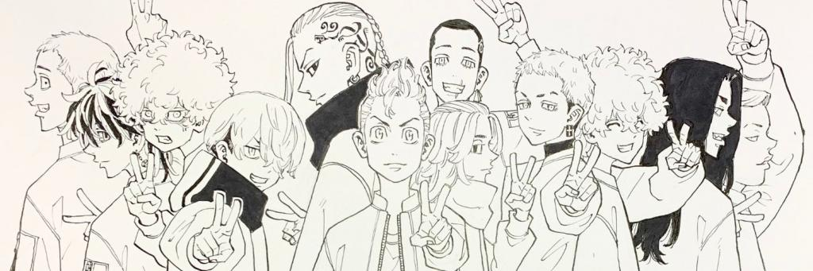
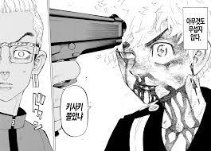

## 도쿄리벤저스 평점 ★★★★☆

평점 ★★★★☆ 

일단 영화+애니+만화책 모두 다 보고 읽은 뒤 총 평점 4점

(정말 아쉬운 건 누가봐도 여기서 끝이다... 했을 때 결말을 냈으면 평점 5점)

진짜 최근에 본 타임리프물 중 가장 재밌었다.

### 타임리프,타임루프,타임슬립 차이

타임리프 - 자신의 삶의 시점을 왔다 갔다 하는것

타임루프 - 루프 말그대로 특정한 시간대가 반복

타임슬립 - 긴 세월을 오가는것 과거 <-> 미래

아무튼 폭력미화, 일진미화 라는 시선에서는 불편할 수 있는데 책을 읽으면

내가 주인공의 입장이라면 어떻게 했을 것인가? 생각해보면 미화라고 생각할 틈도 없다.

간단한 요약 줄거리. (리뷰에 스포일러는 없습니다)

1. 주인공 타케미치는 양아치로 학창시절을 보냈고 더 쌘 아이들의 폭력을 못 견디고 학교를 그만두고 어른이 되어 현실에서 시궁창 삶을 살고 있다.
2. 10년전 헤어진 여자친구가 죽었다는 소식을 뉴스로 접한다.(지금도 사랑함) 

3. 그날 누군가 자신을 죽이는데 10년전 과거로 돌아간다.

4. 현실에서의 여자친구의 죽음을 막기위해 과거와 현재를 오간다.

이딴 만화가 뭐라고..재미없겠다 하는 분들은 아래의 유튜버가 요약해 놓은 영상을 보고 오길 추천 한다.

<https://www.youtube.com/watch?v=uzG4zurEFEM>

도쿄 리벤저스가 유행이고 재미있다는 이야기는 들었지만 나도 굳이 찾아보지 않았다.

크로우즈 제로 이후 폭력물에 흥미도 없었는데 유튜버의 간단한 리뷰를 5분 보다가 이건 봐야겠다 싶어서

영화 -> 애니 -> 만화책 순으로 연재가 끝난 곳 까지 전부 몰아서 감상했다.

너무 매력적인 캐릭터들이 많은 만화이면서 그냥 단순한 학교 물 같지만

세계관도 넓고 각자 주인공들마다 성격도 다 다르며 개인의 완성도 높은 스토리가 존재한다.

-모든 이미지의 출처는 구글이미지입니다

정말로 단순한 폭력물이라 보기엔 꽤 완성도가 높은 작품이다.

주인공은 싸움을 정말 못하고 두뇌가 뛰어난 것도 아니며 지극히 평범한 일반인이다.

그래서 나 자신을 대입하면서 더 집중해서 작품을 감상했던 것 같다.

지극히 평범한 내가 사랑하는 사람이 죽는다는 사실을 알게 된다면

과거에 돌아가서 어떤 일이라도 목숨을 걸고 미래를 바꾸려고 노력하지 않을까?

지극히 평범한 주인공은 과거로 돌아가서 미래를 바꾸려고 안간힘을 쓰는데

거기에서 많은 감동과 여운을 준 만화였다.

자기보다 싸움을 잘하고 머리가 좋더라도 포기하면 사랑하는 사람이 죽는데

누가 주인공을 이길 수 있을까

## 세상에 싸움 잘하는 사람은 많지만 너처럼 근성이 있는 녀석은 드물거든

아무리 나보다 강한 상대이고 뛰어난 상대여도 내가 포기하면

내가 사랑하는 사람이 죽는다는 걸 알고 항상 죽음을 각오하는 주인공

아쉬운 점이 없다고 하면 거짓말이지만 정말 오랜만에 가슴이 뛰는 만화였다.

주인공 타케미치처럼 매일 인생을 살아간다면 10년뒤 나는 얼마나 변할까 하고 생각하게 만든 만화다.

